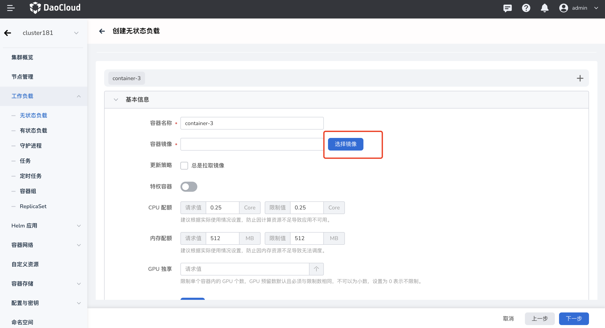

---
hide:
  - toc
---

# Admin 快速使用镜像仓库为平台服务

在 DCE 5.0 中有托管 Harbor（在 DCE 上自建的 Harbor）和仓库集成（集成外部的 Habor 或 Docker Registry）两种镜像仓库管理方式：

- [托管 Harbor](../hosted/intro.md)（建议）
- [仓库集成](../integrate/integrate.md)

DCE 5.0 主推 Harbor 作为镜像仓库提供镜像服务。

1. 假设您已创建了托管 Harbor 或接入了一个外部 Habor，按照以下步骤可以将公开镜像共享给所有命名空间使用（在部署应用时能够通过镜像选择器选择公开的镜像）：

    ```mermaid
    graph TB

    create[创建托管 Harbor] --> setpublic[创建镜像空间并设置为公开]
    --> push[推送镜像]
    --> deploy[部署应用]

    classDef plain fill:#ddd,stroke:#fff,stroke-width:1px,color:#000;
    classDef k8s fill:#326ce5,stroke:#fff,stroke-width:1px,color:#fff;
    classDef cluster fill:#fff,stroke:#bbb,stroke-width:1px,color:#326ce5;

    class create,setpublic,push,deploy cluster;

    click create "https://docs.daocloud.io/kangaroo/hosted/"
    click setpublic "https://docs.daocloud.io/kangaroo/integrate/create-space/"
    click push "https://docs.daocloud.io/kangaroo/quickstart/push/"
    click deploy "https://docs.daocloud.io/kpanda/user-guide/workloads/create-deployment/"
    ```

    预期结果：平台上所有用户在命名空间中部署应用时，均能够通过镜像选择器，选择公开镜像空间中的镜像进行部署。

    

    

1. 假设您已创建了托管 Harbor 或接入了一个外部 Habor，按照以下步骤可以将私有镜像共享给指定的工作空间（租户）下的命名空间使用（在部署应用时能够通过镜像选择器选择私有的镜像）：

    前提条件为：

    ```mermaid
    graph TB

    create[已创建工作空间] --> bind[命名空间已绑定工作空间]

    classDef plain fill:#ddd,stroke:#fff,stroke-width:1px,color:#000;
    classDef k8s fill:#326ce5,stroke:#fff,stroke-width:1px,color:#fff;
    classDef cluster fill:#fff,stroke:#bbb,stroke-width:1px,color:#326ce5;

    class create,bind cluster;

    click create "https://docs.daocloud.io/ghippo/user-guide/workspace/Workspaces/"
    click bind "https://docs.daocloud.io/ghippo/user-guide/workspace/quota/#_4"
    ```

    操作步骤为：

    ```mermaid
    graph TB

    create[创建托管 Harbor] --> setpublic[创建镜像空间并设置为公开]
    --> push[推送镜像]
    --> bind[镜像空间绑定工作空间]
    --> deploy[部署应用]

    classDef plain fill:#ddd,stroke:#fff,stroke-width:1px,color:#000;
    classDef k8s fill:#326ce5,stroke:#fff,stroke-width:1px,color:#fff;
    classDef cluster fill:#fff,stroke:#bbb,stroke-width:1px,color:#326ce5;

    class create,setpublic,push,bind,deploy cluster;

    click create "https://docs.daocloud.io/kangaroo/hosted/"
    click setpublic "https://docs.daocloud.io/kangaroo/integrate/create-space/"
    click push "https://docs.daocloud.io/kangaroo/quickstart/push/"
    click bind "https://docs.daocloud.io/kangaroo/bind-to-ws/"
    click deploy "https://docs.daocloud.io/kpanda/user-guide/workloads/create-deployment/"
    ```

    预期结果：仅在该工作空间下的命名空间部署应用时能够通过镜像选择器，选择该镜像空间下的私有镜像进行部署应用。

    

    

    !!! tip

        1. 接入的 Harbor 可按照上述方式达到同样的使用效果。
        1. Docker Registry 本身只有公开镜像，因此接入后镜像将公开给所有命名空间使用。
