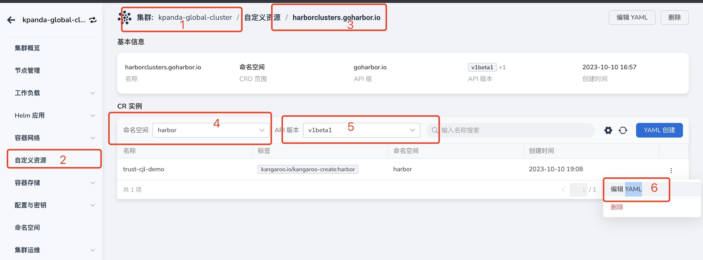
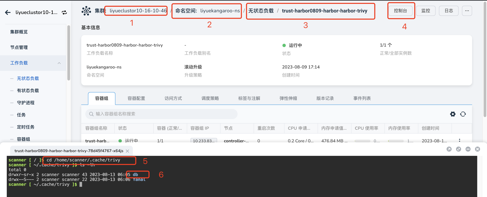
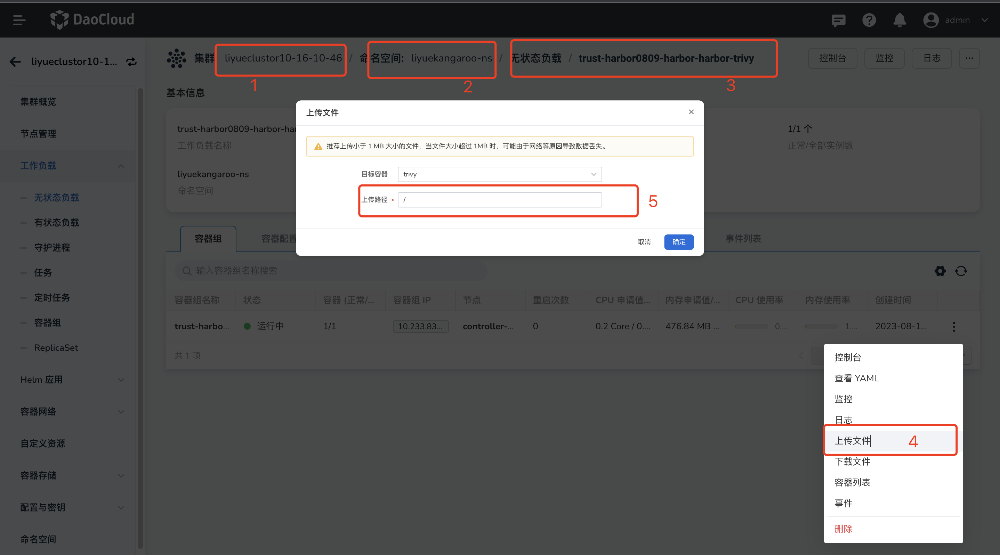

---
hide:
  - toc
---

# 离线环境开启镜像安全扫描

> Trivy 会使用 `admin` 账号来拉取要扫描的镜像，在使用前需要确认可以使用 `admin` 进行 `docker login`。

## 下载离线镜像包

`trivy` 有两个版本，目前都需要下载版本`2`，在 `https://github.com/aquasecurity/trivy-db` 项目中已经不提供版本 `2`
直接下载离线的 `trivy-db` 包了，被打包成了 [`oci` 包](https://github.com/aquasecurity/trivy-db/pkgs/container/trivy-db)。

如下使用 `oras` 工具来下载，先安装 `oras`, 注意区分操作系统版本，如下是下载 `linux` 平台的：

```shell
export VERSION="1.0.0"
$ curl -LO "https://github.com/oras-project/oras/releases/download/v${VERSION}/oras_${VERSION}_linux_amd64.tar.gz"
$ mkdir -p oras-install/
$ tar -zxf oras_${VERSION}_*.tar.gz -C oras-install/
$ sudo mv oras-install/oras /usr/local/bin/
$ rm -rf oras_${VERSION}_*.tar.gz oras-install/
```

使用 `oras` 工具下载 `trivy-db`：

```shell
$ oras pull ghcr.io/aquasecurity/trivy-db:2
db.tar.gz
$ tar -zxf db.tar.gz
# 解压出来有两个文件
db/metadata.json
db/trivy.db
```

## 开启托管 `Harbor` 离线扫描

### 在托管 `harbor` 所在集群进行编辑

```shell
$ kubectl -n {namespace} edit harborclusters.goharbor.io {harbor-name}
# 主要修改 trivy offlineScan 和 skipUpdate 改为 true
trivy:
    offlineScan: true
    skipUpdate: true
```

## 也可以从 `DCE 5.0` 集群管理页面中进行修改



1. 从`集群列表`进入某个集群，选择`自定义资源`
1. 选择 `harborcluster` 的资源
1. 进入托管 Harbor 所在 Namespace
1. 选择 YAML
1. 选择 v1beta1 版本
1. 编辑 YAML：

```yaml
trivy:
    offlineScan: true
    skipUpdate: true
```

## 上传 trivy.db 和 metadata.json 文件

### 先在 `trivy pod` 中创建对应的目录 `/home/scanner/.cache/trivy/db`



1. 从`集群列表`进入某个集群
2. 进入托管 Harbor 所在 Namespace
3. 进入 `trivy` 的工作负载
4. 点击控制台进入容器（如果有多个副本，每个副本都需要设置）
5. 进入容器后，执行 `cd /home/scanner/.cache/trivy`
6. 执行 `mkdir db`

### 创建好目录之后上传离线包



1. 从`集群列表`进入某个集群
2. 进入托管 Hharbor 所在 Namespace
3. 进入 `trivy` 的工作负载
4. 点击上传文件
5. 在弹窗中写入上传路径 `/home/scanner/.cache/trivy/db`，点击`确认`。
6. 进入选择文件页面，分别上传 `trivy.db` 和 `metadata.json` 文件。
