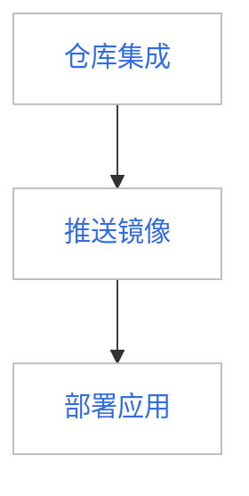

---
hide:
  - toc
---

# Workspace Admin 快速使用镜像仓库为工作空间服务

在 DCE 5.0 中，Workspace Admin 能够通过仓库集成(工作空间)方式集成 Harbor 和 Docker Registry 两种外部镜像仓库。
集成后工作空间成员能够在镜像列表中看到仓库集成(工作空间)的所有镜像，以及在工作空间下的命名空间中部署应用时能够通过镜像选择器选择该仓库中的镜像进行部署。

假设您已经创建了一个外部 Harbor 或者 Docker Registry 镜像仓库，按照以下步骤可以将外部 Harbor 或者 Docker Registry 共享给工作空间成员使用。

前提条件为：

1. 您是 Workspace Admin，并且该工作空间下绑定了一些命名空间
2. 您拥有一个或者多个外部镜像仓库（Harbor 或 Docker Registry）

操作步骤为：

预期结果：在该工作空间下的命名空间部署应用时能够通过镜像选择器，选择该镜像空间下的镜像进行部署应用。

