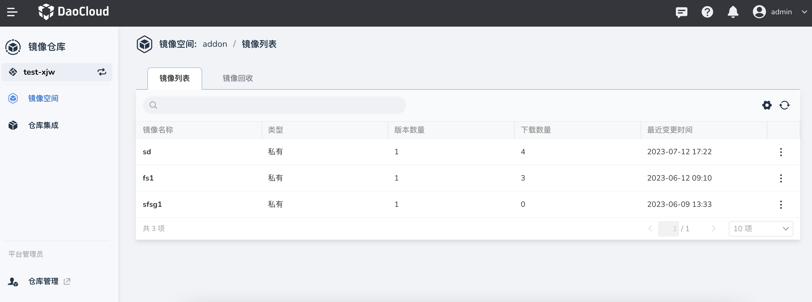

# 镜像空间

DCE 5.0 镜像仓库提供了基于镜像空间的镜像隔离功能。镜像空间分为公开和私有两种类型：

- 公开镜像仓库：所有用户都可以访问，通常存放公开的镜像，默认有一个公开镜像空间。
- 私有镜像仓库：只有授权用户才可以访问，通常存放镜像空间本身的镜像。

您可以选择不同的实例，查看其下的所有镜像空间。

点击某一个镜像空间的名称，可以查看当前空间内的镜像列表以及镜像回收规则。
您可以为当前镜像空间创建镜像回收规则。所有镜像回收规则独立计算并且适用于所有符合条件的镜像，最多支持 15 条回收规则。

