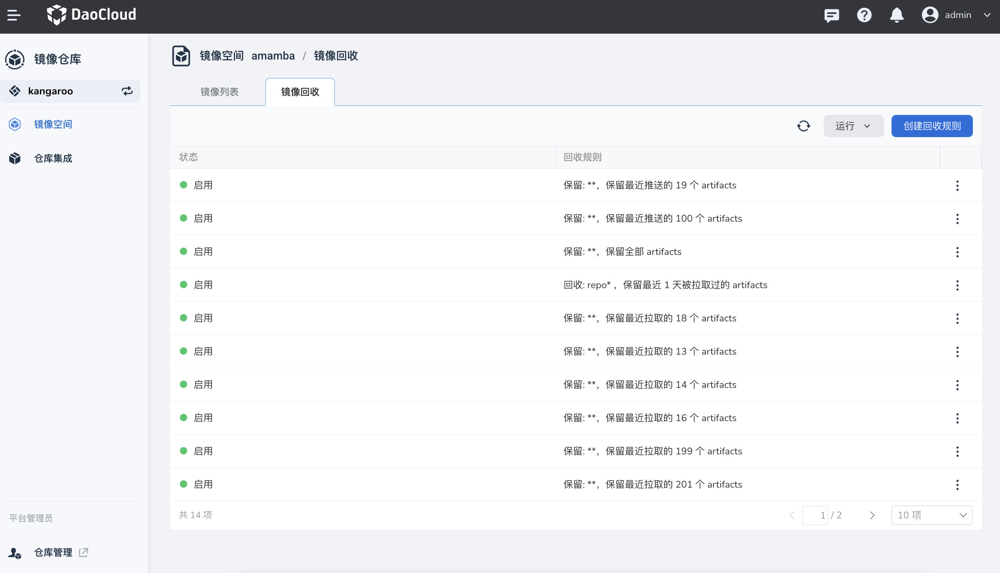
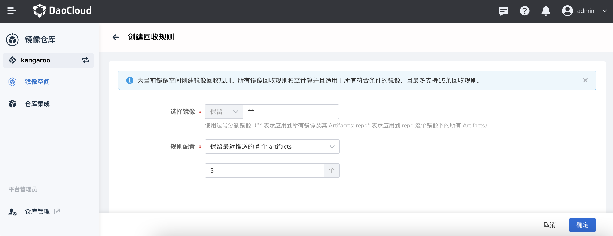

# 镜像回收

镜像回收指的是删除镜像并回收创建镜像所占用的资源。
当您不再需要一个镜像时，您可以将其删除，这将回收镜像占用的磁盘空间。
此过程被称为“镜像回收”。通过镜像回收，您可以释放磁盘空间以便在您的系统上运行其他操作，
同时也可以保持系统的整洁和优化。

您可以为当前镜像空间创建镜像回收规则。
所有镜像回收规则独立计算并且适用于所有符合条件的镜像，且最多支持 15 条回收规则。

点击左侧导航栏`镜像空间`，点击列表中的某个名称。

点击`镜像回收`页签，点击`创建回收规则`按钮。

按提示选择镜像，配置规则。

返回镜像回收列表，点击右侧的 `⋮`，可以禁用、编辑或删除回收规则。
