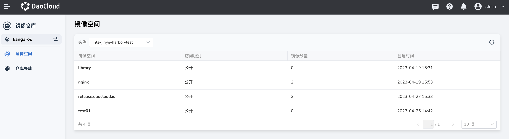

# 镜像回收

在镜像仓库中，许多镜像在一段时间或更新到一定版本后，旧版本的镜像可能不再需要，这些多余的镜像会消耗大量的存储容量。
如果您是 Workspace Admin，可对工作空间下所有镜像空间中的镜像进行管理。
您可以通过设置镜像回收规则来管理镜像仓库中的镜像，通过定时/手动的方式将一些镜像按照一定规则放入回收站。

这里的镜像回收指的是删除镜像并回收创建镜像所占用的资源。
当您不再需要一个镜像时，您可以将其删除，这将回收镜像占用的磁盘空间。
此过程被称为“镜像回收”。通过镜像回收，您可以释放磁盘空间以便在您的系统上运行其他操作，
同时也可以保持系统的整洁和优化。

您可以为当前镜像空间创建镜像回收规则。
所有镜像回收规则独立计算并且适用于所有符合条件的镜像，目前 DCE 5.0 镜像仓库最多支持 15 条回收规则。

1. 使用具有 Workspace Admin 角色的用户登录 DCE 5.0，点击左侧导航栏`镜像空间`，点击列表中的某个名称。

    

1. 点击`镜像回收`页签，点击`创建回收规则`按钮（只有 Harbor 仓库才支持镜像回收）。

    

1. 按提示选择镜像，配置规则。

    

1. 返回镜像回收列表，点击右侧的 `⋮`，可以禁用、编辑或删除回收规则。
