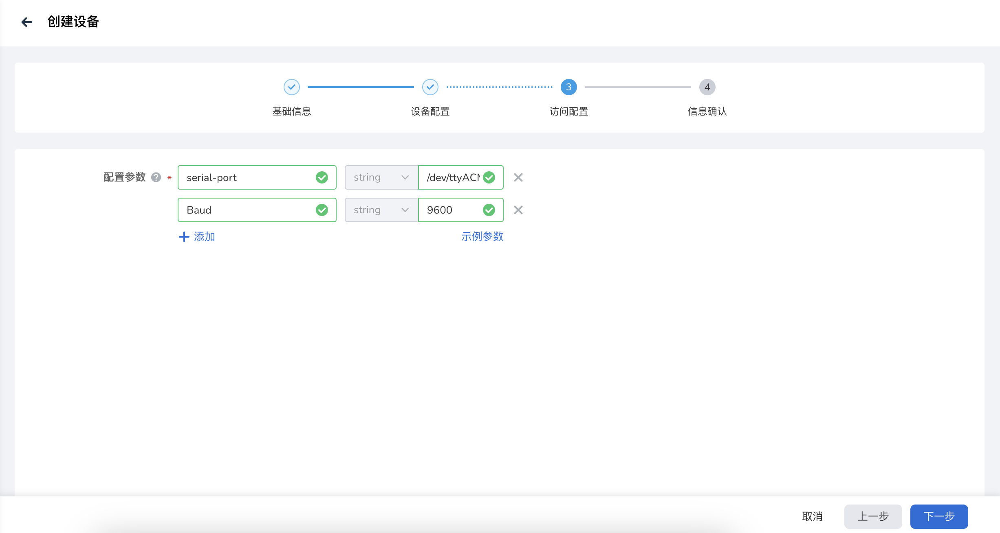

# 智能设备控制

本文介绍基于自定义协议的终端设备接入边缘计算平台，并与云端交互的方法。以一个手势控制灯开关的场景为例，介绍整体实现流程。

## 准备工作

- 边缘节点，节点接入要求参见[边缘节点接入要求](../user-guide/node/join-rqmt.md)
- LED 灯，带有控制单元
<!-- - 手势识别模型应用 -->
- LED 灯驱动 mapper，mapper 开发参阅[如何开发设备驱动应用 mapper](./develop-device-mapper.md)

## 创建终端设备

1. 将 LED 灯驱动 mapper 部署到边缘节点，部署流程参考[创建工作负载](../user-guide/edge-app/create-app.md)

1. 进入边缘单元详情页，选择左侧菜单 __边缘资源__ -> __终端设备__ ，点击终端设备列表右上角 __创建设备__ 按钮。

    

1. 填写基础信息。

     

    !!! note

        访问协议必须和 mapper 定义的协议名称一致。

1. 填写设备配置，添加设备孪生属性和标签。

    - 属性值为设备期望值。
    - 访问方式必须和 mapper 定义的键值数据保持一致。

    
    
    

1. 填写设备访问配置。

    平台连接到设备的访问参数，在这个场景中，设备的访问路径为 /dev/ttyACM0，波特率为9600。

    

1. 信息确认，确认所配置的信息无误，点击 __确定__ ，完成设备创建。

<!-- ### 部署模型应用

1.  -->

## 验证运行效果

1. 设备列表，点击 设备名称，进入设备详情页，可以查看设备上报的状态值。

    

2. 编辑设备孪生属性，修改设备期望值，LED 灯状态改变。
