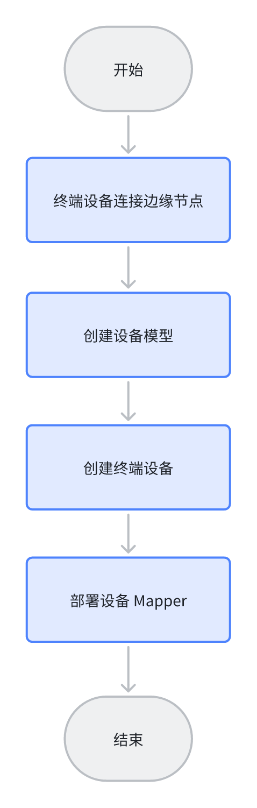
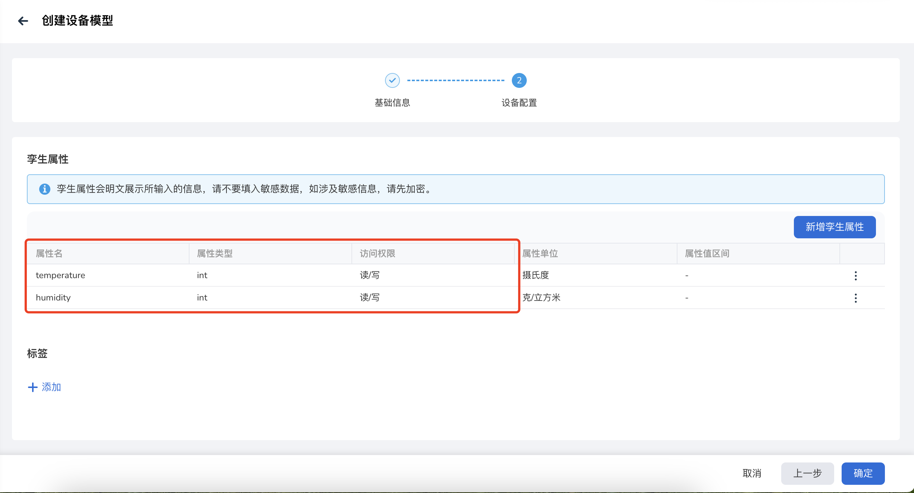
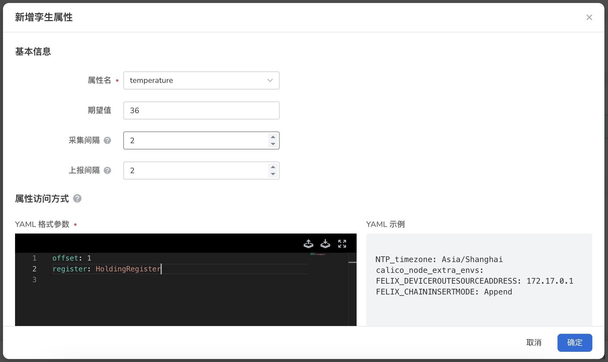
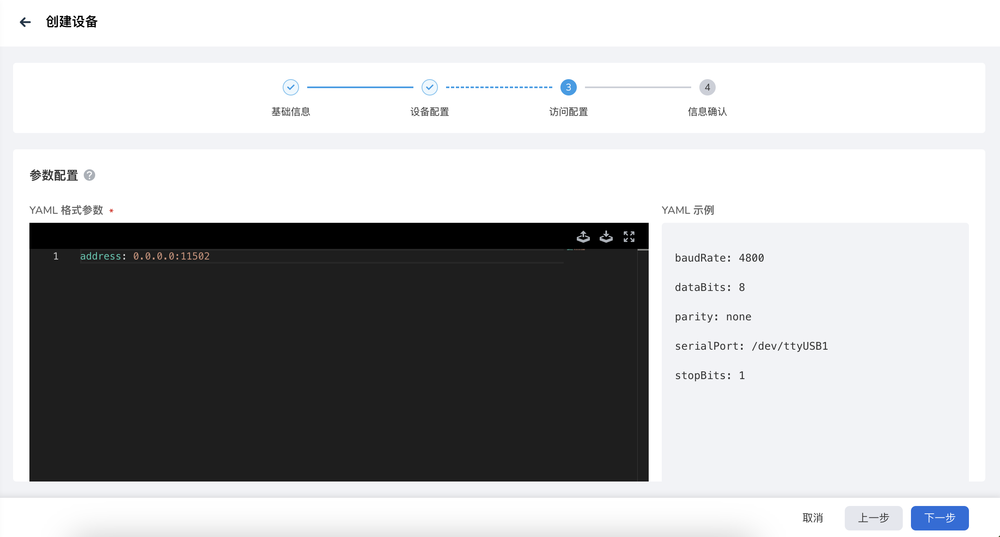
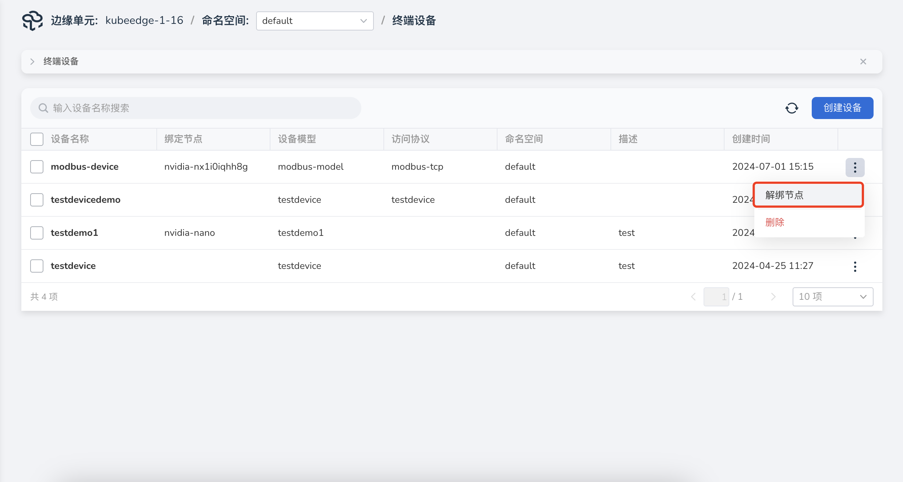
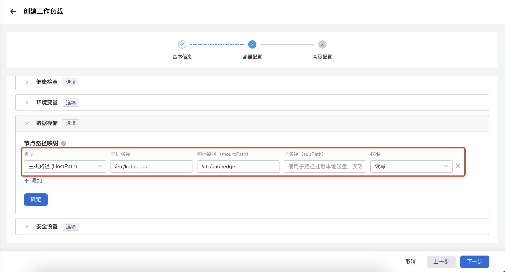
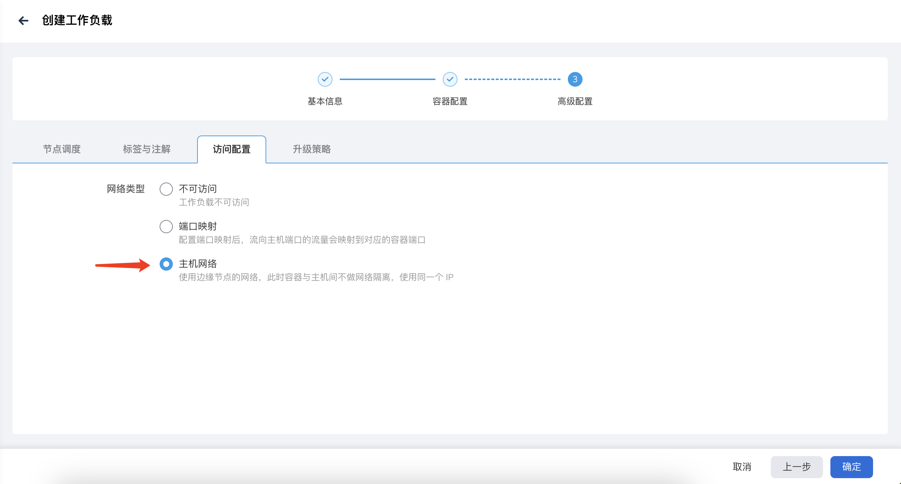
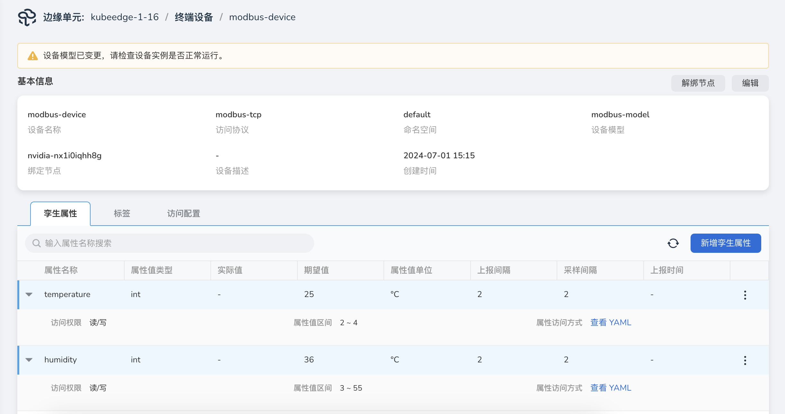

# Modbus 设备接入实践

本文介绍基于 Modbus 协议的终端设备接入边缘计算平台，并与云端交互的方法。本文以一个模拟设备为例，介绍整体实现流程。

接入流程：



## 准备工作

- 模拟 Modbus 协议终端设备，本文的终端设备以一个工作负载来模拟

    模拟设备镜像：**release-ci.daocloud.io/kant/modbusmock:v0.1.0**

- 设备 Mapper，基于 KubeEdge DMI 框架开发，实现了 Modbus 协议设备数据采集，此 mapper 仅适用于上文模拟设备

    Mapper 镜像：**release-ci.daocloud.io/kant/devicedemo:v1.1**

- 边缘节点，节点接入要求参见[边缘节点接入要求](../user-guide/node/join-rqmt.md)

## 终端设备连接边缘节点

由于本文中 Modbus 设备为模拟设备，故我们先将模拟设备镜像下发到边缘节点运行，模拟设备连接。部署流程参考[创建工作负载](../user-guide/edge-app/create-app.md)

创建工作负载-高级配置 参数说明：

- 节点调度，选择设备需要连接的节点
- 访问配置，网络类型选择主机网络

## 创建设备模型

设备模型创建流程参见[创建设备模型](../user-guide/device/create-device-model.md)

以下设备模型参数请跟如下设置保持一致：

- 访问协议名称：modbus-tcp
- 设备模型孪生属性中的属性名、属性类型、访问权限与下图保持一致

    

## 创建终端设备

1. 填写基础信息，设备模型选择上文创建的设备模型

2. 填写设备配置，模型中关联的孪生属性配置如下

    temperature 属性访问方式：

    ```yaml
    offset: 1  #寄存器的偏移量
    register: HoldingRegister  #保存寄存器
    ```

    humidity 属性访问方式：

    ```yaml
    offset: 1  #寄存器的偏移量
    register: InputRegister  #输入寄存器
    ```

    
    

3. 填写设备访问配置，配置参数如下

    ```yaml
    address: 0.0.0.0:11502
    ```

    

4. 设备创建成功后，自动跳转到设备列表，点击列表右侧 **绑定节点** 操作

    

## 部署设备 Mapper

设备 Mapper 主要用来采集设备数据，是一个无状态工作负载，Mapper 部署好后，即可获取到设备运行数据，在这个实践场景中，我们可以在设备详情页看到 Mapper 采集到的温湿度值。

在实际应用场景中，可以根据业务需要，修改 Mapper 的实现和行为，完成 DMI 标准的数据推送、数据拉取、数据存数据库、边端本地化处理、设备联动等功能。

!!! note

    创建终端设备和部署设备 Mapper 顺序可以调换。

设备 Mapper 镜像地址：

```shell
release-ci.daocloud.io/kant/devicedemo:v1.1
```

设备 Mapper 部署流程参见[创建工作负载](../user-guide/edge-app/create-app.md)

创建工作负载参数说明：

- 容器配置-数据存储，选择主机路径，**主机路径 /etc/kubeedge** 映射**容器路径 /etc/kubeedge**，权限为**读写权限**
- 高级配置-访问配置，网络类型选择**主机网络**
- 高级配置-节点调度，选择跟设备绑定的同一节点

    
    

## 验证设备运行效果

以上步骤完成后，前往设备详情页，可以在界面看到设备运行数据，此场景中我们可以看到温度和湿度值，本文中 mock 的设备，数据值不会发生改变。


