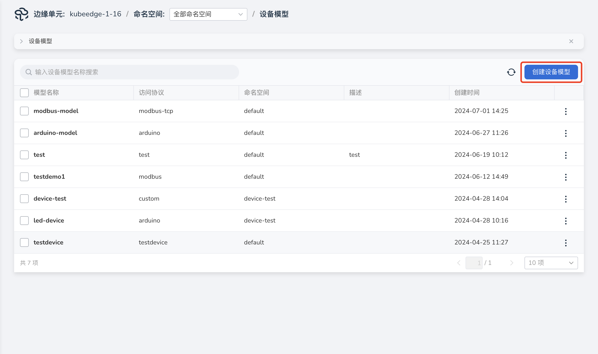
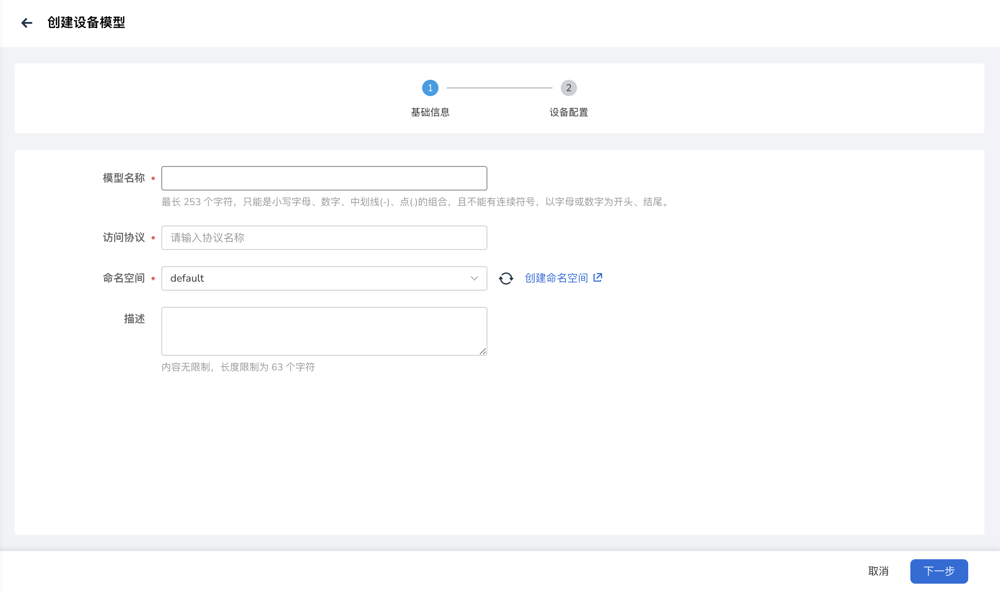
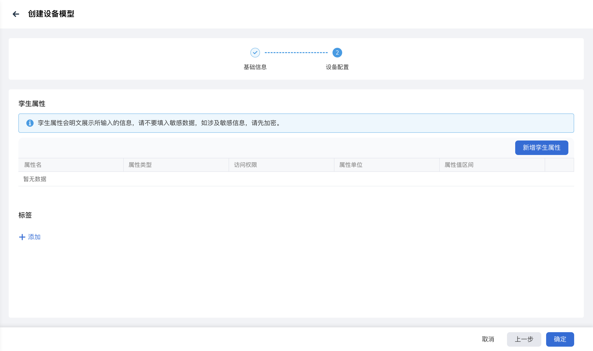
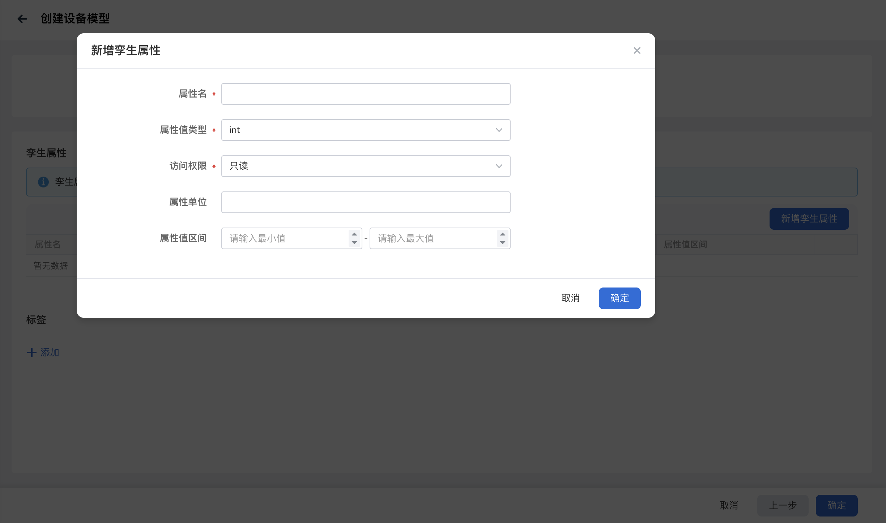

# 创建设备模型

设备模型是终端设备在云端的数字化表示，将设备共同特征抽象成数据模型，用属性来定义设备是什么，可以对外提供哪些信息。

本文介绍创建设备模型的操作步骤，流程如下：

1. 进入边缘单元详情页，选择左侧菜单 __边缘资源__ -> __设备模型__ 。

2. 点击终端设备列表右上角 __创建设备模型__ 按钮。

    

3. 填写基础信息。

    - 模型名称：小写字母、数字、中划线（-）、点（.）的组合，不能有连续符号；以字母或数字为开头、结尾；最多包含 253 个字符。
    - 访问协议：DCE 5.0 云边协同支持 Modbus 等多种协议设备接入。
    - 命名空间：设备所在命名空间，命名空间的资源相互隔离。
    - 描述：设备模型描述信息。

    

4. 填写设备配置，可以添加设备孪生属性和标签，关联的设备实例可以直接引用模型配置。

    - 孪生属性：选填，指终端设备的动态数据，包括专有实时数据，例如灯的开、关状态，温湿度传感器的温度、适度等。
    - 标签：选填，通过给设备打上标签，将不同设备进行分类管理。

    

    新增孪生属性，用户可以根据设备类型选择对应的寄存器类型，并填写对应的参数。参数说明如下：

    - 属性名：必填项，设备属性名称。
    - 属性值类型：必填项，属性值类型，选项包含 string、int、float、boolean。
    - 访问权限：设备孪生属性访问权限，选项包含 读/写、只读。
    - 属性值单位：选填，属性值单位。
    - 属性值区间：对获取的原始数据进行范围限定。

    

下一步：[创建终端设备](./create-device.md)