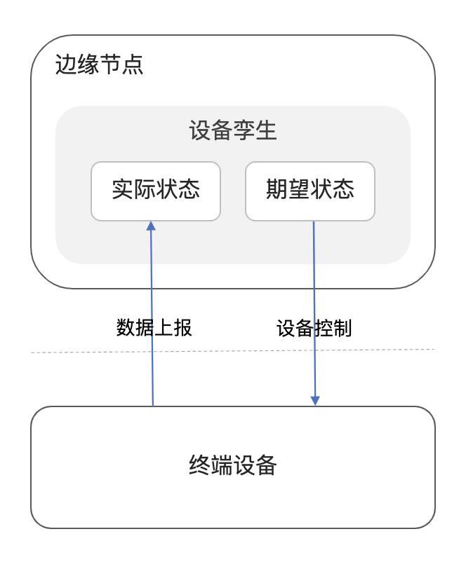

# 终端设备概述

## 终端设备

终端设备可以小到传感器、控制器，大到智能摄像机或工控机床。

终端设备可以连接到边缘节点，支持通过 Modbus 协议接入并进行统一管理。

## 设备孪生

设备孪生指终端设备的动态数据，包括专有实时数据，例如灯的开、关状态。这种数据也可以称为终端设备的孪生属性。

设备孪生具有与物理设备相同的特性，便于终端设备与应用之间进行更好地通信。应用发送的命令首先到达设备孪生，设备孪生根据应用设置的期望状态进行状态更新，此外终端设备实时反馈自身的实际状态，设备孪生同时记录终端设备的期望值和实际值。终端设备在离线状况下再次上线时，终端设备的状态也能得到同步。

在云边协同模块中可以创建终端设备，将终端设备与边缘节点关联，关联后会在边缘节点上保存被关联设备的孪生属性信息。边缘节点上的应用程序可在边缘节点获取设备孪生属性实际值，同时可以修改终端设备孪生期望值以修改设备状态。

## 使用流程

管理和控制终端设备，通常使用的步骤如下：

1. 创建终端设备
2. 将终端设备关联到边缘节点
3. 管理和控制终端设备，监测终端设备状态

下一步：[创建终端设备](create-device.md)
