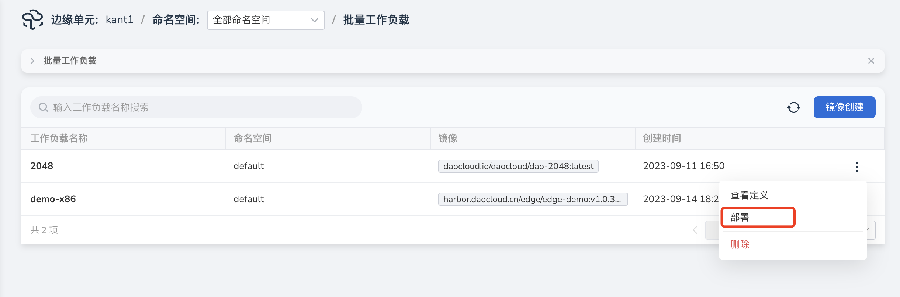
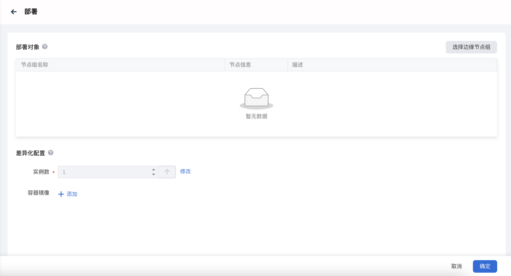
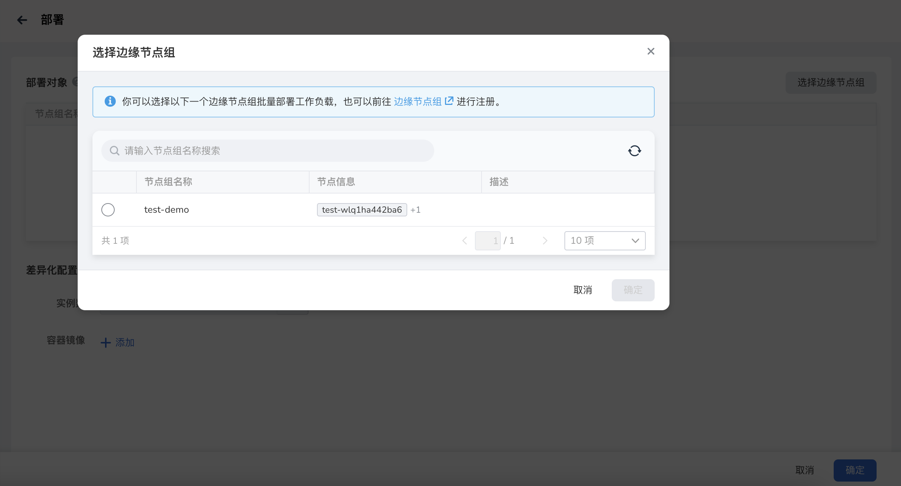
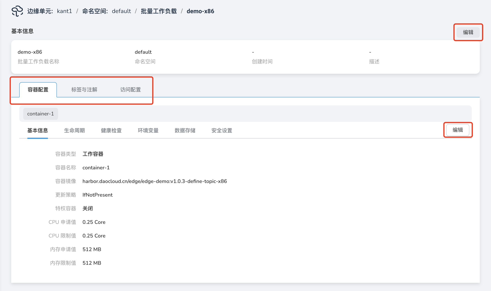

# 部署批量工作负载

本文介绍将批量工作负载定义部署到节点组的操作步骤。

## 前提条件

- 创建一个批量工作负载。
- 创建一个节点组。

## 部署

操作步骤如下：

1. 进入边缘单元详情页，选择左侧菜单`边缘应用` -> `批量工作负载`。

2. 在批量工作负载列表的右侧，点击`...`按钮，在弹出菜单中选择`部署。`

    

3. 填写相关参数。

    - 部署对象：需要部署批量工作负载的边缘节点组。
        
        单击`选择边缘节点组`，勾选需要选择的边缘节点组。页面左上角的搜索框输入节点组名称，可以快速检索想要部署的边缘节点组。

    - 差异化配置：支持对不同节点组的工作负载实例数和容器镜像进行差异化配置。
         
         说明：

         1. 默认实例数为批量工作负载定义的实例数，随着定义的修改而修改。修改后的实例数不受批量负载定义的更新影响。

         2. 支持对容器镜像的镜像、镜像仓、版本进行分段配置，配置后的分段对象不受批量负载定义的更新影响。

    
    

## 查看定义

将应用资源打包，抽象成一个应用定义，按照节点组部署，产生工作负载实例。支持对应用定义的基本信息、容器配置、标签与注解、访问配置进行编辑操作。

说明：更新工作负载定义配置后，除差异化配置外，所有已部署实例的原有配置将同步被替换。

操作步骤如下：

1. 进入边缘单元详情页，选择左侧菜单 边缘应用 -> 批量工作负载。

2. 在批量工作负载列表的右侧，点击 ... 按钮，在弹出菜单中选择 查看定义。

3. 在定义详情页，切换容器配置、标签与注解、访问配置 Tab，点击 编辑 按钮，进入对应编辑界面，完成定义配置修改操作。

