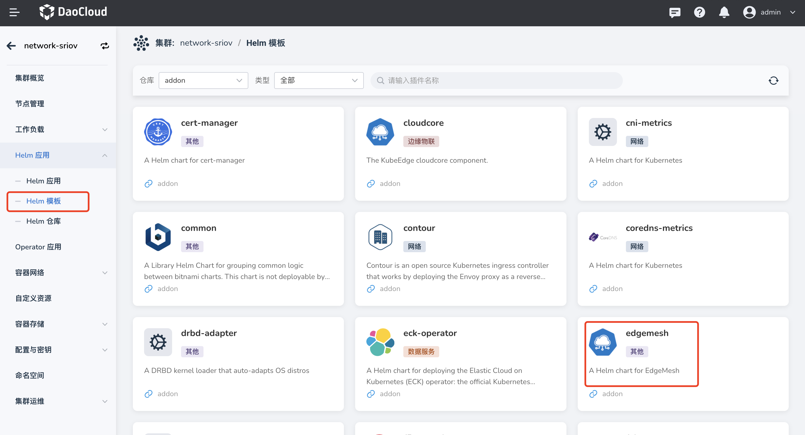
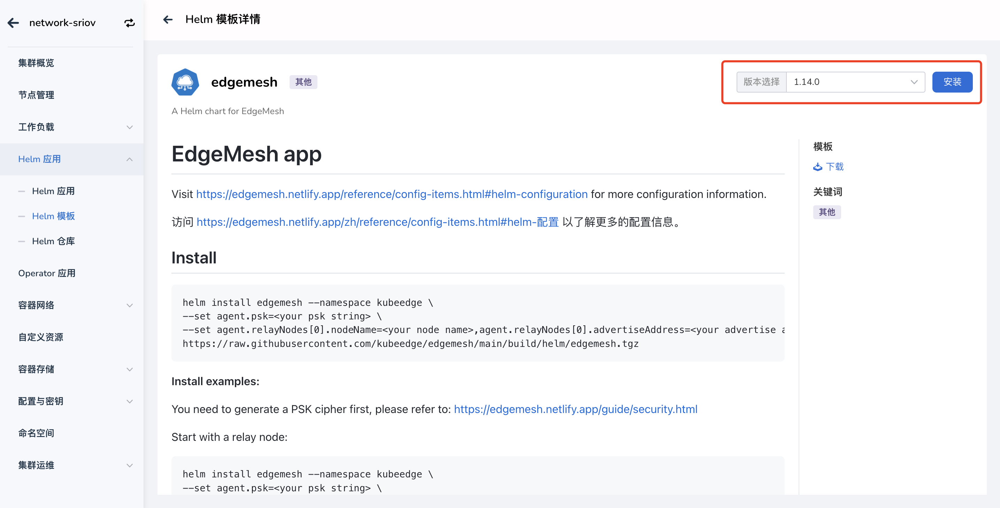
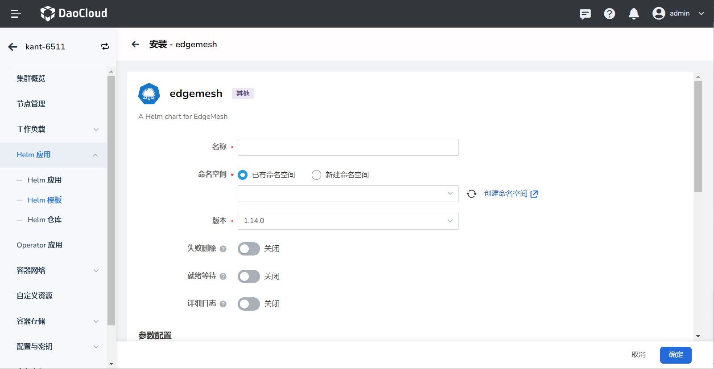

# 部署 EdgeMesh 应用

在使用应用网格能力前，需要先部署 EdgeMesh 应用，本文介绍具体操作流程。

## 前置准备

1. 去除 K8s master 节点的污点

    如果 K8s master 节点上有运行业务应用，并且需要访问集群节点上的其他应用，
    需要先去除 K8s master 节点的污点，执行如下命令。

    ```shell
    kubectl taint nodes --all node-role.kubernetes.io/master-
    ```

    !!! note
    
        如果 K8s master 节点上没有部署需要被代理的应用，可以跳过这一步。

2. 给 Kubernetes API 服务添加过滤标签

    正常情况下，为避免 EdgeMesh 去代理 Kubernetes API 服务，因此需要给它添加过滤标签，
    更多信息请参考[服务过滤](https://edgemesh.netlify.app/zh/advanced/hybird-proxy.html#%E6%9C%8D%E5%8A%A1%E8%BF%87%E6%BB%A4)。

    ```shell
    kubectl label services kubernetes service.edgemesh.kubeedge.io/service-proxy-name=""
    ```

## Helm 安装

操作步骤如下：

1. 选择左侧导航栏的`容器` -> `容器管理`，进入集群列表页面，点击`集群名称`，进入集群详情页。

2. 选择左侧菜单`Helm 应用` -> `Helm 模板`，在 `addon 仓库`下找到 EdgeMesh 插件。

    

3. 点击 edgemesh 条目，进入模板详情页。

4. 在页面右上角选择 EdgeMesh 版本，点击`安装`按钮，进入 EdgeMesh 安装页面。

    

5. 填写 edgemesh 基础配置。

    - 名称：小写字母、数字字符或“-”组成，并且必须以字母开头及字母或数字字符结尾。
    - 命名空间：EdgeMesh 应用所在命名空间。如果命名空间没有创建，可以选择`新建命名空间`。
    - 版本：结合实际业务需求，选择想要安装的 EdgeMesh 版本。
    - 失败删除：开启后，将默认同步开启安装等待。将在安装失败时删除安装。
    - 就绪等待：启用后，将等待应用下所有关联资源处于就绪状态才标记应用安装成功。
    - 详细日志：开启安装过程日志的详细输出。

    

6. YAML 参数配置。

!!! note

    在默认的 YAML 配置下，需要补充设置认证密码（PSK）和中继节点（Relay Node），否则会导致部署失败。

**PSK 和 Relay Node 设置说明**

```yaml
  # PSK：是一种认证密码，确保每个 edgemesh-agent 只有当拥有相同的 “PSK 密码” 时才能建立连接，更多信息请参考
  # [PSK](https://edgemesh.netlify.app/zh/guide/security.html)。建议使用 openssl 生成，也可以设置成自定义的随机字符串。
  psk: Juis9HP1XBouyO5pWGeZa8LtipDURrf17EJvUHcJGuQ=

  # Relay Node：是指在网络通信中转发数据包的节点。它在通信的源节点和目标节点之间起到桥接的作用，
  # 帮助数据包在网络中传输并绕过某些限制或障碍，EdgeMesh 中通常为云上节点，也可以添加多个中继节点。

  relayNodes:
  - nodeName: masternode
    advertiseAddress:
    - 10.31.223.12
 # - nodeName: <your relay node name2>
 #   advertiseAddress:
 #   - 2.2.2.2
 #   - 3.3.3.3
```

**参考示例**

```yaml
agent:
  image: kubeedge/edgemesh-agent:v1.14.0
  affinity: {}
  nodeSelector: {}
  tolerations: []
  resources:
    limits:
      cpu: 1
      memory: 256Mi
    requests:
      cpu: 0.5
      memory: 128Mi

  psk: Juis9HP1XBouyO5pWGeZa8LtipDURrf17EJvUHcJGuQ=

  relayNodes:
  - nodeName: masternode
    advertiseAddress:
    - 10.31.223.12

  modules:
    edgeProxy:
      enable: true
    edgeTunnel:
      enable: true
```

## 检验部署结果

部署完成后，可以执行以下命令检查 EdgeMesh 应用是否成功。

```shell
$ helm ls -A
NAME            NAMESPACE       REVISION        UPDATED                                 STATUS          CHART           APP VERSION
edgemesh        kubeedge        1               2022-09-18 12:21:47.097801805 +0800 CST deployed        edgemesh-0.1.0  latest

$ kubectl get all -n kubeedge -o wide
NAME                       READY   STATUS    RESTARTS   AGE   IP              NODE         NOMINATED NODE   READINESS GATES
pod/edgemesh-agent-7gf7g   1/1     Running   0          39s   192.168.0.71    k8s-node1    <none>           <none>
pod/edgemesh-agent-fwf86   1/1     Running   0          39s   192.168.0.229   k8s-master   <none>           <none>
pod/edgemesh-agent-twm6m   1/1     Running   0          39s   192.168.5.121   ke-edge2     <none>           <none>
pod/edgemesh-agent-xwxlp   1/1     Running   0          39s   192.168.5.187   ke-edge1     <none>           <none>

NAME                            DESIRED   CURRENT   READY   UP-TO-DATE   AVAILABLE   NODE SELECTOR   AGE   CONTAINERS       IMAGES                           SELECTOR
daemonset.apps/edgemesh-agent   4         4         4       4            4           <none>          39s   edgemesh-agent   kubeedge/edgemesh-agent:latest   k8s-app=kubeedge,kubeedge=edgemesh-agent
```

下一步：[创建服务](./server.md)
