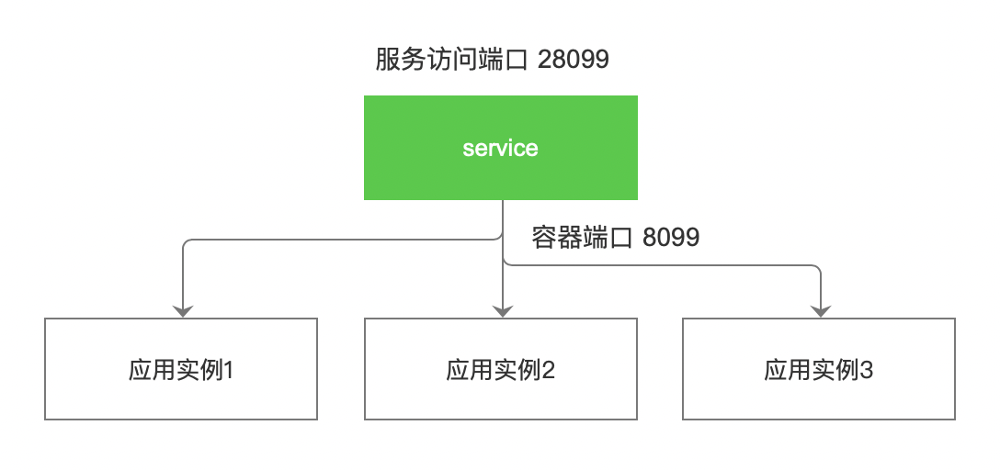

# 应用网格概述

边缘计算场景下，云端会纳管海量分散的边缘节点，而边缘节点往往处于弱网、网络抖动等极差网络环境，
网络拓扑较为复杂，不同区域的边缘节点往往网络不互通。为了解决边缘场景下边边业务之间通信的问题，
云边协同提供应用网格的能力，支持服务发现与流量代理，从而实现边缘业务流量闭环。

应用网格中有如下概念：

服务：服务定义了工作负载实例及访问实例的途径。使用服务名称可以代替 IP 地址，从而实现节点上应用间的相互访问。

如下图所示，边缘节点上的应用实例通过访问对应的服务，可以实现不同边缘节点上的应用实例的通信。

应用网格能力依赖 EdgeMesh 应用，用户在使用网格能力前，需要先部署 EdgeMesh 应用。
部署流程参考[部署 edgemesh 应用](./deploy-edgemesh.md)