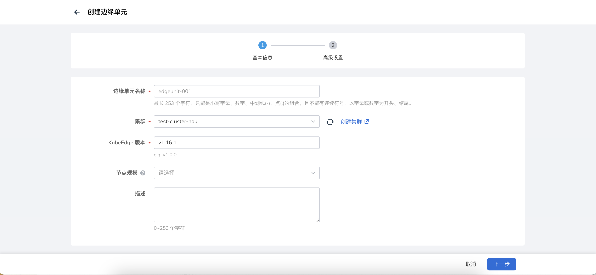
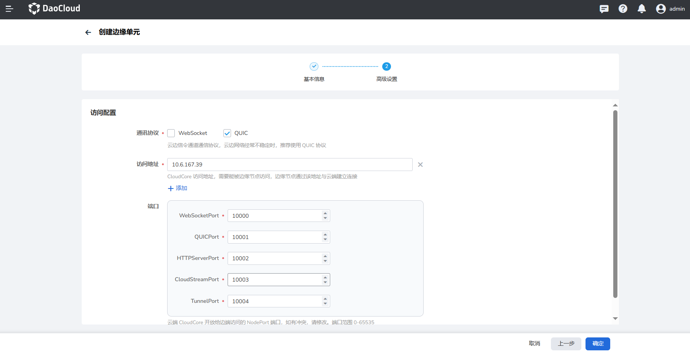

---
hide:
  - toc
---

# 创建外接边缘单元

**外接边缘单元** 指的是将企业系统中已安装的 KubeEdge 接入到 DCE 5.0 云边协同中进行统一管理。

KubeEdge：是一个开源系统，将原生的容器化应用程序编排功能扩展到边缘节点。

- CloudCore：KubeEdge 云端核心组件。
- ControllerManager：KubeEdge CRD 扩展，目前应用于边缘应用和边缘节点组。

下文说明创建外接边缘单元的步骤：

1. 选择左侧导航栏的 __云边协同__ ，进入边缘单元列表页面，点击页面右上角的 __创建边缘单元__ 按钮，在下拉列表中选择 __创建外接边缘单元__ ；

    

1. 填写基础信息；

    - 边缘单元名称：小写字母、数字、中划线（-）、点（.）的组合，不能有连续符号；以字母或数字为开头、结尾；最多包含 253 个字符。
    - 集群：运行边缘单元控制面的集群。
    - KubeEdge 版本：KubeEdge 开源系统发布的某一个版本，用于将容器化应用程序编排功能扩展到边缘的主机，
      它基于 kubernetes 构建，并为网络应用程序提供基础架构支持。

    <!--- 边缘组件副本数：云端边缘组件的副本数，确保云端节点故障时，边缘组件高可用。-->

    - 描述：边缘单元描述信息。

    !!! note

        如果您选择的集群是一个单节点集群，请确保 master 节点支持调度，即已删除污点 NoSchedule，避免系统组件安装失败。

    

1. 填写高级设置

    !!! note

        如果您是使用在线安装方式，则只需要填写访问配置，如果使用的是离线安装，则还需设置组件仓库信息。

    **访问设置**
    
    KubeEdge 云端组件的访问设置，边缘节点通过此设置与云端建立连接。

    - 通讯协议：云边信令通道通信协议，云边网络经常不稳定时，推荐使用 QUIC 协议。
    - 访问地址：KubeEdge 云端组件 CloudCore 的访问地址，需要能被边缘节点访问，边缘节点通过该地址与云端建立连接。
    - 端口：云端 CloudCore 默认给边端开放 NodePort 端口，如有冲突，请修改。
        - WebSocketPort ：访问协议 WebSocket 端口，默认10000。
        - QUICPort：访问协议 QUIC 端口，默认10001。
        - HTTPServerPort：HTTP 服务端口，默认10002。
        - CloudStreamPort：云端流处理接口端口，默认10003。
        - TunnelPort：边缘节点业务数据通道端口，默认10004。

    

1. 完成以上信息配置后，点击 __确定__ 按钮，完成边缘单元创建，自动返回边缘单元列表。

下一步：[管理边缘单元](./manage-unit.md)
