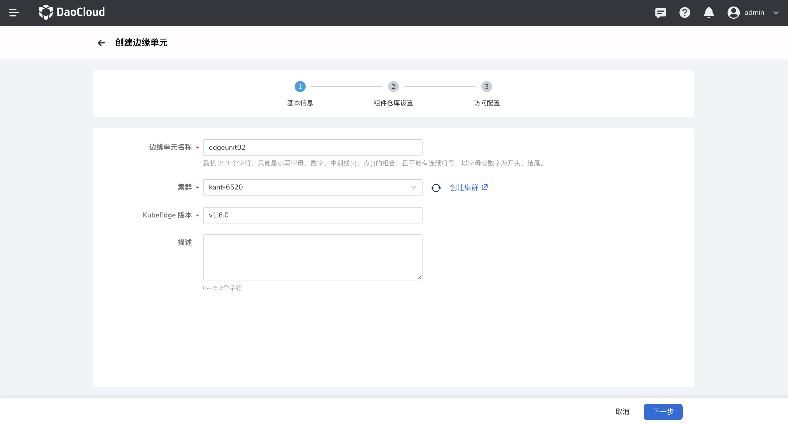
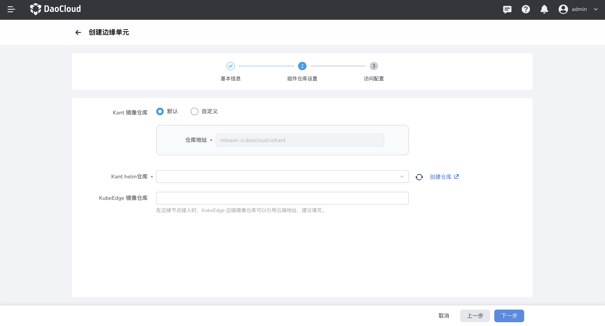

---
hide:
  - toc
---

# 创建外接边缘单元

**外接边缘单元** 指的是将企业系统中已安装的 KubeEdge 接入到 DCE 5.0 云边协同中进行统一管理。

KubeEdge：是一个开源系统，将原生的容器化应用程序编排功能扩展到边缘节点。

- CloudCore：KubeEdge 云端核心组件。
- ControllerManager：KubeEdge CRD 扩展，目前应用于边缘应用和边缘节点组。

下文说明创建外接边缘单元的步骤：

1. 选择左侧导航栏的 __云边协同__ ，进入边缘单元列表页面，点击页面右上角的 __创建边缘单元__ 按钮，在下拉列表中选择 __创建外接边缘单元__ ；

    

2. 填写基础信息；

    - 边缘单元名称：小写字母、数字、中划线（-）、点（.）的组合，不能有连续符号；以字母或数字为开头、结尾；最多包含 253 个字符。
    - 集群：运行边缘单元控制面的集群。
    - KubeEdge 版本：KubeEdge 开源系统发布的某一个版本，用于将容器化应用程序编排功能扩展到边缘的主机，
      它基于 kubernetes 构建，并为网络应用程序提供基础架构支持。

    <!--- 边缘组件副本数：云端边缘组件的副本数，确保云端节点故障时，边缘组件高可用。-->

    - 描述：边缘单元描述信息。

    !!! note

        如果您选择的集群是一个单节点集群，请确保 master 节点支持调度，即已删除污点 NoSchedule，避免系统组件安装失败。

    

3. 组件仓库设置。KubeEdge、Kant 的云端组件仓库设置；

    - Kant 镜像仓库：系统所需云端组件镜像仓库，Kant 代指云边协同模块。
        - 默认：系统提供的默认镜像仓库地址，存储云边协同模块所需云端组件镜像，像 kant-worker-admission;
        - 自定义：如果用户将系统云端组件镜像存储在自己的镜像仓库，用户可以选择自定义仓库地址。

    - Kant Helm 仓库：系统所需云端组件 helm 应用仓库，Kant 代指云边协同模块。如果下拉选项中没有您想要的 Helm 仓库，可以点击右侧 __创建仓库__ 按钮，创建新的 Helm 仓库。

    - KubeEdge 镜像仓库（可选）：KubeEdge 云端组件镜像仓库。

    !!! note

        在边缘节点接入时，KubeEdge 边端镜像仓库可以引用云端地址，建议填写。

    

4. 访问配置。KubeEdge 云端组件的访问设置，边缘节点通过此设置与云端建立连接；

    - 访问地址：KubeEdge 云端组件 CloudCore 的访问地址，需要能被边缘节点访问。

    - 端口：

        - WebSocketPort：访问协议 WebSocket 端口，默认 10000
        - QUICPort：访问协议 QUIC 端口，默认 10001
        - HTTPServerPort：HTTP 服务端口，默认 10002
        - CloudStreamPort：云端流处理接口端口，默认 10003
        - TunnelPort：边缘节点业务数据通道端口，默认 10004

    !!! note

        如果 NodePort 端口有冲突，请修改。

    

5. 完成以上信息配置后，点击 __确定__ 按钮，完成边缘单元创建，自动返回边缘单元列表。

下一步：[管理边缘单元](./manage-unit.md)
