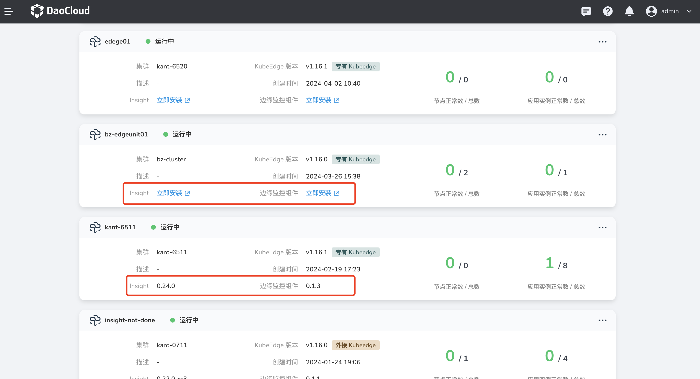
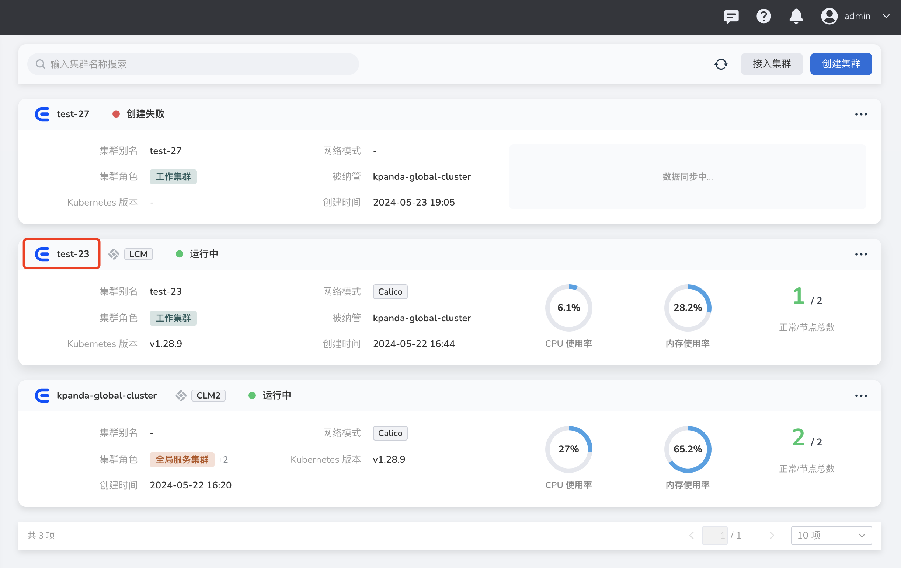
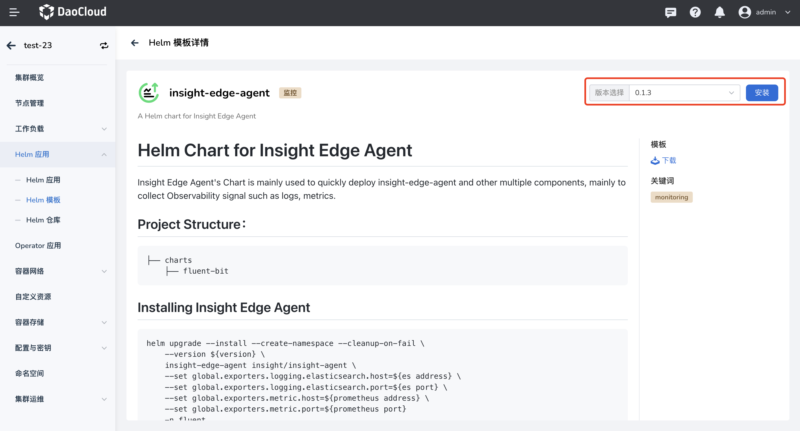
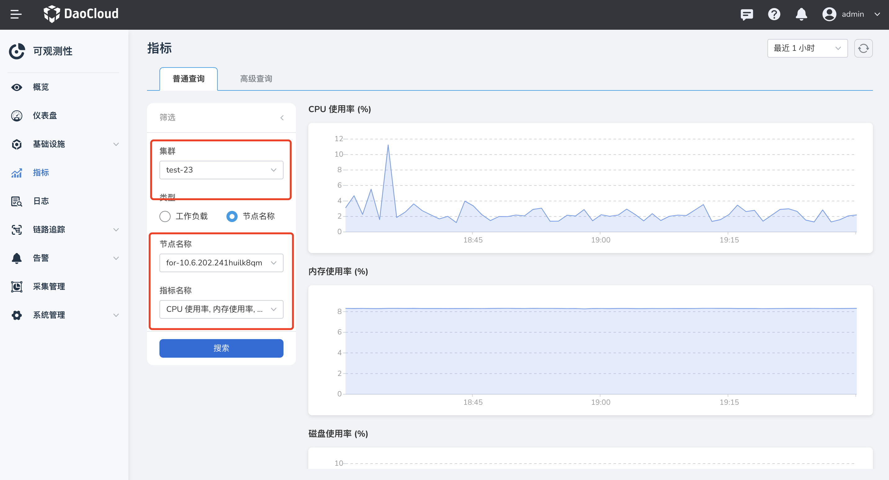

# 边缘资源监控

本文介绍如何在边缘单元开启监控能力，以实时查看边缘节点和边缘工作负载的状态及其资源使用情况。

边缘监控依赖 insight-agent 监控组件和边缘监控组件，下文介绍如何安装对应组件。

!!! note

    请先安装 insight-agent 监控组件，边缘监控组件依赖 Insight 相关插件。

## 检查是否安装监控组件

选择左侧导航栏的 __云边协同__ ，进入边缘单元列表页面，查看边缘单元条目中 Insight 和边缘组件显示信息：

- 显示版本号，代表监控组件已安装；
- 显示立即安装，代表监控组件未安装，点击 **立即安装** 按钮，跳转到对应的 Helm 应用详情页。



## 安装 insight-agent

insight-agent 是集群观测数据采集的插件，支持对指标、链路、日志数据的统一观测，安装流程参考 [在线安装 insight-agent](../../../insight/quickstart/install/install-agent.md)。

为避免 insight daemonset 组件被调度到边缘节点，需要给 **全局服务集群** 的 **insight-system** 命名空间下各 daemonset 组件加上以下亲和性设置。

```yaml
nodeAffinity:
  requiredDuringSchedulingIgnoredDuringExecution:
    nodeSelectorTerms:
      - matchExpressions:
        - key: node-role.kubernetes.io/edge
          operator: DoesNotExist
```


## 安装边缘监控组件

1. 选择左侧导航栏的 **容器管理** -> **集群列表** ，进入集群列表页面，点击 **集群名称** ，进入集群详情页。

    

2. 选择左侧菜单 **Helm 应用** -> **Helm 模板** ，在 addon 仓库下找到 insight-edge-agent 插件，点击进入模版详情页。

    

3. 在页面右上角选择 insight-edge-agent 版本，点击 **安装** 按钮，进入 insight-edge-agent 安装页面。

    

4. 在表单中分别填写全局管理集群和边缘工作集群中对应数据存储组件的地址，确认填写的信息无误后，点击 **确定** 。

    为实现对多集群观测数据的统一存储、查询，边缘集群需要将采集的观测数据上报给全局管理集群进行统一存储。

    - 在 **边缘工作集群** 获取 Prometheus 服务地址和端口，目前仅支持 NodePort 访问方式，故地址对应的是工作集群控制节点地址

        在 insight-system 命名空间下，输入如下命令，找到 9090 端口映射的服务端口

        ```shell
        kubectl get svc -n insight-system | grep prometheus
        ```

        !!! note

            如果 prometheus 服务默认访问方式为 ClusterIP，请修改为 NodePort 访问方式。

        

    - 在 **全局服务集群** 获取 elasticsearch 服务地址和端口，目前仅支持 NodePort 访问方式，故地址对应的是集群控制节点地址

        在 insight-system 或 mcamel-system 命名空间下，输入如下命令，找到 9200 端口映射的服务端口

        ```shell
        kubectl get service -n mcamel-system | grep es
        ```    

        

        !!! note

            其他参数默认不用修改。

        

5. 系统将自动返回 Helm 应用列表，当应用 **insight-edge-agent** 的状态从 **未就绪** 变为 **已部署** ，且所有的组件状态为 **运行中** 时，则安装成功。

## 查看边缘监控数据

边缘组件安装部署成功后，等待一段时间，可在 **可观测性** 模块查看边缘资源的数据。


