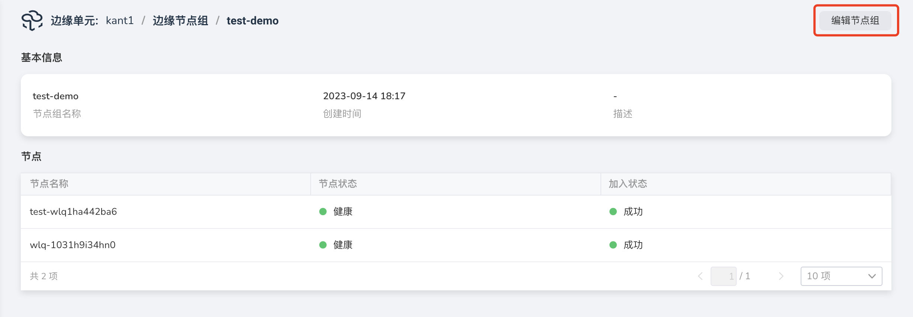
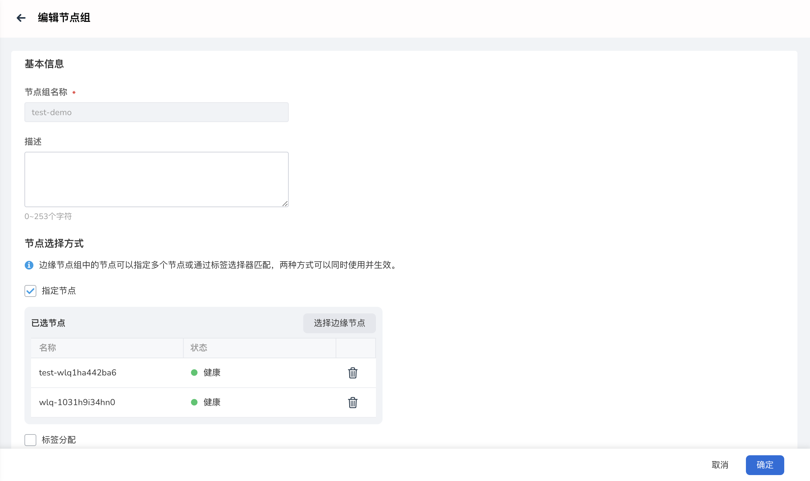

# 管理边缘节点组

本文说明对边缘节点组进行编辑、删除操作步骤。

## 编辑节点组

操作步骤如下：

1. 进入边缘单元详情页，选择左侧菜单`边缘资源` -> `边缘节点组`。

2. 点击边缘节点组列表中的`节点组名称`。

3. 节点组详情页，点击右上角`编辑节点组`按钮。

    

4. 编辑页面，修改节点组配置信息。

    

5. 点击`确定`，完成节点组配置修改，系统自动返回到节点组详情页。

## 删除节点组

操作步骤如下：

1. 进入边缘单元详情页，选择左侧菜单`边缘资源` -> `边缘节点组`。

2. 在节点组列表的右侧，点击 `⋮` 按钮，在弹出菜单中选择`删除`。

3. 输入节点组名称，点击`删除`，完成删除操作。

    
