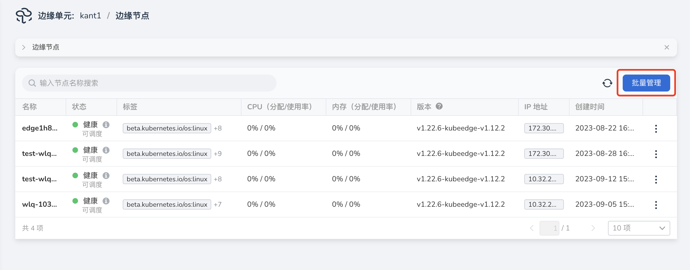
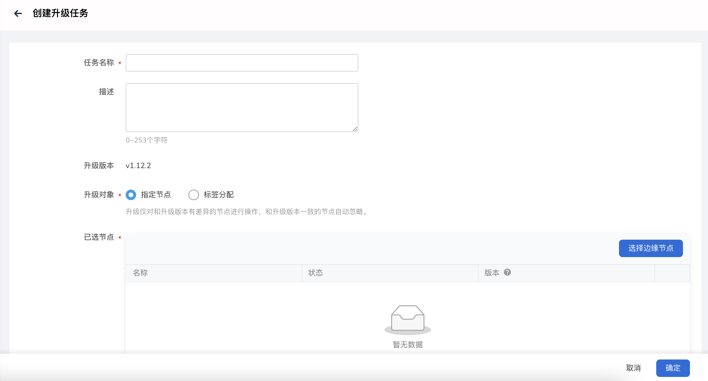

# 批量升级边缘节点

边缘节点上安装的边缘软件，像 EdgeCore、MQTT 等软件支持升级，平台会不定期发布新版本，用户可以根据需求升级边缘节点。

## 升级说明

- 升级任务中选中的节点无差别更新升级到与当前云端 CloudCore 版本一致。
  例如，当前云端 CloudCore 版本为 1.13，选中的节点版本有 1.12、1.14，那么升级版本统一为 1.13。
- 只有健康状态的节点可升级，包含可调度和暂停调度状态。
- 为了让您的边缘节点应用更稳定可靠的运行，需要由您在业务影响最小的时间窗内进行节点升级，以减轻对您业务的影响。
- 升级期间，边缘节点上的应用业务不会中断，如果您有使用消息路由功能，可能会有短暂影响。
- 请勿在节点升级过程中变更节点配置，比如重启 Docker、变更网络配置等，这些操作会增大节点升级失败风险。

## 操作步骤

1. 在边缘节点列表页面，点击`批量管理`按钮，进入`批量管理`页，选择`批量升级`页签，点击右上角`创建升级任务`按钮。

    

2. 填写相关参数。

    - 任务名称：批量升级任务名称不能为空，长度限制为63位。
    - 描述：批量升级任务描述信息。
    - 升级版本：升级版本与云端 CloudCore 版本一致。
    - 升级对象：需要升级的节点，可以是指定节点或通过标签匹配。

    > 说明：升级仅对与升级版本有差异的节点进行操作，与升级版本一致的节点将被自动忽略。

    

## 节点升级状态说明

- 升级中：节点正在进行升级操作。
- 升级成功：节点已经完成升级操作，并成功升级到与云端 CloudCore 版本一致。
- 升级失败回滚失败：节点升级失败，系统自动回滚到升级前版本失败。
  此时需要用户排查失败原因，查看 EdgeCore 等组件日志，并手动处理。
- 升级失败回滚成功：节点升级失败，系统自动回滚到升级前版本，回滚成功。
  可以查看失败原因，排查解决问题后再次尝试升级操作。
