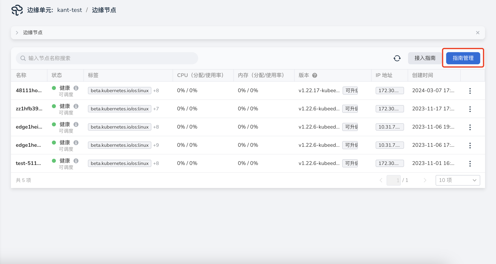
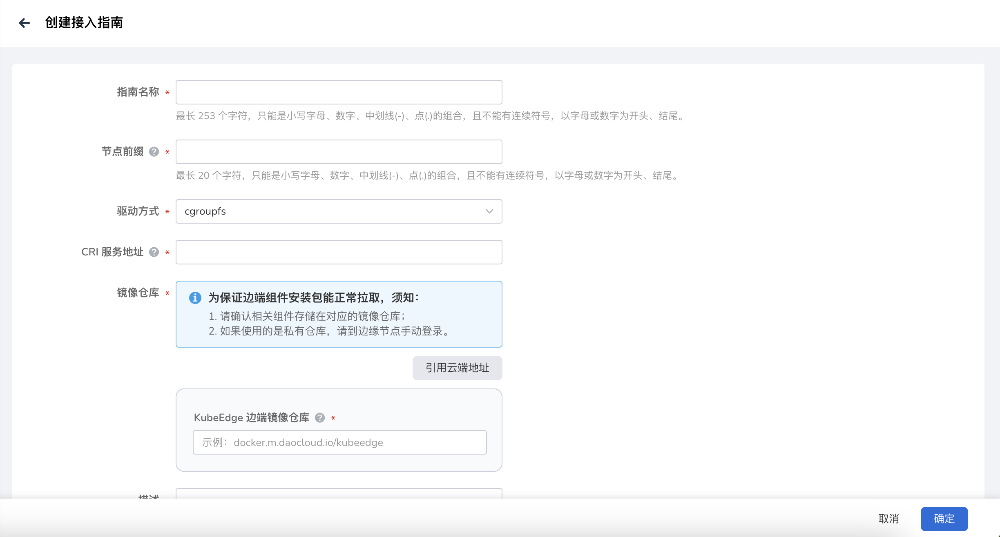

# 创建接入指南

相同类型的边缘节点能够设定相同的边缘节点配置，通过创建接入指南，获取边缘节点配置文件和安装程序。
安装指南与边缘节点满足一对多的关系，提高管理效率的同时，节约了运维成本。

下文说明创建接入指南的步骤和接入指南管理。

## 操作步骤

1. 边缘节点列表 页面，点击 **指南管理** 按钮，进入指南管理列表页，点击右上角 **创建接入指南** 按钮。

    

2. 填写注册信息。

    - 指南名称：指南名称不能为空，长度限制为 253 位。
    - 节点前缀：节点名称由“节点前缀-随机码”组成。
    - 驱动方式：控制组（CGroup）的驱动，用于对 Pod 和容器进行资源管理和资源配置，如CPU和内存资源的请求和限制。
    - CRI 服务地址：CRI Client 和 CRI Server 在本地进行通信的 socket 文件或者 TCP 地址，
      例如 __unix:///run/containerd/containerd.sock__ 
    - KubeEdge 边端镜像仓库：存储 KubeEdge 组件（Mosquitto、installation-package、pause）镜像仓库地址，如果边端镜像和云端镜像在一个镜像仓库，您可以点击 **引用云端地址** 按钮，快速填写。
    - 描述：接入指南描述信息。
    - 标签：接入指南标签信息。

    

3. 完成信息填写后，点击 **确定** 按钮，完成接入指南创建。

## 后续操作

完成指南创建后，您可以查看 **接入指南**，并根据接入流程提示，完成对边缘节点的纳管操作，具体请参见[节点接入指南](./access-guide.md)。
