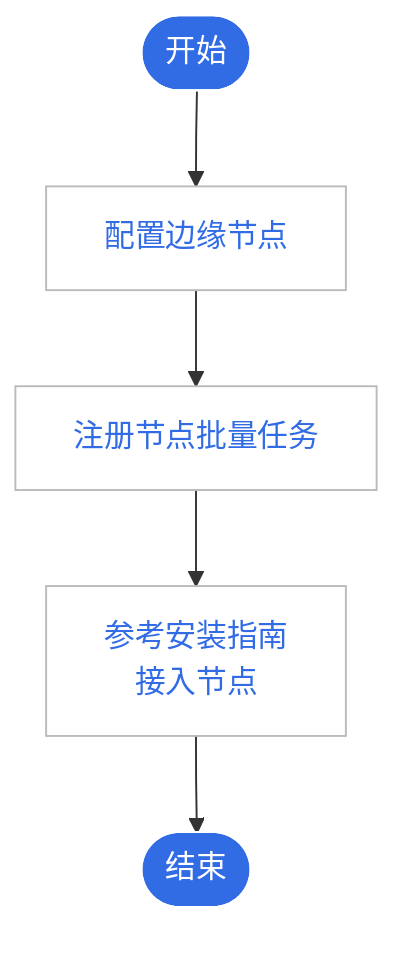

# 边缘节点概述

边缘节点是容器集群组成的基本元素，既可以是云主机，也可以是物理机，用于运行容器化应用的载体，
边缘应用将以 Pod 的形式在节点上运行。

管理边缘节点，需要完成如下操作步骤：

1. 准备边缘节点并完成节点环境配置，边缘节点需要满足一定的规格要求，具体请参见[边缘节点接入要求](./join-rqmt.md)。

2. 在云边协同模块创建接入指南，获取边缘节点配置文件和安装程序，具体请参见[创建接入指南](./create-access-guide.md)。

3. 根据安装指南，完成边缘节点的接入纳管，具体请参见[纳管边缘节点](./access-guide.md)。

使用流程如下：

