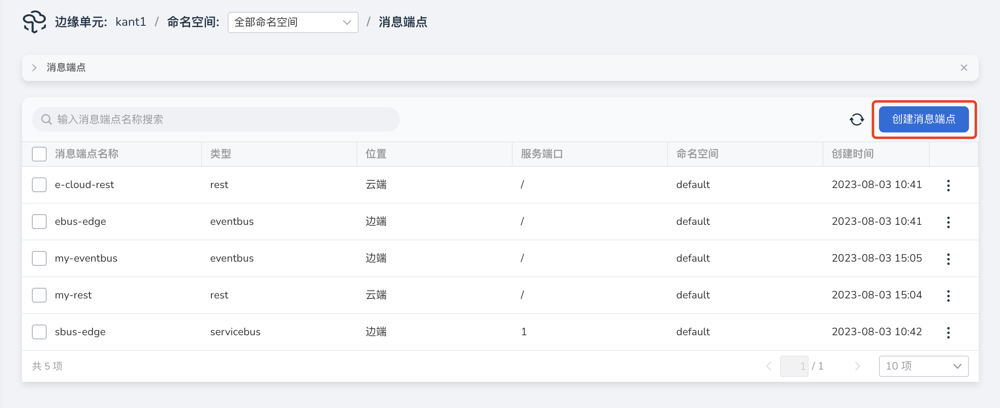
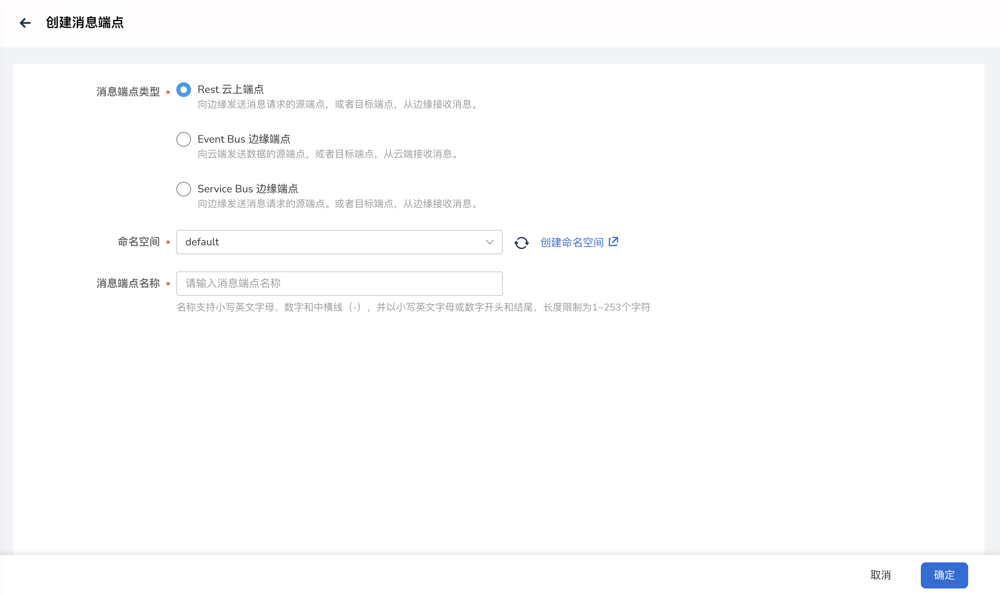
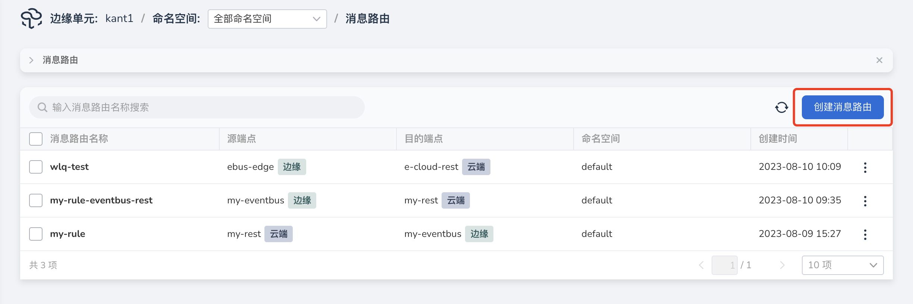
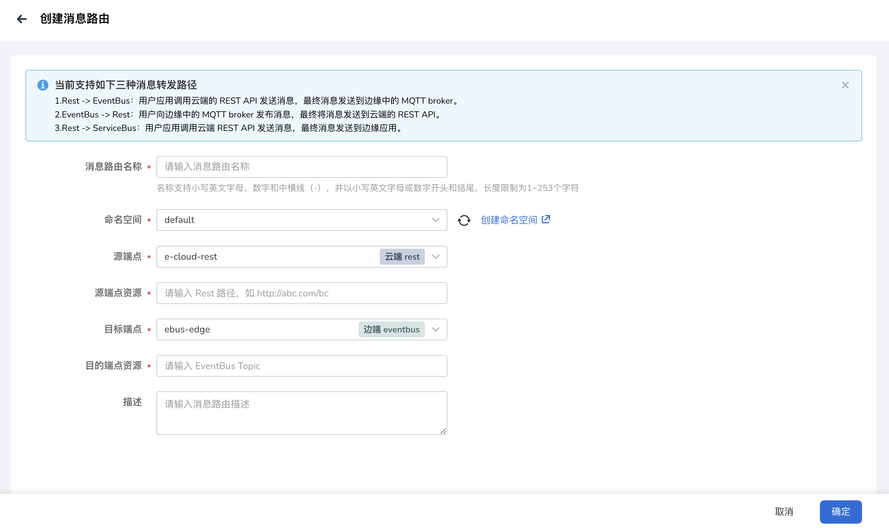
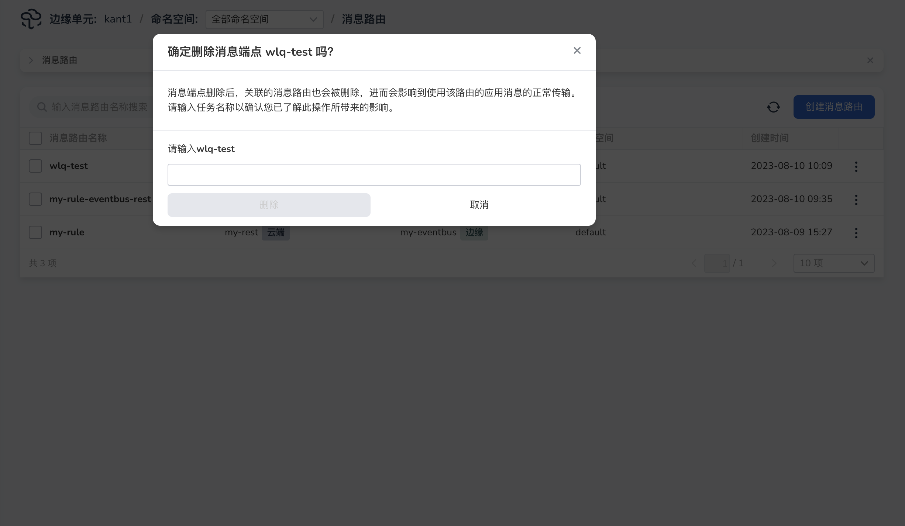

# 创建消息路由

本文介绍创建消息端点、消息路由以及删除消息路由的步骤。

## 创建消息端点

操作步骤如下：

1. 进入`边缘单元`详情页，选择左侧菜单`边云消息` -> `消息端点`。

2. 点击消息端点列表右上角`创建消息端点`按钮。

    

3. 填写相关参数。

    - 消息端点类型：选择类型，当前支持 Rest 云上端点、Event Bus 边缘端点、Service Bus 边缘端点。
    - 命名空间：消息端点所在命名空间。
    - 消息端点名称：输入消息端点名称。
    - 服务端口：只有类型为 Service Bus 的边缘端点需要填写，范围为1-65535。

4. 单击`确定`，即创建消息端点成功，返回到消息端点列表页面。

    

## 创建消息路由

操作步骤如下：

1. 进入`边缘单元`详情页，选择左侧菜单`边云消息` -> `消息路由`。

2. 点击消息路由列表右上角`创建消息路由`按钮。

    

3. 填写相关参数。

    - 消息路由名称：输入消息路由名称。
    - 命名空间：消息路由所在的命名空间。
    - 源端点：选择源端点，选项来源于创建的消息端点。
    - 源端点资源：
        - 当源端点为云端 Rest 类型，输入 Rest 路径，如 /abc/bc。
        - 当源端点为边端 Event Bus 类型，输入 Topic，由字母、数字、下划线（_）、中划线（-）、斜杠（/）组成。
    - 目标端点：选择目的端点，选项来源于创建的消息端点。
    - 目标端点资源：
        - 当目的端点为云端 Rest 类型，输入 URL，如 http://127.0.0.1:8080/hello。
        - 当目的端点为边端 Service Bus 类型，输入 Service Bus 路径，如 /abc/bc。

    

4. 单击`确定`，即创建路由规则成功，返回到消息路由列表页面。

路由规则创建完成后，系统将按照相应规则将发送到源端点指定资源的消息转发到目的端点的指定资源上。

## 删除消息路由

操作步骤如下：

1. 进入`边缘单元`详情页，选择左侧菜单`边云消息` -> `消息路由`。

2. 点击指定消息路由右侧`删除`按钮。

3. 在删除确认弹框中输入`消息路由名称`。

4. 点击`删除`，即删除成功，放回到消息路由列表页。

    