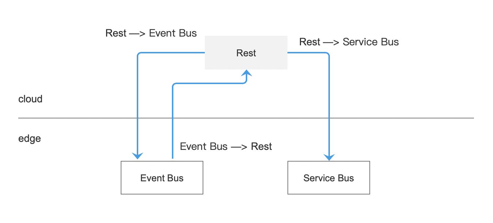

# 边云消息概述

云边协同提供了边云消息路由功能，用户可以配置消息路由，平台根据消息路由将消息转发至对应端点，让消息按照规定的路径转发，灵活控制数据路由，并提高数据安全性。

- 消息端点：发送或接收消息的一方，可以是边缘应用、云服务等。
- 消息路由：消息转发的路径。

## 消息端点

平台提供以下三种类型消息端点：

- Rest：云上端点，向边缘发送消息请求的源端点。或者目标端点，从边缘接收消息。
- Event Bus：边缘端点，向云端发送数据的源端点。或者目标端点，从云端接收消息。
- Service Bus：边缘端点，向边缘发送消息请求的源端点。或者目标端点，从边缘接收消息。

## 消息路由

对应不同类型的消息端点，平台提供以下消息转发路径：

- Rest -> EventBus：用户应用调用云端的 REST API 发送消息，最终消息发送到边缘中的 MQTT broker。
- EventBus -> Rest：用户向边缘中的 MQTT broker 发布消息，最终将消息发送到云端的 REST API。
- Rest -> ServiceBus：用户应用调用云端 REST API 发送消息，最终消息发送到边缘应用。

后续操作：[创建消息路由](./create-route.md)