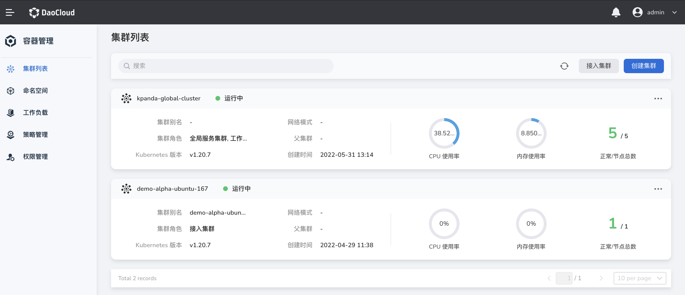
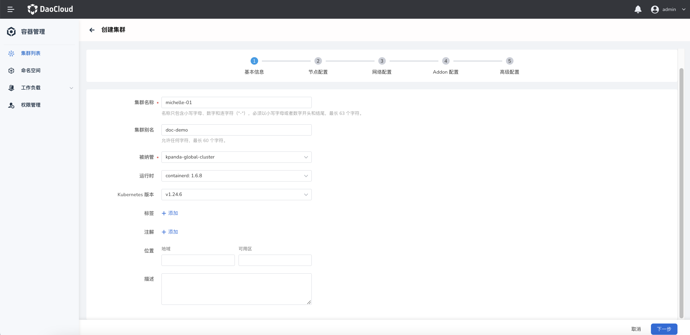
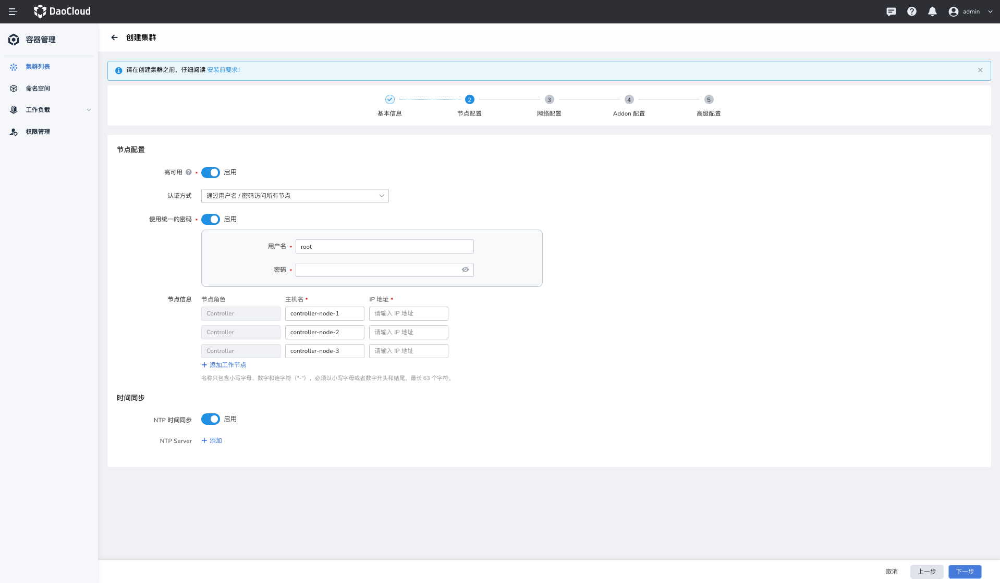
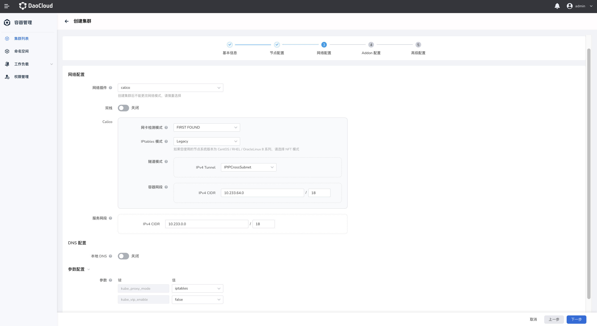
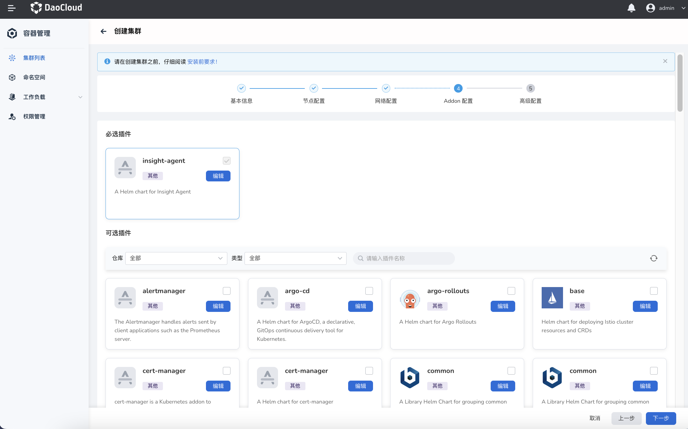
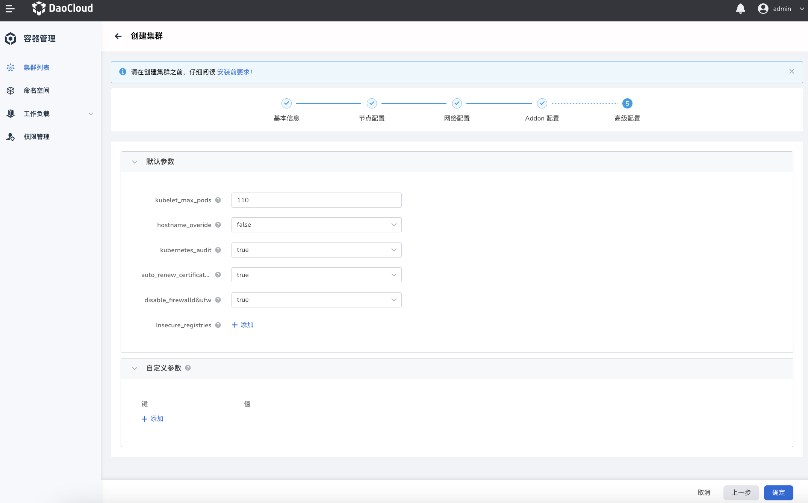
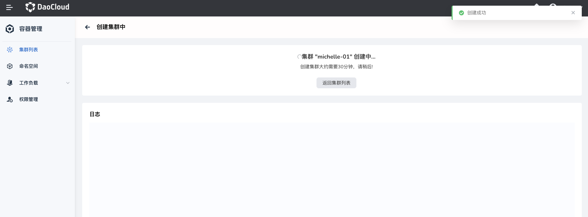
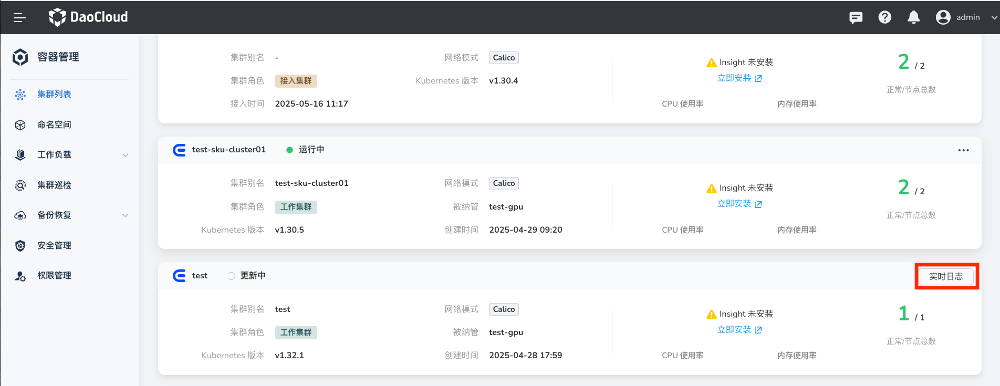

# 创建工作集群

在 DCE 5.0 容器管理模块中，[集群角色](./ClusterRole.md#集群角色)分四类：全局服务集群、管理集群、工作集群、接入集群。其中，接入集群只能从第三方厂商接入，参见[接入集群](JoinACluster.md)。

本页介绍如何创建工作集群。

## 前提条件

创建集群之前需要满足一定的前提条件：

- Kubernetes 版本 1.22+
- 目标主机需要允许 IPv4 转发。如果 Pod 和 Service 使用的是 IPv6，则目标服务器需要允许 IPv6 转发。
- DCE 暂不提供对防火墙的管理功能，您需要预先自行定义目标主机防火墙规则。为了避免创建集群的过程中出现问题，建议禁用目标主机的防火墙。
- 参阅[节点可用性检查](../Nodes/NodeCheck.md)

## 操作步骤

1. 在`集群列表`页面中，点击`创建集群`按钮。

    

2. 参考下列要求填写集群基本信息，并点击`下一步`。

    - 集群名称：名称只包含小写字母、数字和连字符（"-"），必须以小写字母或者数字开头和结尾，最长 63 个字符。
    - 被纳管：选择由哪个集群来管理此集群，例如在集群生命周期中创建、升级、节点扩缩容、删除集群等。
    - 运行时：选择集群的运行时环境，目前支持 containerd 和 docker。
    - Kubernetes 版本：支持 v1.23.0 至 v 1.25.3。

        

3. 填写节点配置信息，并点击`下一步`。

    - 高可用：开启后需要提供至少 3 个控制器节点。关闭后，只提供 1 个控制器节点即可。

        > 生产环境中建议使用高可用模式。

    - 认证方式：选择通过用户名/密码还是公私钥访问节点。

        > 如果使用公私钥方式访问节点，需要预先配置节点的 SSH 密钥。参阅[使用 SSH 密钥认证节点](../Nodes/NodeConfig.md)。

    - 使用统一的密码：开启后集群中所有节点的访问密码都相同，需要在下方输入访问所有节点的统一密码。如果关闭，则可以为每个节点设置单独的用户名和密码。

    - 节点检查：预先检查节点的连通性。这是非强制性的，可以跳过检查。
    - NTP 时间同步：开启后会自动同步各个节点上的时间。

        

4. 填写网络配置信息，并点击`下一步`。

    - 网络插件：负责为集群内的 Pod 提供网络服务，**创建集群后不可更改网络插件**。支持 [cilium](../../../network/modules/cilium/what.md) 和 [calico](../../../network/modules/calico/what.md)。选择 `none` 表示暂不安装网络插件。
    - 容器网断：集群下容器使用的网段，决定集群下容器的数量上限。创建后不可修改。
    - 服务网段：同一集群下容器互相访问时使用的 Service 资源的网段，决定 Service 资源的上限。创建后不可修改。

        

5. 填写插件配置信息，并点击`下一步`。

    

6. 填写高级配置信息，并点击`确定`。

    - `kubelet_max_pods`：设置每个节点的最大 Pod 数量，默认为 110 个。
    - `hostname_overide`：重置主机名，建议使用默认值，采用系统默认生成的名称作为主机名称。
    - `kubernetes_audit`：Kubernetes 的审计日志，默认开启。
    - `auto_renew_certificate`：在每月第一个星期一自动更新 Kubernetes 控制平面证书，默认开启。
    - `disable_firewalld&ufw`：禁用防火墙，避免节点在安装过程中无法被访问。
    - `Insecure_registries`：私有镜像仓库配置。使用私有镜像仓库创建集群时，为了避免证书问题导致容器引擎拒绝访问，需要在这里填写私有镜像仓库地址，以绕过容器引擎的证书认证而获取镜像。
    - `yum_repos`：填写 Yum 源仓库地址。

        

## 完成创建

填写正确信息并完成上述步骤后，页面会提示集群正在创建中。

!!! note

    创建集群耗时较长，需要耐心等待。其间，可以点击`返回集群列表`按钮回到集群列表页面，等待集群创建完成。
    如需查看当前状态，可点击`实时日志`。

