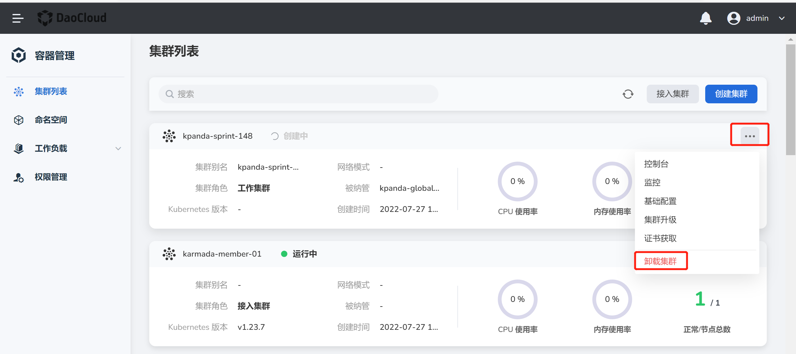
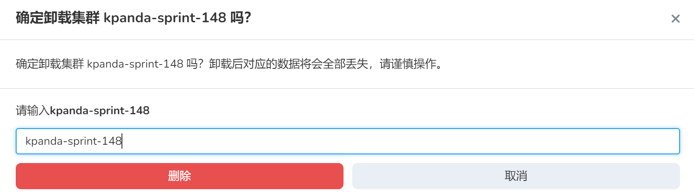
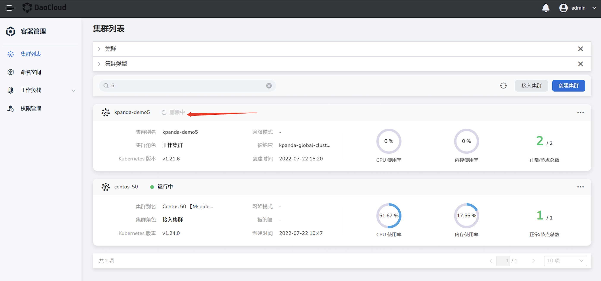

---
hide:
  - toc
---

# 卸载/解除集群接入

通过 DCE 5.0 [容器管理](../../03ProductBrief/what.md)平台创建的集群支持`卸载集群`或`解除接入`操作，从其他环境直接接入的集群仅支持`解除接入`操作。二者的区别在于：

- `卸载集群`操作会销毁该集群，并重置集群下所有节点的数据。所有数据都将被销毁，建议做好备份。后期需要时必须重新创建一个集群。
- `解除接入`只是将该集群从容器管理模块中移除，不会摧毁集群，也不会销毁数据。后期需要时重新接入即可。

!!! note

    - 当前操作用户应具备 [Admin](../../../ghippo/04UserGuide/01access-control/role.md) 或 [`Kpanda Owner`](../../../ghippo/04UserGuide/01access-control/global.md) 权限才能执行卸载或解除接入的操作。
    - 卸载集群之前，应该在`集群设置`->`高级配置`中关闭`集群删除保护`，否则不显示`卸载集群`的选项。

1. 在`集群列表`页找到需要卸载/解除接入的集群，点击右侧的 `...` 并在下拉列表中点击`卸载集群`/`解除接入`。

    

2. 输入集群名称进行确认，然后点击`删除`。

    

3. 返回`集群列表`页可以看到该集群的状态已经变成`删除中`。卸载集群可能需要一段时间，请您耐心等候。

    
