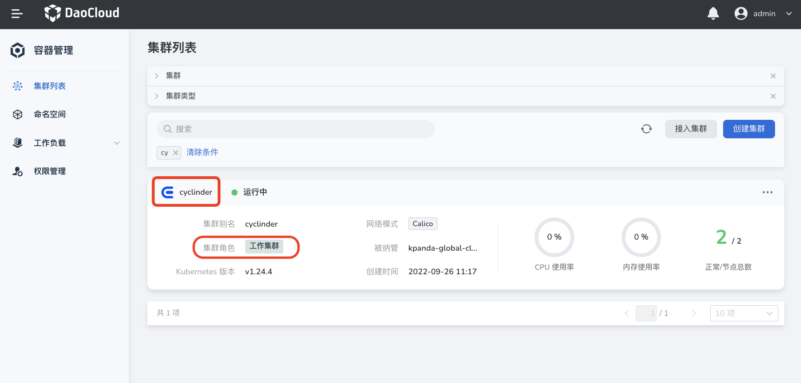
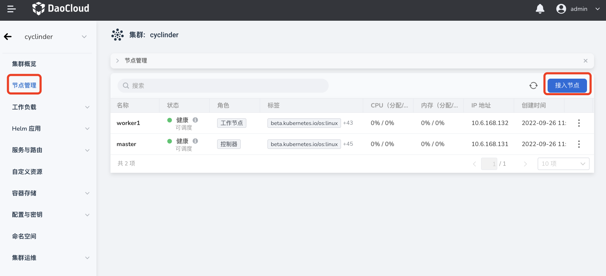
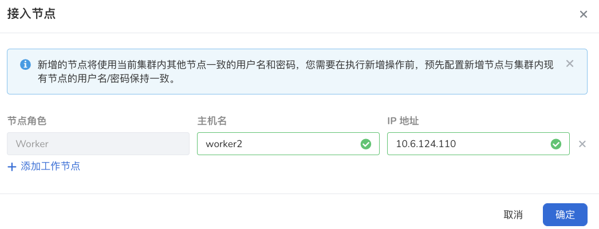

---
hide:
  - toc
---

# 集群节点扩容

随着业务应用不断增长，集群资源日趋紧张，这时可以基于 KubeSpray 对集群节点进行扩容。扩容后，应用可以运行在新增的节点上，缓解资源压力。

只有通过容器管理平台[创建的集群](../Clusters/CreateCluster.md)才支持节点扩缩容，从外部接入的集群不支持此操作。

1. 在`集群列表`页面点击目标集群的名称。

    若`集群角色`中带有`接入集群`的标签，则说明该集群不支持节点扩缩容。

    

2. 在左侧导航栏点击`节点管理`，然后在页面右上角点击`接入节点`。

    

3. 输入主机名称和节点 IP 并点击`确定`。

    点击`➕ 添加工作节点`可以继续接入更多节点。

    

!!! note

    接入节点大约需要 20 分钟，请您耐心等待。
