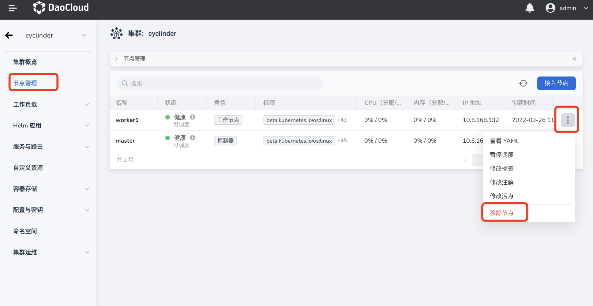
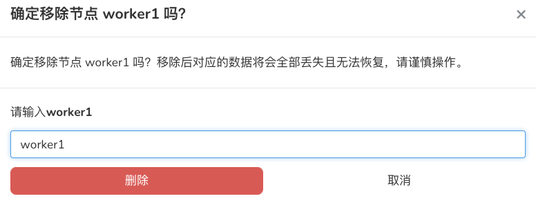

# 集群节点缩容

需要调整集群规模时，可以卸载部分节点。卸载后，应用无法继续运行在此节点上。

## 前提条件

- 当前操作用户具有 [`Cluster Admin`](../Permissions/PermissionBrief.md) 角色授权 。
- 卸载节点之前，需要确认节点已暂停调度，并且此节点上的应用都已驱逐至其他节点。

    - 驱逐方式：登录控制器节点，通过 kubectl drain 命令驱逐节点上所有 Pod 。安全驱逐的方式可以允许容器组里面的容器执行优雅地中止。

## 操作步骤

1. 在`集群列表`页面点击集群名称

    

2. 在左侧导航栏点击`节点管理`，找到需要卸载的节点，点击 `ⵗ` 选择`移除节点`

    

3. 输入节点名称,并点击`删除`进行确认

    

!!! note

      1. 集群节点缩容时，只能逐个进行卸载，无法批量卸载。

      2. 如需卸载集群控制器节点，需要确保最终控制器节点数为 **奇数**。

      3. 集群节点缩容时不可下线 **第一个控制器** 节点。如果必须执行此操作，请联系售后工程师。
