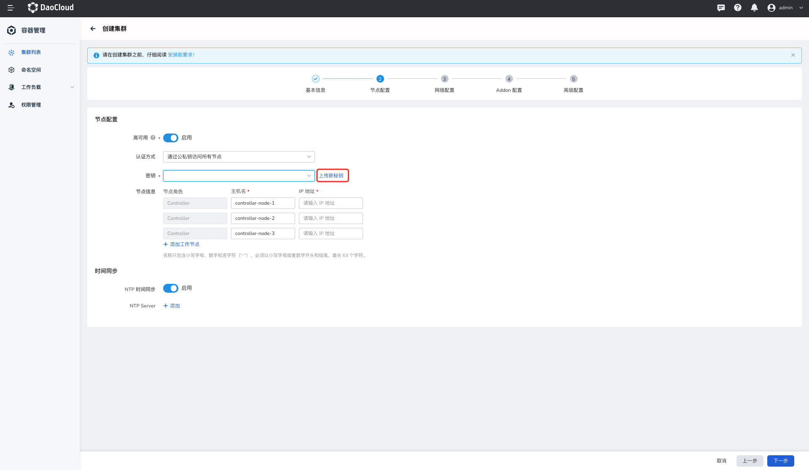

# 节点配置

## 使用 SSH 密钥认证节点

如果您选择使用 SSH 密钥方式连接所有待创建集群的节点，您需要按照如下说明配置公私钥。

1. 执行如下命令，在被纳管集群的任意节点上生成公私钥。

    ```yaml
    cd /root/.ssh #进入 .ssh 路径
    ssh-keygen -t rsa  #生成密钥
    ```

2. 执行 `ls` 命令查看管理集群上的密钥是否创建成功，正确反馈如下：

    ```yaml
    ls #查看目录下所有文件，预期输出如下：
    id_rsa  id_rsa.pub  known_hosts
    ```

其中名为 `id_rsa` 的文件是私钥，名为 `id_rsa.pub` 的文件是公钥。

3. 将公钥文件 `id_rsa.pub` 通过 SCP 的方式发送到待创建集群的所有节点上。

    ```yaml
    scp /root/.ssh/id_rsa.pub root@10.0.0.0:/root/.ssh/id_rsa.pub
    ```

将上面命令中的 root@10.0.0.0 用户账户和 IP 替换为待创建集群的节点 用户名和 IP。规划的每台待创建集群的节点都需要执行相同的操作。

4. 将私钥文件 `id_rsa` 进行 base 64 编码。

    ```yaml
    base64 id_rsa #将私钥文件进行 base64 格式编码
    ```

5. 将编码后的私钥文件 `id_rsa` 下载到您当前节点上，并在界面完成私钥文件的上传。

    