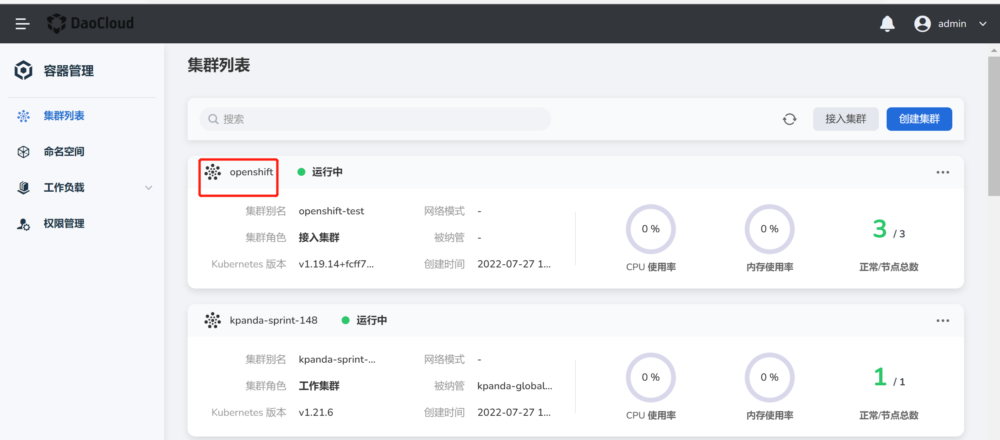
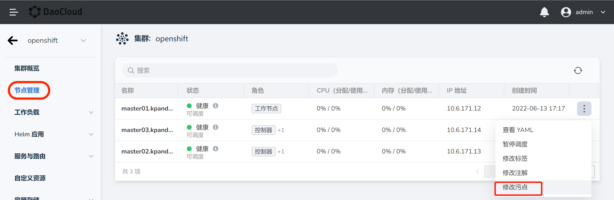
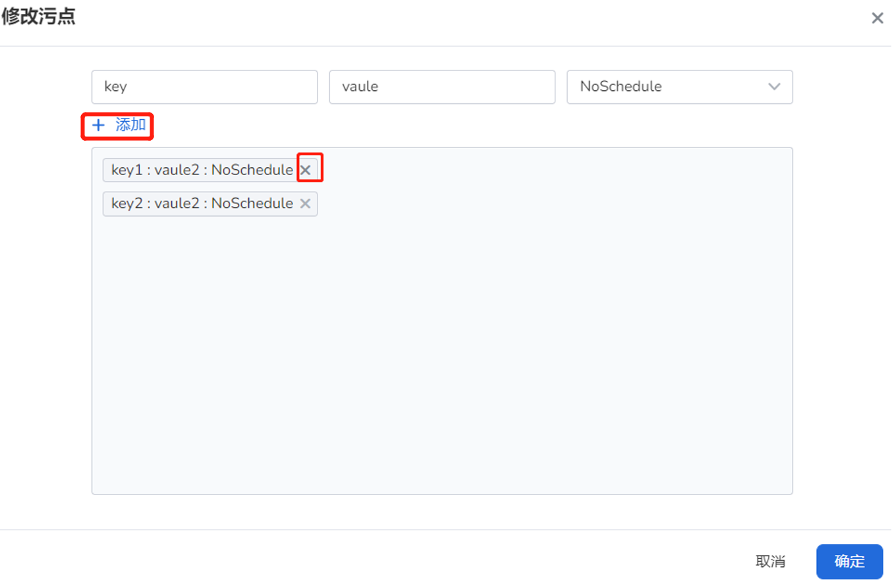

# 节点污点管理

污点 (Taint) 能够使节点排斥某一类 Pod，避免 Pod 被调度到该节点上。
每个节点上可以应用一个或多个污点，不能容忍这些污点的 Pod 则不会被调度该节点上。
有关污点的更多详情，可参考 Kubernetes 官方文档[污点和容忍度](https://kubernetes.io/zh-cn/docs/concepts/scheduling-eviction/taint-and-toleration/)。

## 注意事项

1. 当前操作用户应具备 [`NS Edit`](../Permissions/PermissionBrief.md) 角色授权或其他更高权限。
2. 为节点添加污点之后，只有能容忍该污点的 Pod 才能被调度到该节点。<!--有关如何为 Pod 设置容忍度，可参考-->

## 操作步骤

1. 在`集群列表`页找到目标集群，点击集群名称，进入`集群概览`页面。

    

2. 在左侧导航栏，点击`节点管理`，找到需要修改污点的节点，点击右侧的 `ⵗ` 操作图标并点击`修改污点`按钮。

    

3. 在弹框内输入污点的键值信息，选择污点效果，点击`确定`。

    点击 `➕ 添加`可以为节点添加多个污点，点击污点效果右侧的 `X` 可以删除污点。

    目前支持三种污点效果：

    - NoSchedule：不能容忍某个污点的 Pod 不会被调度到存在该污点的节点上。
    - PreferNoSchedule：**尽量避免** 将不能容忍某个污点的 Pod 不会被调度到存在该污点的节点上。
    - NoExecute：保持现状。如果不能容忍某个污点的 Pod 在节点设置污点之前，已经运行在该节点上，也不会驱逐该 Pod。如果不能容忍某个污点的 Pod 在节点设置污点之前，还未运行在该节点上，则不会被调度到该节点。

        
