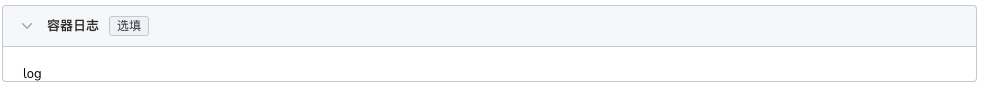

# 通过镜像创建定时任务

定时任务（CronJob） 适用于于执行周期性的操作场景，例如备份、报告生成等。这些任务可以配置为周期性重复的（例如：每天/每周/每月一次）；您可以定义任务开始执行的时间间隔。

## 前提条件

通过镜像创建 CronJob 之前，需要满足以下前提条件：

- 容器管理平台[已接入 Kubernetes 集群](../Clusters/JoinACluster.md)或者[已创建 Kubernetes 集群](../Clusters/CreateCluster.md)，且能够访问集群的 UI 界面。

- 已完成一个[命名空间的创建](../Namespaces/createns.md)、[用户的创建](../../../ghippo/04UserGuide/01UserandAccess/User.md)，用户应具有 [`NS Edit`](../Permissions/PermissionBrief.md#ns-edit) 或更高权限 ，详情可参考[命名空间授权](../Permissions/Cluster-NSAuth.md)。

- 单个实例中有多个容器时，请确保容器使用的端口不冲突，否则部署会失效。

参考以下步骤，创建一个 CronJob。

## 镜像创建

1. 以 `NS Edit` 用户成功登录后，点击左上角的`集群列表`进入集群列表页面。点击一个集群名称，进入`集群详情`。

    

2. 点击左侧导航栏的`工作负载`进入工作负载列表，点击`定时任务`页签，点击右上角`镜像创建`按钮。

    

3. 屏幕将显示`创建定时任务`页面。

## 基本信息配置

进入部署页面，根据下表配置信息。完成后点击`下一步`。

- 负载名称：输入新建工作负载的名称，命名必须唯一。请输入4 到 63 个字符的字符串，可以包含小写英文字母、数字和中划线（-），并以小写英文字母开头，小写英文字母或数字结尾。例如 cronjob-01。
- 集群：选择新建工作负载所在的集群。在集群内创建工作负载时，将在当前集群中创建工作负载。集群不可更改。当在集群外部创建工作负载时，将在所选集群创建工作负载。例如 Cluster-01。
- 命名空间：选择新建工作负载所在的命名空间。关于命名空间更多信息请参考[命名空间概述](../Namespaces/createns.md)。若您不设置命名空间，系统会默认使用 default 命名空间。例如 Namespace-01。
- 实例数：输入工作负载的 Pod 实例数量。若您不设置实例数量，系统会默认创建 2 个 Pod 实例。
- 描述：输入工作负载的描述信息，内容自定义。字符数量应不超过 512 个。

## 容器配置

容器配置仅针对单个容器进行配置，如需在一个容器组中添加多个容器，可点击左侧的 `+` 添加多个容器。

完成以下所有容器配置信息后，点击`下一步`。

=== "基本信息（必填）"

    

    按照以下输入信息后，点击`确认`。

    - 容器名称：输入新建容器的名称。请输入 4 到 63 个字符的字符串，可以包含小写英文字母、数字和中划线（-），并以小写英文字母开头，小写英文字母或数字结尾。例如 backup_log。
    - 容器镜像：从镜像仓库选择的镜像名称，同时也支持手动输入镜像名称（名称需为镜像仓库中已有的镜像名，否则将无法获取），如需对接外部私有镜像，需要先[创建镜像仓库密钥](../ConfigMapsandSecrets/create-secret.md)，然后拉取镜像。例如 backupjob。
    - 更新策略：容器执行更新时，镜像拉取策略。开启后工作负载每次重启/升级均会重新拉取镜像，否则只会在节点上不存在同名同版本镜像时拉取镜像。默认为：总是拉取镜像。
    - 特权容器：默认情况下，容器不可以访问宿主机上的任何设备，开启特权容器后，容器即可访问宿主机上的所有设备，享有宿主机上的运行进程的所有权限。默认启用。
    - CPU 配额：容器 CPU 资源的最低使用量和最高限度。申请：容器需要使用的最小 CPU 值。限制：允许容器使用的 CPU 最大值。建议设容器配额的最高限额，避免容器资源超额导致系统故障。
    - 内存配额：容器内存资源的最低使用量和最高限度。申请：容器需要使用的最小内存值。限制：允许容器使用的内存最大值。建议设容器配额的最高限额，避免容器资源超额导致系统故障。

=== "生命周期（选填）"

    容器生命周期配置用于设置容器启动时、启动后、停止前需要执行的命令。具体详情请参照[容器生命周期配置](PodConfig/lifescycle.md)。

    

=== "健康检查（选填）"

    容器健康检查用于判断容器和应用的健康状态。有助于提高应用的可用性。具体详情请参考[容器健康检查配置](PodConfig/healthcheck.md)。

    

=== "环境变量（选填）"

    容器环境变量配置用于配置 Pod 内的容器参数，为 Pod 添加环境标志或传递配置等。具体详情请参考[容器环境变量配置](PodConfig/EnvironmentVariables.md)。

    

=== "数据存储（选填）"

    容器数据存储配置用于配置容器挂载数据卷和数据持久化设置。具体详情请参考[容器数据存储配置](PodConfig/EnvironmentVariables.md)。

    

=== "安全设置（选填）"

    按照下表对容器权限进行设置，保护系统和其他容器不受其影响。

    

=== "容器日志（选填）"

    设置容器日志采集策略、配置日志目录。用于收集容器日志便于统一管理和分析。具体详情请参考[容器日志配置](PodConfig/EnvironmentVariables.md)。
    
    

## 定时任务配置

- 定时规则：可基于 小时、天、周、月进行规则设置。默认为 2。
- 并发规则：是否允许多个 Job 任务并行执行。

    - `Forbid`：在前一个任务未完成时，不创建新任务，如果新任务的执行时间到了而老任务没有执行完，CronJob 会忽略新任务的执行。
    - `Allow`：定时任务支持新建 Job，多个任务可并行。
    - `Replace`：已到新任务创建时间点，但前一个任务还未完成，新的任务会取代前一个任务。
    
- 任务记录：可设定任务执行成功或失败的任务记录数量，如设置为 0 表示不保留。保留成功任务数：0。保留失败任务数：0。
- 超时时间：当任务执行超出该时间时，任务将会被标识为执行失败，任务下的所有 Pod 都会被删除。为空时表示不设置超时时间。默认值为 600 ms。
- 重试次数：任务可重试次数，默认值为 6。
- 重启策略：任务执行是否重启，支持的重启策略为：不重启、失败时重启。

## 高级配置

除了基本信息配置，DCE 还提供了丰富的高级配置，可对的升级策略、调度策略、标签与注解等功能进行配置。

### 标签与注解

可以点击`添加`按钮为工作负载实例 Pod 添加标签和注解。

### 完成创建

确认所有参数输入完成后，点击`创建`按钮，完成工作负载创建。等待工作负载状态变为`运行中`。
如果工作负载状态出现异常，请查看具体异常信息，可参考[工作负载状态](../Workloads/PodConfig/workload-status.md)。
