# 创建有状态负载（StatefulSet）

有状态负载（StatefulSet）是运行在 Kubernetes 上的一种在运行过程中需要保存数据和状态的应用。和其它工作负载类似，有状态负载也是由 Pod 构成。通过 Daocloud 容器管理平台，您可以基于所拥有的权限轻松管理多云多集群上的工作负载，包括对有状态负载的创建、更新、删除、弹性扩缩、重启、版本回退等全生命周期管理。

本文介绍如何通过镜像创建有状态负载。

## 前提条件

在使用镜像创建有状态负载之前，需要满足以下前提条件：

- 容器管理平台[已接入 Kubernetes 集群](../Clusters/JoinACluster.md)或者[已创建 Kubernetes 集群](../Clusters/CreateCluster.md)，且能够访问集群的 UI 界面。

- 已完成一个[命名空间的创建](../Namespaces/createns.md)、[用户的创建](../../../ghippo/04UserGuide/01UserandAccess/User.md)，用户应具有 [`NS Edit`](../Permissions/PermissionBrief.md#ns-edit) 或更高权限，详情可参考[命名空间授权](../Namespaces/createns.md)。

- 如果需要为 StatefulSet 挂载存储卷，需要先创建存储卷。

- 单个实例中有多个容器时，请确保容器使用的端口不冲突，否则部署会失效。

## 镜像创建

参考以下步骤，使用镜像创建一个有状态工作负载。

### 基本信息配置

1. 以 `NS Edit` 用户成功登录后，点击左侧导航栏上的`集群列表`进入集群列表页面。点击一个集群名称，进入`集群详情`。

    

2. 点击左侧导航栏的`工作负载`进入工作负载列表，点击`有状态负载`页签，点击右上角`镜像创建`按钮。

    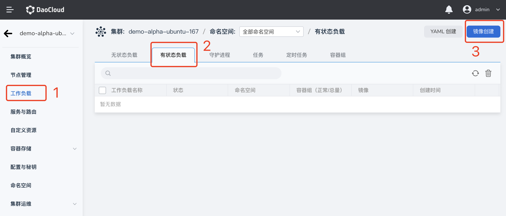

3. 在`创建有状态负载`页面中，根据下表输入信息后，点击`下一步`。

    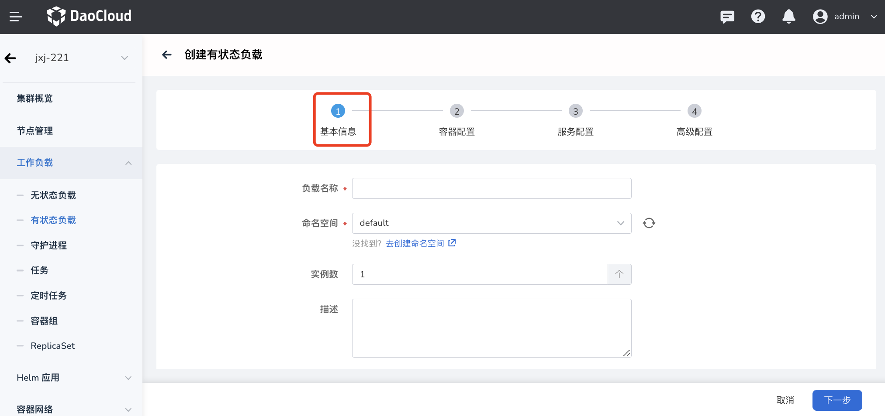

    - 负载名称：输入新建工作负载的名称，命名必须唯一。请注意名称最长 63 个字符，只能包含小写字母、数字及分隔符（“_”）,且必须以小写字母或数字开头及结尾。例如 statefulset-01。
    - 集群：选择新建工作负载所在的集群。在集群内创建工作负载时，将在当前集群中创建工作负载。集群不可更改。当在集群外部创建工作负载时，将在所选集群创建工作负载。例如 Cluster-01。
    - 命名空间：选择新建工作负载所在的命名空间。关于命名空间更多信息请参考[命名空间概述](../Namespaces/createns.md)。若您不设置命名空间，系统会默认使用 default 命名空间。
    - 实例数：输入工作负载的 Pod 实例数量。若您不设置实例数量，系统会默认创建 2 个 Pod 实例。
    - 描述：输入工作负载的描述信息，内容自定义。字符数量应不超过 512 个。例如：这是一个有状态负载，主要用来运行 Mysql 服务。

### 容器配置

在配置容器相关参数时，您必须正确配置容器的名称、镜像参数，否则将无法进入下一步。如果您需在一个容器组中添加多个容器，可点击右侧的 `+` 添加多个容器。

完成以下所有容器配置信息后，点击`下一步`。

=== "基本信息（必填）"

    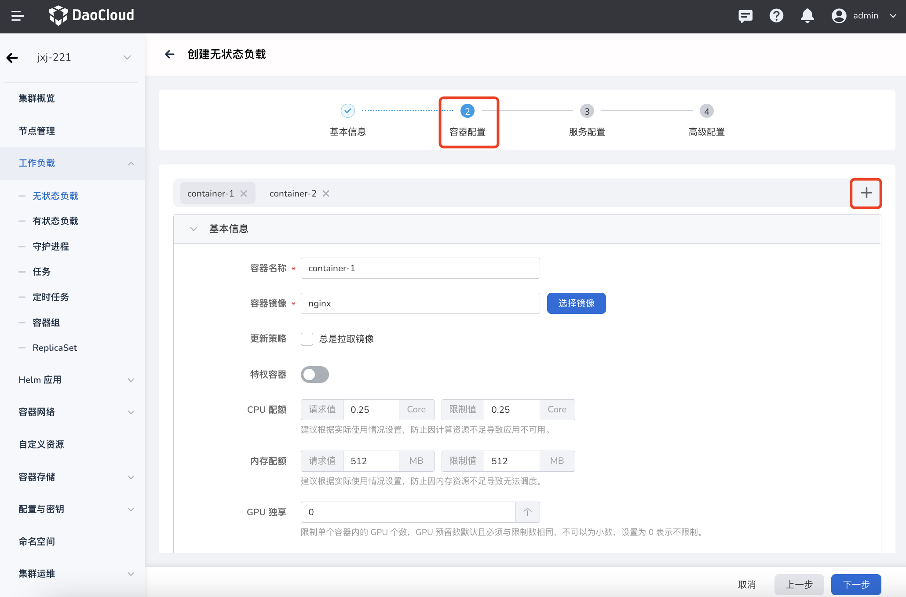

    按照以下输入信息后，点击`确认`。

    - 容器名称：请注意名称最长63个字符，只能包含小写字母、数字及分隔符（“_”）,且必须以小写字母或数字开头及结尾。例如 nginx-01。
    - 容器镜像：选择镜像仓库后输入镜像名称或镜像地址来选择镜像。请注意，镜像名称必须为镜像仓库中已有的镜像名，否则将无法获取）。例如 您可以选择`公共镜像仓库` 后 输入 “nginx” 来部署 nginx 镜像。
    - 更新策略：当对容器执行更新时，[镜像拉取策略](https://kubernetes.io/zh-cn/docs/concepts/containers/images/#image-pull-policy)。默认不启用`总是拉取镜像策略`，即在工作负载每次重启/升级时拉取本地镜像,当镜像在本地不存在时将会从镜像仓库重新拉取。如果启用`总是拉取镜像策略`将默认从仓库重新拉取镜像。
    - 特权容器：默认情况下，容器不可以访问宿主机上的任何设备，开启特权容器后，容器即可访问宿主机上的所有设备，享有宿主机上的运行进程的所有权限。默认启用。
    - CPU 配额：容器 CPU 资源的最低使用量和最高使用量。申请：容器需要使用的最小 CPU 用量。限制：允许容器使用的最大 CPU 用量。请根据需要为容器配置 CPU 配额，避免资源浪费和因容器资源超额导致系统故障。默认为 0.25，0.25。
    - 内存配额：容器内存资源的最低使用量和最高使用量。申请：容器需要使用的最小内用量。限制：允许容器使用的内存最大用量。请根据需要为容器配置 CPU 配额，避免资源浪费和因容器资源超额导致系统故障。默认为 512 MB，512 MB。
    - GPU 配额：为集群配置 GPU 使用配额，需要管理员预先在集群节点上安装 GPU 卡及驱动插件，并在 **集群设置** 上开启了 GPU 特性后，您才能为集群配置 GPU 配额。GPU 配额设置支持为容器设置独享整张 GPU 卡或部分 vGPUs。例如，您有一张 8 核心的 GPU 卡，您可以输入数字 `8` 让容器独享整长卡，也可以输入数字 `1` 为容器配置 1 核心的 vGPU。

=== "生命周期（选填）"

    容器生命周期配置用于设置容器启动时、启动后、停止前需要执行的命令。具体详情请参照[容器生命周期配置](PodConfig/lifescycle.md)。

    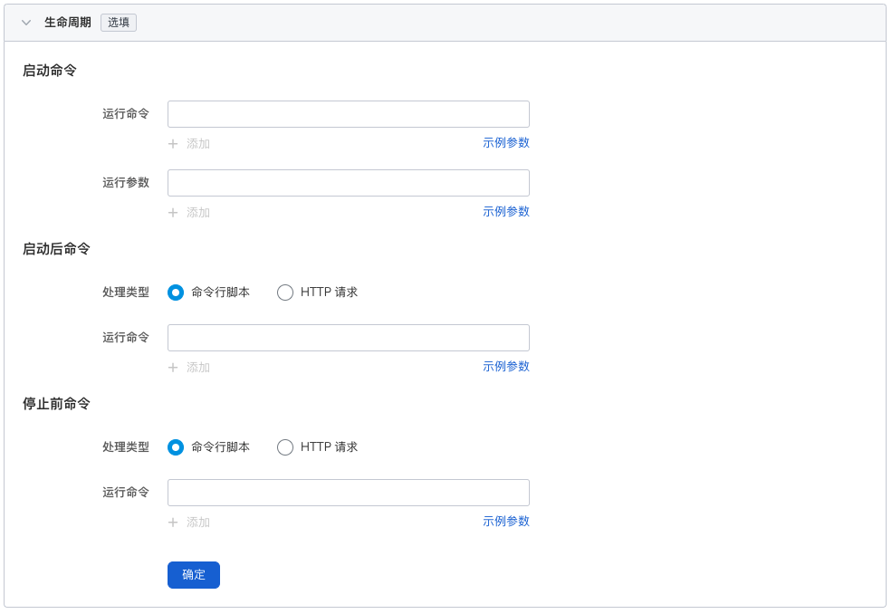

=== "健康检查（选填）"

    容器健康检查用于判断容器和应用的健康状态。有助于提高应用的可用性。具体详情请参考[容器健康检查配置](PodConfig/healthcheck.md)。

    

=== "环境变量（选填）"

    容器环境变量配置用于配置 Pod 内的容器参数，为 Pod 添加环境变量或传递配置等。具体详情请参考[容器环境变量配置](PodConfig/EnvironmentVariables.md)。

    

=== "数据存储（选填）"

    容器数据存储配置用于配置容器挂载数据卷和数据持久化设置。具体详情请参考[容器数据存储配置](PodConfig/EnvironmentVariables.md)。

    

=== "安全设置（选填）"

    通过 Linux 内置的账号权限隔离机制来对容器进行安全隔离。您可以通过使用不同权限的账号 UID（数字身份标记）来限制容器的权限。如使用 root 账号的权限，请输入 `0`。

    

### 服务配置

为有状态负载配置[服务](../ServicesandRoutes/CreatingServices.md)，使有状态负载能够被外部访问。

1. 点击`创建服务`按钮。

    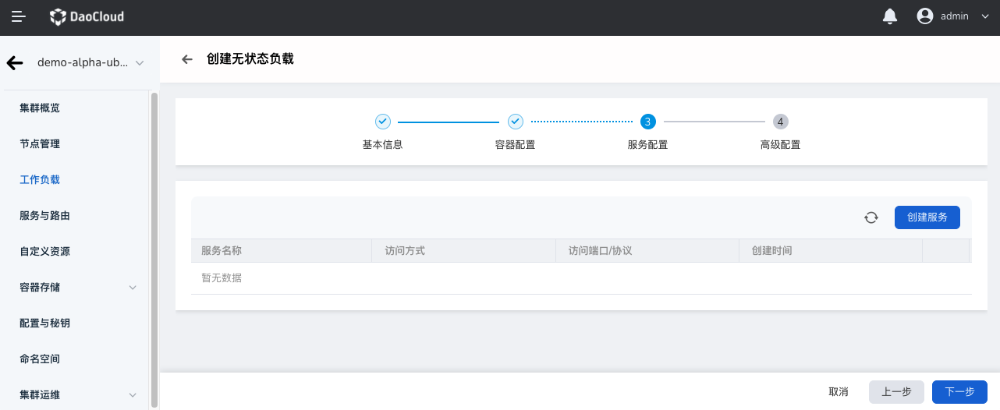

2. 参考[创建服务](../ServicesandRoutes/CreatingServices.md)，配置服务参数。

    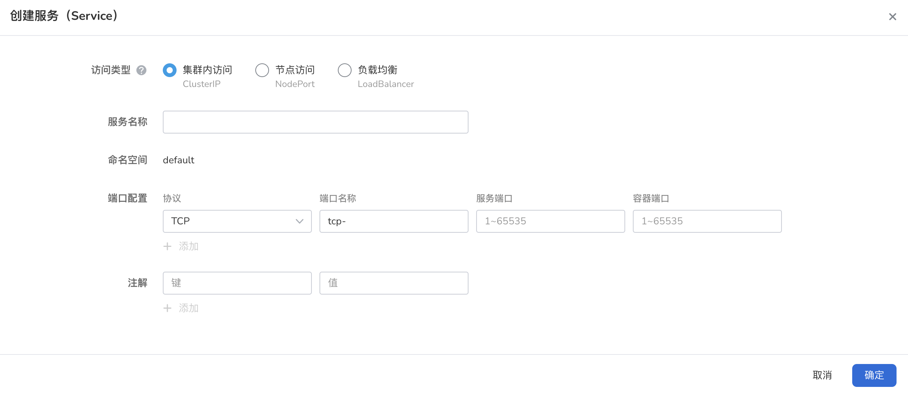

3. 点击`确定`，点击`下一步`。

### 高级配置

除了基本信息配置，Daocloud 容器管理平台还提供了丰富的高级配置，可对工作负载的升级策略、调度策略、标签与注解等高级功能进行配置。

=== "升级策略"

    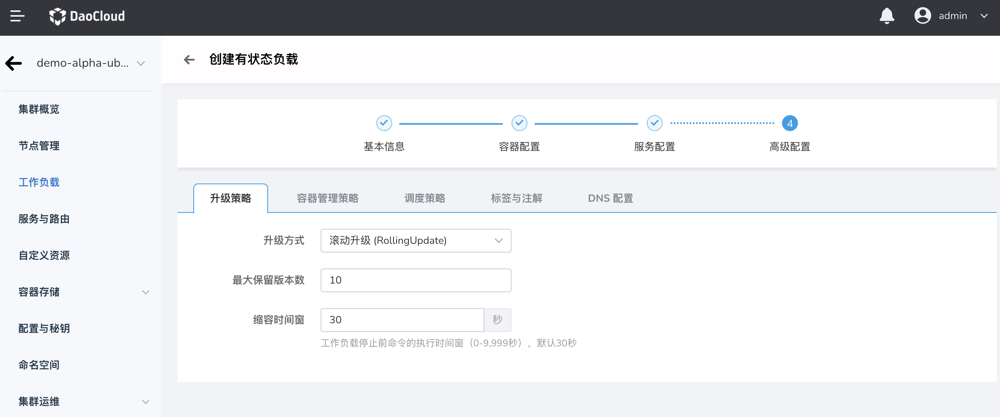

    - 升级方式：**滚动升级** 将逐步用新版本的实例替换旧版本的实例，升级的过程中，业务流量会同时负载均衡分布到新老的实例上，因此业务不会中断。**替换升级** 将先把您工作负载的老版本实例删除，再安装指定的新版本，升级过程中业务会中断。
    - 最大保留版本数：为回滚时保留的旧版本的数量。默认为 10。
    - 缩容时间窗(s) ：工作负载停止前命令的执行时间窗（0-9,999秒），默认 30 秒。

=== "容器管理策略"

    

    Kubernetes v1.7 及其之后的版本可以通过 `.spec.podManagementPolicy` 设置 Pod 的管理策略，支持以下两种方式：

    - **按序策略**（OrderedReady）：默认 Pod 管理策略，对于包含 N 个 副本的 StatefulSet，当部署 Pod 时，顺序为 0..N-1。当删除 Pod 时，它们是逆序终止的。

        顺序为 N-1...0。只有前一个 Pod 部署 Ready 或者删除完成后，有状态负载才会操作后一个 Pod。

    - **并行策略**（Parallel）：并行创建或删除 Pod，和 Deployment 类型的 Pod 一样。（不等待前面的 pod ready 就开始创建所有的 pod）。 StatefulSet 控制器并行的启动或终止所有的 Pod， 启动或者终止其他 Pod 前，无需等待 Pod 进入 Running 和 ready或者完全停止状态。 这个选项只会影响扩缩操作的行为，更新则不会被影响。

=== "调度策略"

    用户可以设置容忍时间来定义当工作负载所在的节点损坏时，将工作负载调度到其它节点的容忍时间。也支持基于节点标签和 Pod 标签对工作负载所部署的节点进行调度。具体详情请参考[调度策略](PodConfig/SchedulingPolicy.md)。

    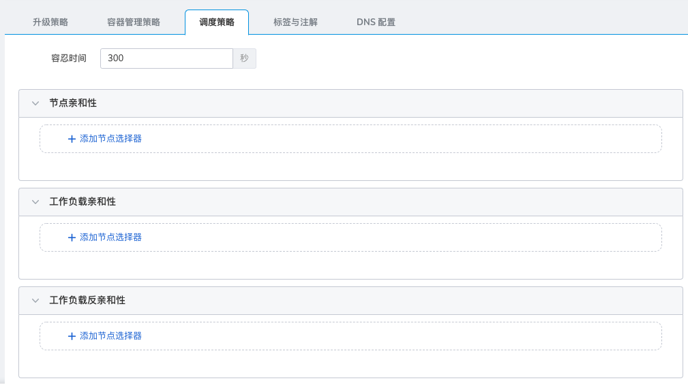

    - 容忍时间：工作负载实例所在的节点不可用的情况下，将工作负载实例重新调度到其它可用节点的时间，单位为秒。
    - 节点亲和性：根据节点上的标签来约束 Pod 可以调度到哪些节点上。
    - 工作负载亲和性：更新 Pod 的过程中 Pod 总数量超过 Pod 期望副本数量部分的最大值。
    - 工作负载反亲和性：基于已经在节点上运行的 Pod 的标签来约束 Pod 不可以调度到的节点。

=== "标签与注解"

    可以点击`添加`按钮为工作负载和容器组添加标签和注解。

    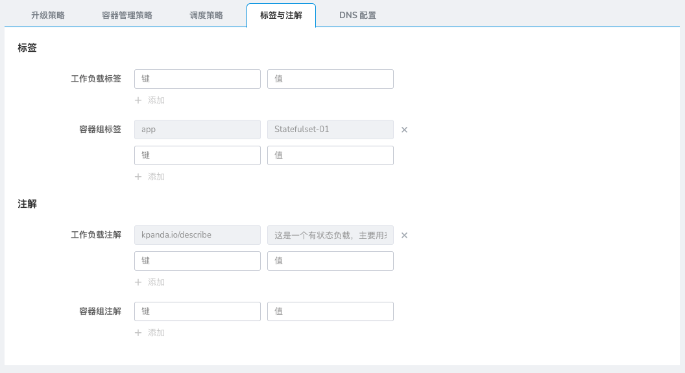

=== "DNS 配置"

    应用在某些场景下会出现冗余的 DNS 查询。Kubernetes 为应用提供了与 DNS 相关的配置选项，通过对应用进行 DNS 配置，能够在某些场景下有效地减少冗余的 DNS 查询，提升业务并发量。具体详情请参考 [DNS 配置](PodConfig/EnvironmentVariables.md)。

    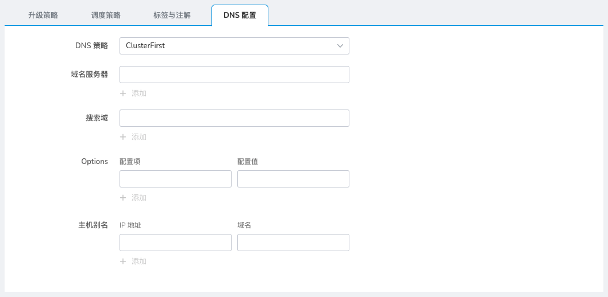

    - DNS 策略：对应用进行 DNS 配置，减少冗余的 DNS 查询，提升业务并发量。
        - Default：容器的域名解析文件使用 kubelet 的 `--resolv-conf` 参数指向的域名解析文件。该配置只能解析注册到互联网上的外部域名，无法解析集群内部域名，且不存在无效的 DNS 查询。
        - ClusterFirstWithHostNet：应用对接主机的域名文件。
        - ClusterFirst：应用对接 Kube-DNS/CoreDNS。
        - None：Kubernetes v1.9（Beta in v1.10）中引入的新选项值。设置为 None 之后，必须设置 dnsConfig，此时容器的域名解析文件将完全通过 dnsConfig 的配置来生成。
    - 域名服务器：根据节点上的标签来约束 Pod 可以调度到哪些节点上。
    - 搜索域：域名查询时的 DNS 搜索域列表。指定后，提供的搜索域列表将合并到基于 dnsPolicy 生成的域名解析文件的 search 字段中，并删除重复的域名。Kubernetes 最多允许 6 个搜索域。
    - Options：DNS 的配置选项，其中每个对象可以具有 name 属性（必需）和 value 属性（可选）。该字段中的内容将合并到基于 dnsPolicy 生成的域名解析文件的 options 字段中，dnsConfig 的 options 的某些选项如果与基于 dnsPolicy 生成的域名解析文件的选项冲突，则会被 dnsConfig 所覆盖。
    - 主机别名：为主机设置的别名。

### 完成创建

确认所有参数输入完成后，点击`确定`按钮，完成工作负载创建，系统将自动返回`无状态工作负载`列表。点击新建工作负载列右侧的 `︙`，可以对工作负载执行执行更新、删除、弹性扩缩、重启、版本回退等操作。

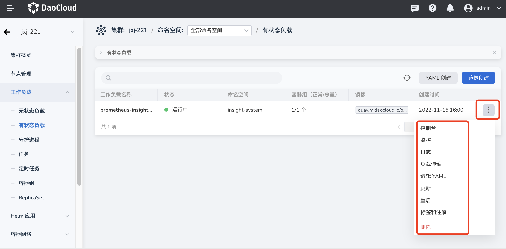

等待工作负载状态变为`运行中`。如果工作负载状态出现异常，请查看具体异常信息，可参考[工作负载状态](../Workloads/PodConfig/workload-status.md)。

## Yaml 创建

### 基本信息配置

1. 以 `NS Edit` 用户成功登录后，点击左侧导航栏上的`集群列表`进入集群列表页面。点击一个集群名称，进入`集群详情`页面。

    

2. 在集群详情页面，点击左侧导航栏的`工作负载`进入工作负载列表后，点击页面右上角的`YAML 创建`按钮。

    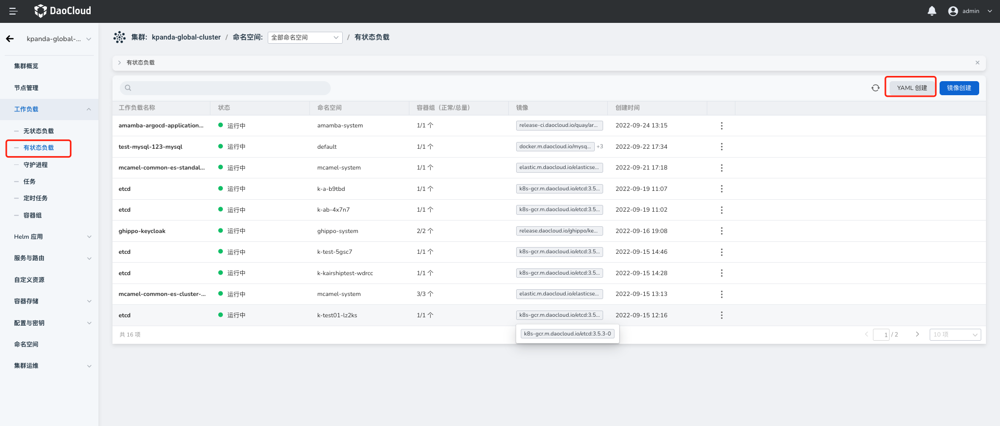

3. 完成上述步骤后，您将跳转至`创建有状态负载`的详细配置页面，请参照下面的步骤完成有状态负载的创建。

### 输入 Yaml

参考下面的 Yaml 模板，创建一个名为 `test-mysql-123-mysql` 的有状态负载。

??? note "点击查看 YAML 内容"

    ```yaml
    kind: StatefulSet
    apiVersion: apps/v1
    metadata:
      name: test-mysql-123-mysql
      namespace: default
      uid: d3f45527-a0ab-4b22-9013-5842a06f4e0e
      resourceVersion: '20504385'
      generation: 1
      creationTimestamp: '2022-09-22T09:34:10Z'
      ownerReferences:
        - apiVersion: mysql.presslabs.org/v1alpha1
          kind: MysqlCluster
          name: test-mysql-123
          uid: 5e877cc3-5167-49da-904e-820940cf1a6d
          controller: true
          blockOwnerDeletion: true
    spec:
      replicas: 1
      selector:
        matchLabels:
          app.kubernetes.io/managed-by: mysql.presslabs.org
          app.kubernetes.io/name: mysql
          mysql.presslabs.org/cluster: test-mysql-123
      template:
        metadata:
          creationTimestamp: null
          labels:
            app.kubernetes.io/component: database
            app.kubernetes.io/instance: test-mysql-123
            app.kubernetes.io/managed-by: mysql.presslabs.org
            app.kubernetes.io/name: mysql
            app.kubernetes.io/version: 5.7.31
            mysql.presslabs.org/cluster: test-mysql-123
          annotations:
            config_rev: '13941099'
            prometheus.io/port: '9125'
            prometheus.io/scrape: 'true'
            secret_rev: '13941101'
        spec:
          volumes:
            - name: conf
              emptyDir: {}
            - name: init-scripts
              emptyDir: {}
            - name: config-map
              configMap:
                name: test-mysql-123-mysql
                defaultMode: 420
            - name: data
              persistentVolumeClaim:
                claimName: data
          initContainers:
            - name: init
              image: docker.m.daocloud.io/bitpoke/mysql-operator-sidecar-5.7:v0.6.1
              args:
                - clone-and-init
              envFrom:
                - secretRef:
                    name: test-mysql-123-mysql-operated
              env:
                - name: MY_NAMESPACE
                  valueFrom:
                    fieldRef:
                      apiVersion: v1
                      fieldPath: metadata.namespace
                - name: MY_POD_NAME
                  valueFrom:
                    fieldRef:
                      apiVersion: v1
                      fieldPath: metadata.name
                - name: MY_POD_IP
                  valueFrom:
                    fieldRef:
                      apiVersion: v1
                      fieldPath: status.podIP
                - name: MY_SERVICE_NAME
                  value: mysql
                - name: MY_CLUSTER_NAME
                  value: test-mysql-123
                - name: MY_FQDN
                  value: $(MY_POD_NAME).$(MY_SERVICE_NAME).$(MY_NAMESPACE)
                - name: MY_MYSQL_VERSION
                  value: 5.7.31
                - name: BACKUP_USER
                  valueFrom:
                    secretKeyRef:
                      name: test-mysql-123-mysql-operated
                      key: BACKUP_USER
                      optional: true
                - name: BACKUP_PASSWORD
                  valueFrom:
                    secretKeyRef:
                      name: test-mysql-123-mysql-operated
                      key: BACKUP_PASSWORD
                      optional: true
              resources: {}
              volumeMounts:
                - name: conf
                  mountPath: /etc/mysql
                - name: config-map
                  mountPath: /mnt/conf
                - name: data
                  mountPath: /var/lib/mysql
              terminationMessagePath: /dev/termination-log
              terminationMessagePolicy: File
              imagePullPolicy: IfNotPresent
          containers:
            - name: mysql
              image: docker.m.daocloud.io/mysql:5.7.31
              ports:
                - name: mysql
                  containerPort: 3306
                  protocol: TCP
              env:
                - name: MY_NAMESPACE
                  valueFrom:
                    fieldRef:
                      apiVersion: v1
                      fieldPath: metadata.namespace
                - name: MY_POD_NAME
                  valueFrom:
                    fieldRef:
                      apiVersion: v1
                      fieldPath: metadata.name
                - name: MY_POD_IP
                  valueFrom:
                    fieldRef:
                      apiVersion: v1
                      fieldPath: status.podIP
                - name: MY_SERVICE_NAME
                  value: mysql
                - name: MY_CLUSTER_NAME
                  value: test-mysql-123
                - name: MY_FQDN
                  value: $(MY_POD_NAME).$(MY_SERVICE_NAME).$(MY_NAMESPACE)
                - name: MY_MYSQL_VERSION
                  value: 5.7.31
                - name: ORCH_CLUSTER_ALIAS
                  value: test-mysql-123.default
                - name: ORCH_HTTP_API
                  value: http://mysql-operator.mcamel-system/api
                - name: MYSQL_ROOT_PASSWORD
                  valueFrom:
                    secretKeyRef:
                      name: test-mysql-123-secret
                      key: ROOT_PASSWORD
                      optional: false
                - name: MYSQL_USER
                  valueFrom:
                    secretKeyRef:
                      name: test-mysql-123-secret
                      key: USER
                      optional: true
                - name: MYSQL_PASSWORD
                  valueFrom:
                    secretKeyRef:
                      name: test-mysql-123-secret
                      key: PASSWORD
                      optional: true
                - name: MYSQL_DATABASE
                  valueFrom:
                    secretKeyRef:
                      name: test-mysql-123-secret
                      key: DATABASE
                      optional: true
              resources:
                limits:
                  cpu: '1'
                  memory: 1Gi
                requests:
                  cpu: 100m
                  memory: 512Mi
              volumeMounts:
                - name: conf
                  mountPath: /etc/mysql
                - name: data
                  mountPath: /var/lib/mysql
              livenessProbe:
                exec:
                  command:
                    - mysqladmin
                    - '--defaults-file=/etc/mysql/client.conf'
                    - ping
                initialDelaySeconds: 60
                timeoutSeconds: 5
                periodSeconds: 5
                successThreshold: 1
                failureThreshold: 3
              readinessProbe:
                exec:
                  command:
                    - /bin/sh
                    - '-c'
                    - >-
                      test $(mysql --defaults-file=/etc/mysql/client.conf -NB -e
                      'SELECT COUNT(*) FROM sys_operator.status WHERE
                      name="configured" AND value="1"') -eq 1
                initialDelaySeconds: 5
                timeoutSeconds: 5
                periodSeconds: 2
                successThreshold: 1
                failureThreshold: 3
              lifecycle:
                preStop:
                  exec:
                    command:
                      - bash
                      - /etc/mysql/pre-shutdown-ha.sh
              terminationMessagePath: /dev/termination-log
              terminationMessagePolicy: File
              imagePullPolicy: IfNotPresent
            - name: sidecar
              image: docker.m.daocloud.io/bitpoke/mysql-operator-sidecar-5.7:v0.6.1
              args:
                - config-and-serve
              ports:
                - name: sidecar-http
                  containerPort: 8080
                  protocol: TCP
              envFrom:
                - secretRef:
                    name: test-mysql-123-mysql-operated
              env:
                - name: MY_NAMESPACE
                  valueFrom:
                    fieldRef:
                      apiVersion: v1
                      fieldPath: metadata.namespace
                - name: MY_POD_NAME
                  valueFrom:
                    fieldRef:
                      apiVersion: v1
                      fieldPath: metadata.name
                - name: MY_POD_IP
                  valueFrom:
                    fieldRef:
                      apiVersion: v1
                      fieldPath: status.podIP
                - name: MY_SERVICE_NAME
                  value: mysql
                - name: MY_CLUSTER_NAME
                  value: test-mysql-123
                - name: MY_FQDN
                  value: $(MY_POD_NAME).$(MY_SERVICE_NAME).$(MY_NAMESPACE)
                - name: MY_MYSQL_VERSION
                  value: 5.7.31
                - name: XTRABACKUP_TARGET_DIR
                  value: /tmp/xtrabackup_backupfiles/
              resources:
                limits:
                  cpu: '1'
                  memory: 1Gi
                requests:
                  cpu: 10m
                  memory: 64Mi
              volumeMounts:
                - name: conf
                  mountPath: /etc/mysql
                - name: data
                  mountPath: /var/lib/mysql
              readinessProbe:
                httpGet:
                  path: /health
                  port: 8080
                  scheme: HTTP
                initialDelaySeconds: 30
                timeoutSeconds: 5
                periodSeconds: 5
                successThreshold: 1
                failureThreshold: 3
              terminationMessagePath: /dev/termination-log
              terminationMessagePolicy: File
              imagePullPolicy: IfNotPresent
            - name: metrics-exporter
              image: prom/mysqld-exporter:v0.13.0
              args:
                - '--web.listen-address=0.0.0.0:9125'
                - '--web.telemetry-path=/metrics'
                - '--collect.heartbeat'
                - '--collect.heartbeat.database=sys_operator'
              ports:
                - name: prometheus
                  containerPort: 9125
                  protocol: TCP
              env:
                - name: MY_NAMESPACE
                  valueFrom:
                    fieldRef:
                      apiVersion: v1
                      fieldPath: metadata.namespace
                - name: MY_POD_NAME
                  valueFrom:
                    fieldRef:
                      apiVersion: v1
                      fieldPath: metadata.name
                - name: MY_POD_IP
                  valueFrom:
                    fieldRef:
                      apiVersion: v1
                      fieldPath: status.podIP
                - name: MY_SERVICE_NAME
                  value: mysql
                - name: MY_CLUSTER_NAME
                  value: test-mysql-123
                - name: MY_FQDN
                  value: $(MY_POD_NAME).$(MY_SERVICE_NAME).$(MY_NAMESPACE)
                - name: MY_MYSQL_VERSION
                  value: 5.7.31
                - name: USER
                  valueFrom:
                    secretKeyRef:
                      name: test-mysql-123-mysql-operated
                      key: METRICS_EXPORTER_USER
                      optional: false
                - name: PASSWORD
                  valueFrom:
                    secretKeyRef:
                      name: test-mysql-123-mysql-operated
                      key: METRICS_EXPORTER_PASSWORD
                      optional: false
                - name: DATA_SOURCE_NAME
                  value: $(USER):$(PASSWORD)@(127.0.0.1:3306)/
              resources:
                limits:
                  cpu: 100m
                  memory: 128Mi
                requests:
                  cpu: 10m
                  memory: 32Mi
              livenessProbe:
                httpGet:
                  path: /metrics
                  port: 9125
                  scheme: HTTP
                initialDelaySeconds: 30
                timeoutSeconds: 30
                periodSeconds: 30
                successThreshold: 1
                failureThreshold: 3
              terminationMessagePath: /dev/termination-log
              terminationMessagePolicy: File
              imagePullPolicy: IfNotPresent
            - name: pt-heartbeat
              image: docker.m.daocloud.io/bitpoke/mysql-operator-sidecar-5.7:v0.6.1
              args:
                - pt-heartbeat
                - '--update'
                - '--replace'
                - '--check-read-only'
                - '--create-table'
                - '--database'
                - sys_operator
                - '--table'
                - heartbeat
                - '--utc'
                - '--defaults-file'
                - /etc/mysql/heartbeat.conf
                - '--fail-successive-errors=20'
              env:
                - name: MY_NAMESPACE
                  valueFrom:
                    fieldRef:
                      apiVersion: v1
                      fieldPath: metadata.namespace
                - name: MY_POD_NAME
                  valueFrom:
                    fieldRef:
                      apiVersion: v1
                      fieldPath: metadata.name
                - name: MY_POD_IP
                  valueFrom:
                    fieldRef:
                      apiVersion: v1
                      fieldPath: status.podIP
                - name: MY_SERVICE_NAME
                  value: mysql
                - name: MY_CLUSTER_NAME
                  value: test-mysql-123
                - name: MY_FQDN
                  value: $(MY_POD_NAME).$(MY_SERVICE_NAME).$(MY_NAMESPACE)
                - name: MY_MYSQL_VERSION
                  value: 5.7.31
              resources:
                limits:
                  cpu: 100m
                  memory: 64Mi
                requests:
                  cpu: 10m
                  memory: 32Mi
              volumeMounts:
                - name: conf
                  mountPath: /etc/mysql
              terminationMessagePath: /dev/termination-log
              terminationMessagePolicy: File
              imagePullPolicy: IfNotPresent
          restartPolicy: Always
          terminationGracePeriodSeconds: 30
          dnsPolicy: ClusterFirst
          securityContext:
            runAsUser: 999
            fsGroup: 999
          affinity:
            podAntiAffinity:
              preferredDuringSchedulingIgnoredDuringExecution:
                - weight: 100
                  podAffinityTerm:
                    labelSelector:
                      matchLabels:
                        app.kubernetes.io/component: database
                        app.kubernetes.io/instance: test-mysql-123
                        app.kubernetes.io/managed-by: mysql.presslabs.org
                        app.kubernetes.io/name: mysql
                        app.kubernetes.io/version: 5.7.31
                        mysql.presslabs.org/cluster: test-mysql-123
                    topologyKey: kubernetes.io/hostname
          schedulerName: default-scheduler
      volumeClaimTemplates:
        - kind: PersistentVolumeClaim
          apiVersion: v1
          metadata:
            name: data
            creationTimestamp: null
            ownerReferences:
              - apiVersion: mysql.presslabs.org/v1alpha1
                kind: MysqlCluster
                name: test-mysql-123
                uid: 5e877cc3-5167-49da-904e-820940cf1a6d
                controller: true
          spec:
            accessModes:
              - ReadWriteOnce
            resources:
              limits:
                storage: 1Gi
              requests:
                storage: 1Gi
            storageClassName: local-path
            volumeMode: Filesystem
          status:
            phase: Pending
      serviceName: mysql
      podManagementPolicy: OrderedReady
      updateStrategy:
        type: RollingUpdate
        rollingUpdate:
          partition: 0
      revisionHistoryLimit: 10
    status:
      observedGeneration: 1
      replicas: 1
      readyReplicas: 1
      currentReplicas: 1
      updatedReplicas: 1
      currentRevision: test-mysql-123-mysql-6b8f5577c7
      updateRevision: test-mysql-123-mysql-6b8f5577c7
      collisionCount: 0
      availableReplicas: 1
    ```

### 完成创建

确认所有参数输入完成后，点击`确定`按钮，完成工作负载创建，自动返回`有状态负载`列表。
点击新建工作负载列右侧的 `︙`，可以对工作负载执行执行更新、删除、弹性扩缩、重启、版本回退等操作。


等待工作负载状态变为`运行中`。如果工作负载状态出现异常，请查看具体异常信息，可参考[工作负载状态](../Workloads/PodConfig/workload-status.md)。
