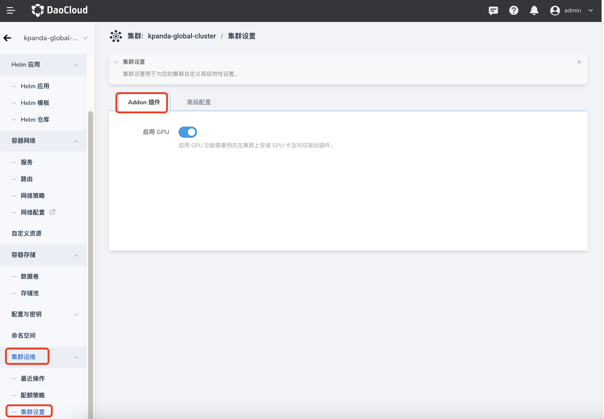
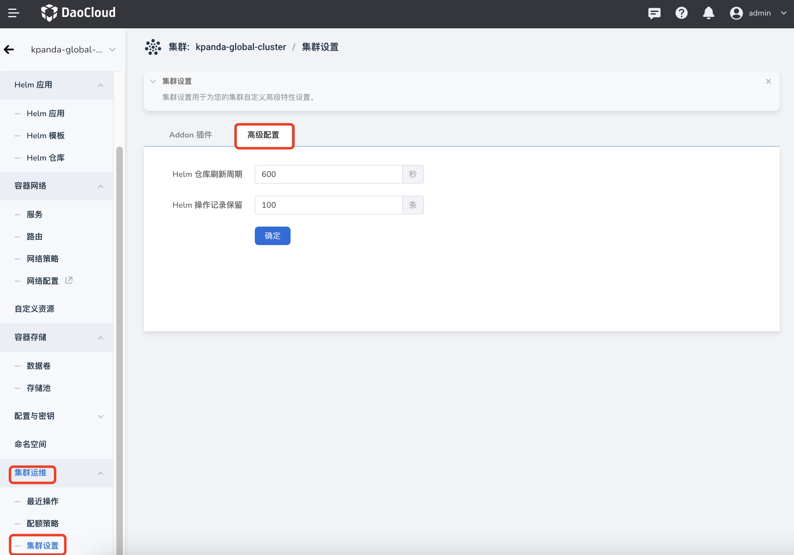

---
hide:
  - toc
---

# 集群设置

集群设置用于为您的集群自定义高级特性设置，包括是否启用 GPU、Helm 仓库刷新周期、Helm 操作记录保留等。

- 启用 GPU：需要预先在集群上安装 GPU 卡及对应驱动插件。

    点击目标集群的名称，在左侧导航栏点击`最近操作`->`集群设置`->`Addon 插件`。

    

- Helm 仓库刷新周期、操作记录保留条数

    
