# 数据卷

数据卷（Volume）供用户创建的工作负载使用，是将工作负载数据持久化的一种资源对象，数据卷保存了可被 Pod 中容器访问的数据目录。

## 创建网络策略

目前支持通过 YAML 和表单两种方式创建网络策略，这两种方式各有优劣，可以满足不同用户的使用需求。

通过 YAML 创建步骤更少、更高效，但门槛要求较高，需要熟悉网络策略的 YAML 文件配置。

通过表单创建更直观更简单，根据提示填写对应的值即可，但步骤更加繁琐。

### YAML 创建

1. 在集群列表中点击目标集群的名称，然后在左侧导航栏点击`容器网络`->`网络策略`->`YAML 创建`。

    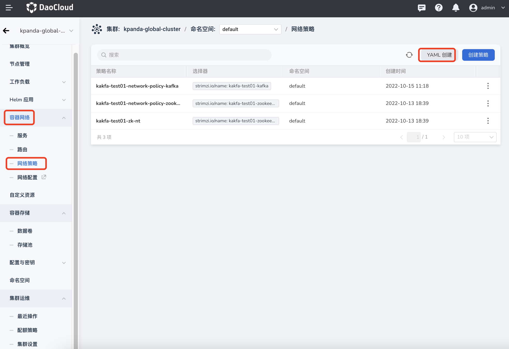

2. 在弹框中输入或粘贴事先准备好的 YAML 文件，然后在弹框底部点击`确定`。

    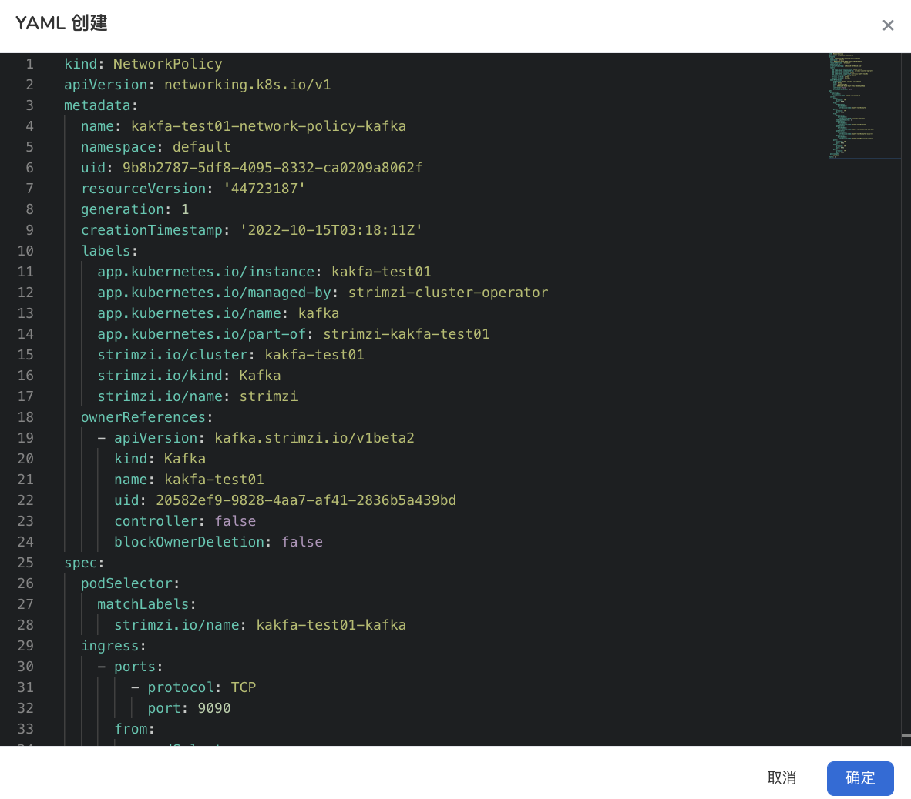

### 表单创建

1. 在集群列表中点击目标集群的名称，然后在左侧导航栏点击`容器网络`->`网络策略`->`创建策略`。

    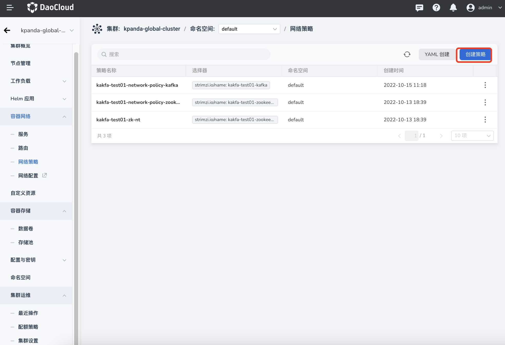

2. 填写基本信息。

    名称和命名空间在创建之后不可更改。

    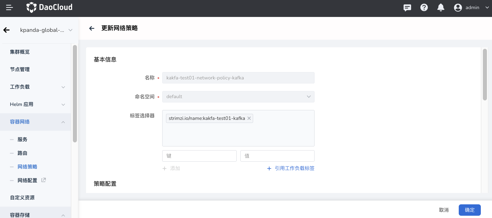

3. 填写策略配置。

    策略配置分为入流量策略和出流量策略。如果源 Pod 想要成功连接到目标 Pod，源 Pod 的出流量策略和目标 Pod 的入流量策略都需要允许连接。如果任何一方不允许连接，都会导致连接失败。

    - 入流量策略：点击`➕`开始配置策略，支持配置多条策略。多条网络策略的效果相互叠加，只有同时满足所有网络策略，才能成功建立连接。

        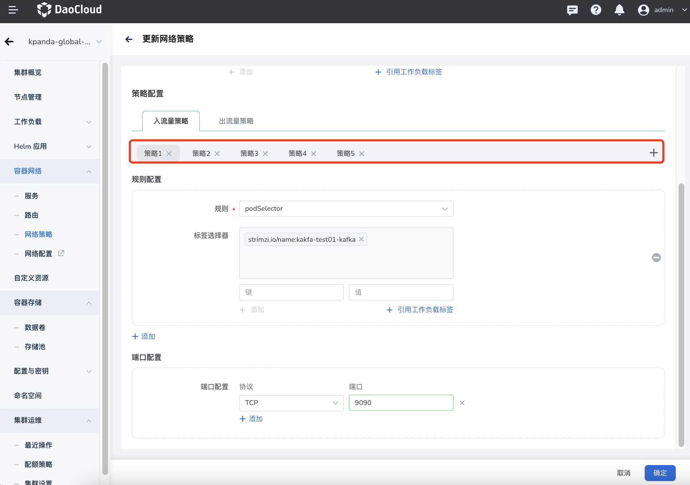

    - 出流量策略

        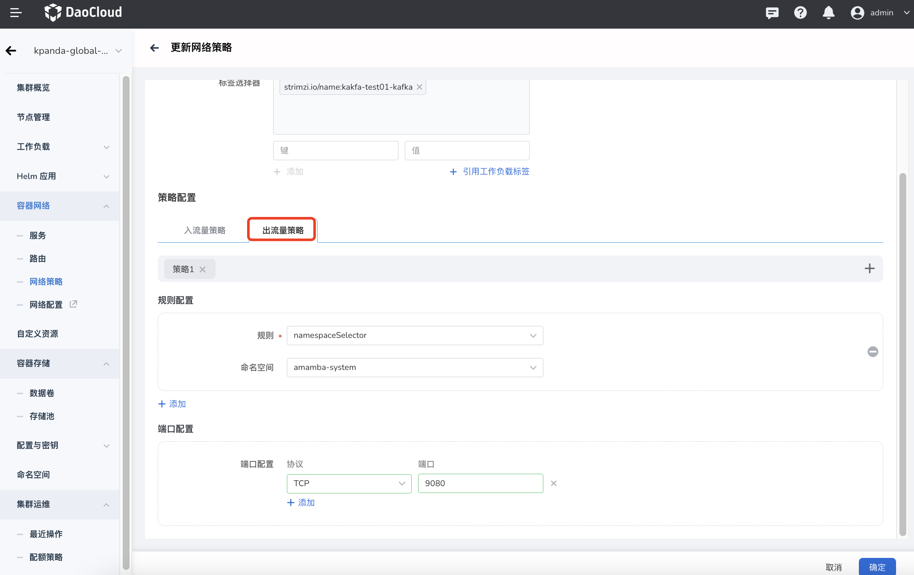

## 查看网络策略

1. 在集群列表中点击目标集群的名称，然后在左侧导航栏点击`容器网络`->`网络策略`，点击网络策略的名称。

    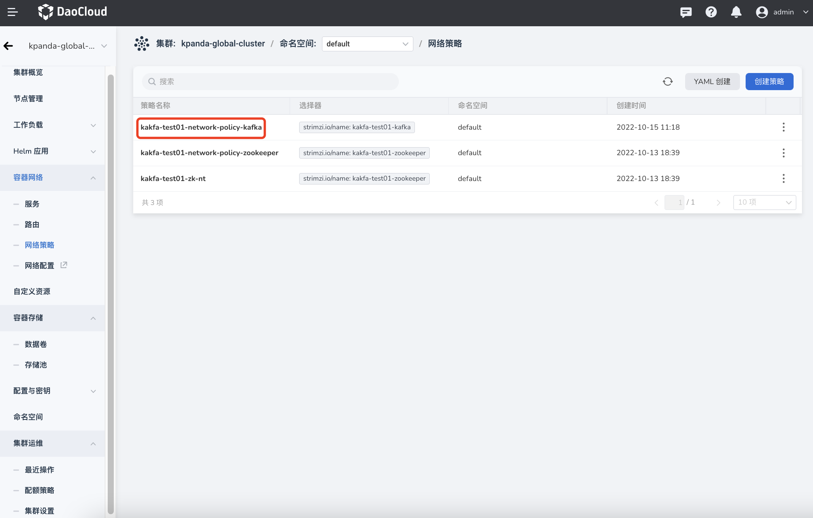

2. 查看该策略的基本配置、关联实例信息、入流量策略、出流量策略。

    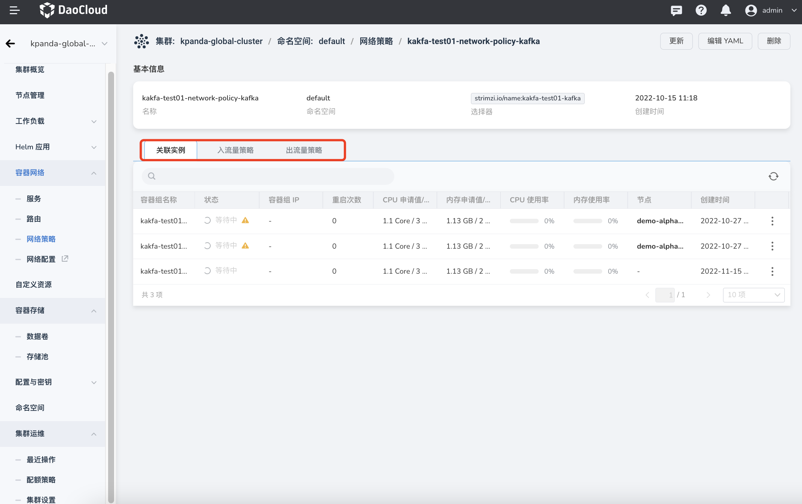

!!! info

    在关联实例页签下，支持查看实例监控、日志、容器列表、YAML 文件、事件等。

    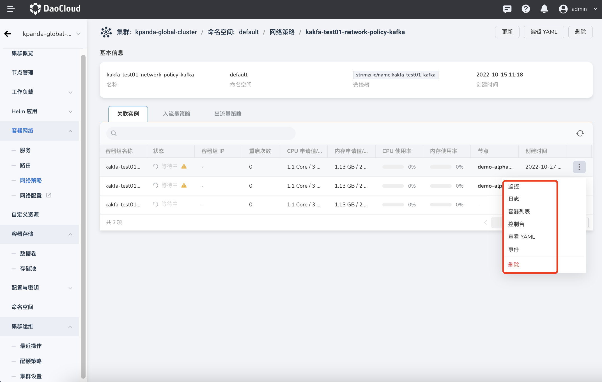

## 更新网络策略

有两种途径可以更新网络策略。支持通过表单或 YAML 文件更新网络策略。

- 在网络策略列表页面，找到需要更新的策略，在右侧的操作栏下选择`更新`即可通过表单更新，选择`编辑 YAML` 即可通过 YAML 更新。

    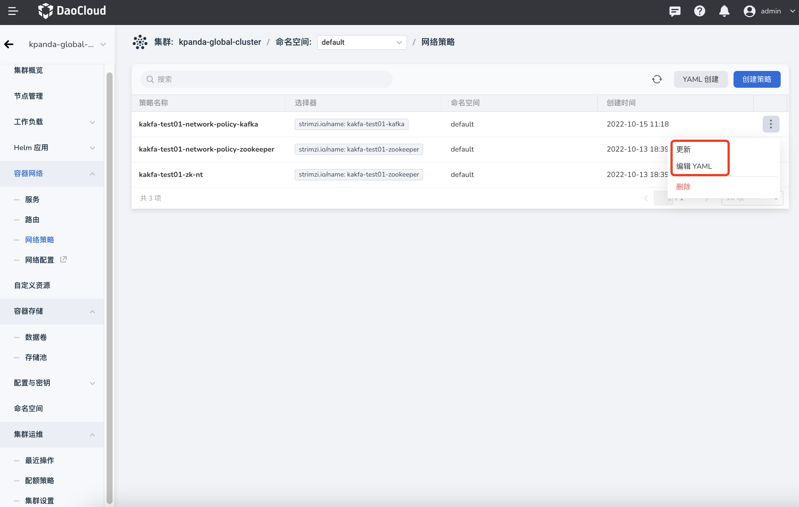

- 点击网络策略的名称，进入网络策略的详情页面后，在页面右上角选择`更新`即可通过表单更新，选择`编辑 YAML` 即可通过 YAML 更新。

    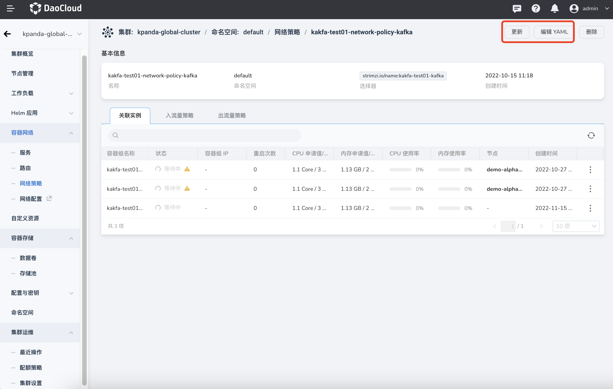

## 删除网络策略

有两种途径可以删除网络策略。支持通过表单或 YAML 文件更新网络策略。

- 在网络策略列表页面，找到需要更新的策略，在右侧的操作栏下选择`更新`即可通过表单更新，选择`编辑 YAML` 即可通过 YAML 删除。

    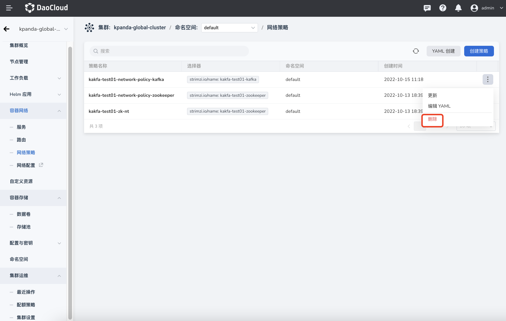

- 点击网络策略的名称，进入网络策略的详情页面后，在页面右上角选择`更新`即可通过表单更新，选择`编辑 YAML` 即可通过 YAML 删除。

    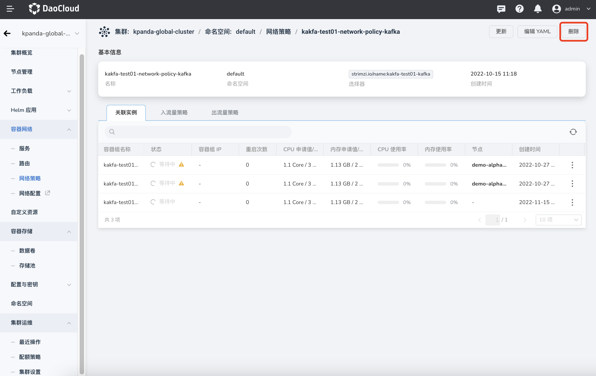

