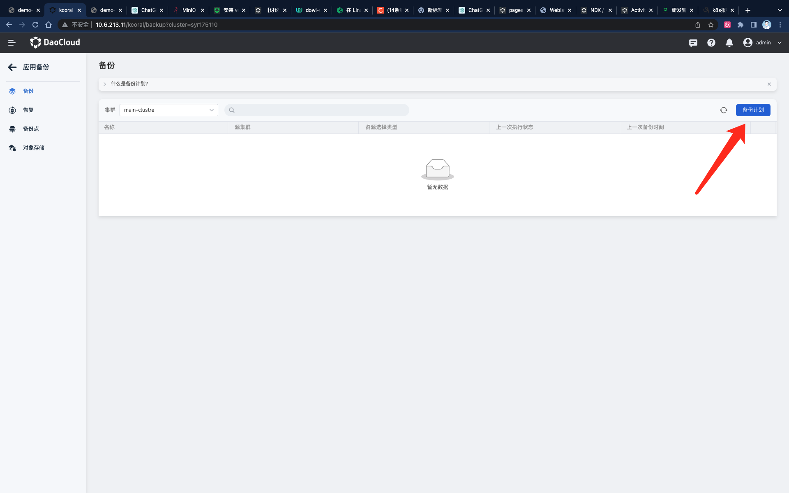
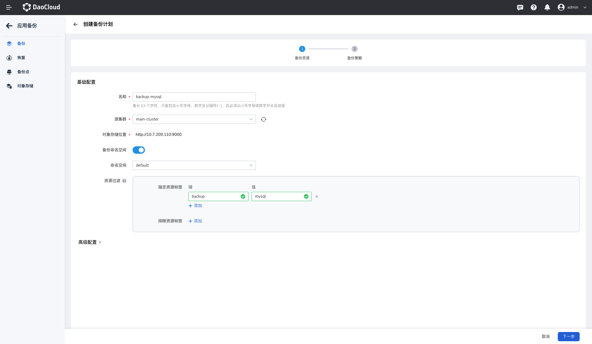
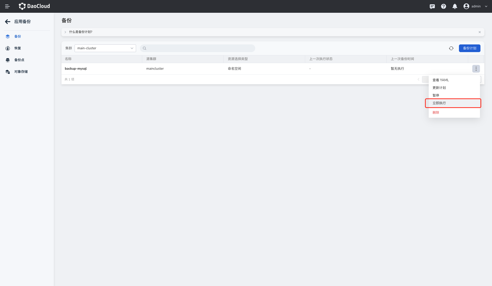
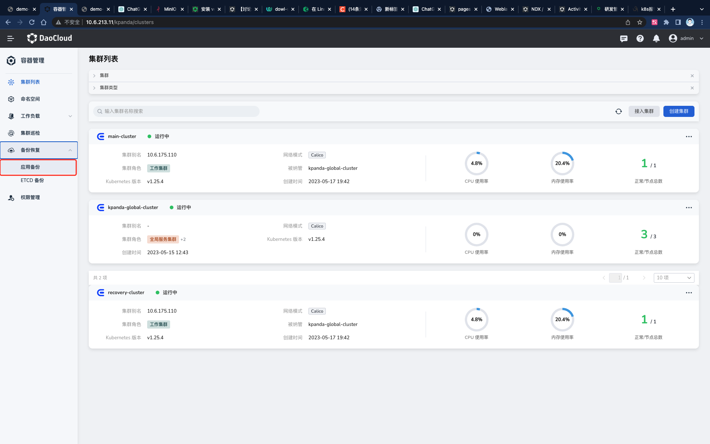
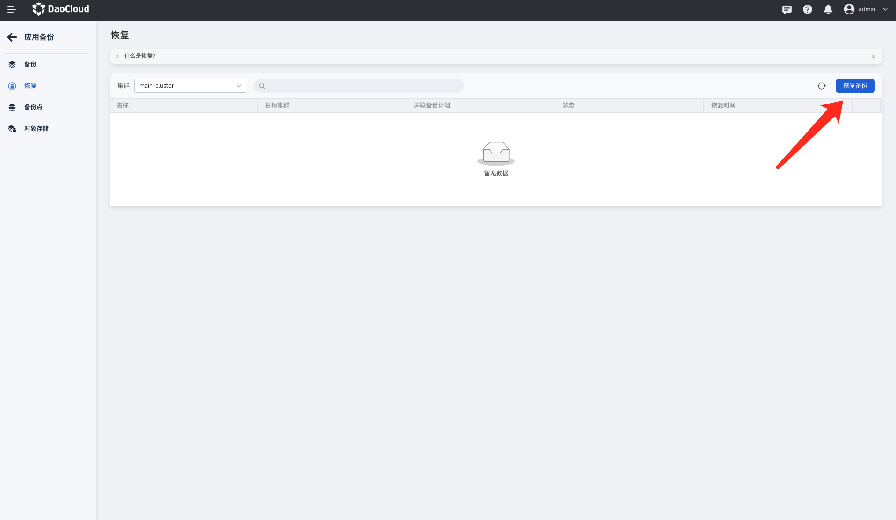
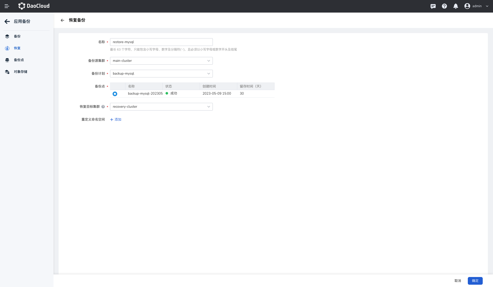

# 对 Mysql 应用及数据进行跨集群备份恢复

在本 demo 中，我们将基于第五代产品的应用备份功能，实现一个有状态应用的跨集群备份迁移。

## 前提

1. 已完成 DCE 5.0 平台的部署，且具有DCE 5.0 平台管理员权限的账号
2. 准备两个集群作为主备集群，集群上所有的节点均已完成 nfs 相关依赖的安装。
3. 本地已经完成了一个 minio 对象存储系统的搭建。

## Demo 配置介绍

**集群配置**

| 集群             | IP           | 节点   |
| ---------------- | ------------ | ------ |
| main-cluster     | 10.6.175.100 | 1 节点 |
| recovery-cluster | 10.6.175.110 | 1 节点 |

**minio 配置**

| **minio 服务器访问地址** | **bucket** | **用户名** | **密码** |
| ------------------------ | ---------- | ---------- | -------- |
| http://10.7.209.110:9000 | mysql-demo | root       | dangerous |

# 在 main-cluster 集群上备份 mysql 服务及数据

## **环境准备**

### 一、在  main-cluster 集群上部署 NFS 存储服务

前提：集群**所有节点**均已经完成 nfs 所需依赖的安装，执行如下命令进行安装。

```yaml
yum install nfs-utils iscsi-initiator-utils nfs-utils iscsi-initiator-utils nfs-utils iscsi-initiator-utils -y

# 预期输出如下：

[root@g-master1 ~]# yum install nfs-utils iscsi-initiator-utils nfs-utils iscsi-initiator-utils nfs-utils iscsi-initiator-utils -y

extension-0                                                                                                                                                                                                                                              | 2.9 kB  00:00:00
extension-1                                                                                                                                                                                                                                              | 3.6 kB  00:00:00
Resolving Dependencies                                                                                          nfs-utils.x86_64 1:1.3.0-0.68.el7.2
......此处忽略100行.....
Dependency Installed:
  gssproxy.x86_64 0:0.7.0-30.el7_9        iscsi-initiator-utils-iscsiuio.x86_64 0:6.2.0.874-22.el7_9     keyutils.x86_64 0:1.5.8-3.el7           libbasicobjects.x86_64 0:0.1.1-32.el7     libcollection.x86_64 0:0.7.0-32.el7     libevent.x86_64 0:2.0.21-4.el7
  libini_config.x86_64 0:1.3.1-32.el7     libnfsidmap.x86_64 0:0.25-19.el7                               libpath_utils.x86_64 0:0.2.1-32.el7     libref_array.x86_64 0:0.1.5-32.el7        libtirpc.x86_64 0:0.2.4-0.16.el7        libverto-libevent.x86_64 0:0.2.5-4.el7
  quota.x86_64 1:4.01-19.el7              quota-nls.noarch 1:4.01-19.el7                                 rpcbind.x86_64 0:0.2.0-49.el7           tcp_wrappers.x86_64 0:7.6-77.el7

Complete! #最终执行结果
```

1. **为 mysql 服务提前准备 nfs 存储服务**

登陆 main-cluster 集群上任一控制节点，使用 `vi nfs.yaml`命令在节点上创建一个 名为 nfs.yaml 的文件，将下面的 yaml 内容复制到 nfs.yaml 文件内。

<details>
<summary>nfs.yaml</summary>
```yaml
kind: ClusterRole
apiVersion: rbac.authorization.k8s.io/v1
metadata:
name: nfs-provisioner-runner
namespace: nfs-system
rules:
- apiGroups: [""]
    resources: ["persistentvolumes"]
    verbs: ["get", "list", "watch", "create", "delete"]
- apiGroups: [""]
    resources: ["persistentvolumeclaims"]
    verbs: ["get", "list", "watch", "update"]
- apiGroups: ["storage.k8s.io"]
    resources: ["storageclasses"]
    verbs: ["get", "list", "watch"]
- apiGroups: [""]
    resources: ["events"]
    verbs: ["create", "update", "patch"]
- apiGroups: [""]
    resources: ["services", "endpoints"]
    verbs: ["get"]
- apiGroups: ["extensions"]
    resources: ["podsecuritypolicies"]
    resourceNames: ["nfs-provisioner"]
    verbs: ["use"]
---
kind: ClusterRoleBinding
apiVersion: rbac.authorization.k8s.io/v1
metadata:
name: run-nfs-provisioner
subjects:
- kind: ServiceAccount
    name: nfs-provisioner
    # replace with namespace where provisioner is deployed
    namespace: default
roleRef:
kind: ClusterRole
name: nfs-provisioner-runner
apiGroup: rbac.authorization.k8s.io
---
kind: Role
apiVersion: rbac.authorization.k8s.io/v1
metadata:
name: leader-locking-nfs-provisioner
rules:
- apiGroups: [""]
    resources: ["endpoints"]
    verbs: ["get", "list", "watch", "create", "update", "patch"]
---
kind: RoleBinding
apiVersion: rbac.authorization.k8s.io/v1
metadata:
name: leader-locking-nfs-provisioner
subjects:
- kind: ServiceAccount
    name: nfs-provisioner
    # replace with namespace where provisioner is deployed
    namespace: default
roleRef:
kind: Role
name: leader-locking-nfs-provisioner
apiGroup: rbac.authorization.k8s.io
---
apiVersion: v1
kind: ServiceAccount
metadata:
name: nfs-provisioner
---
kind: Service
apiVersion: v1
metadata:
name: nfs-provisioner
labels:
    app: nfs-provisioner
spec:
ports:
    - name: nfs
    port: 2049
    - name: nfs-udp
    port: 2049
    protocol: UDP
    - name: nlockmgr
    port: 32803
    - name: nlockmgr-udp
    port: 32803
    protocol: UDP
    - name: mountd
    port: 20048
    - name: mountd-udp
    port: 20048
    protocol: UDP
    - name: rquotad
    port: 875
    - name: rquotad-udp
    port: 875
    protocol: UDP
    - name: rpcbind
    port: 111
    - name: rpcbind-udp
    port: 111
    protocol: UDP
    - name: statd
    port: 662
    - name: statd-udp
    port: 662
    protocol: UDP
selector:
    app: nfs-provisioner
---
kind: Deployment
apiVersion: apps/v1
metadata:
name: nfs-provisioner
spec:
selector:
    matchLabels:
    app: nfs-provisioner
replicas: 1
strategy:
    type: Recreate
template:
    metadata:
    labels:
        app: nfs-provisioner
    spec:
    serviceAccount: nfs-provisioner
    containers:
        - name: nfs-provisioner
        resources:
            limits:
            cpu: "1"
            memory: "4294967296"
        image: release.daocloud.io/velero/nfs-provisioner:v3.0.0
        ports:
            - name: nfs
            containerPort: 2049
            - name: nfs-udp
            containerPort: 2049
            protocol: UDP
            - name: nlockmgr
            containerPort: 32803
            - name: nlockmgr-udp
            containerPort: 32803
            protocol: UDP
            - name: mountd
            containerPort: 20048
            - name: mountd-udp
            containerPort: 20048
            protocol: UDP
            - name: rquotad
            containerPort: 875
            - name: rquotad-udp
            containerPort: 875
            protocol: UDP
            - name: rpcbind
            containerPort: 111
            - name: rpcbind-udp
            containerPort: 111
            protocol: UDP
            - name: statd
            containerPort: 662
            - name: statd-udp
            containerPort: 662
            protocol: UDP
        securityContext:
            capabilities:
            add:
                - DAC_READ_SEARCH
                - SYS_RESOURCE
        args:
            - "-provisioner=example.com/nfs"
        env:
            - name: POD_IP
            valueFrom:
                fieldRef:
                fieldPath: status.podIP
            - name: SERVICE_NAME
            value: nfs-provisioner
            - name: POD_NAMESPACE
            valueFrom:
                fieldRef:
                fieldPath: metadata.namespace
        imagePullPolicy: "IfNotPresent"
        volumeMounts:
            - name: export-volume
            mountPath: /export
    volumes:
        - name: export-volume
        hostPath:
            path: /data
---
kind: StorageClass
apiVersion: storage.k8s.io/v1
metadata:
name: nfs
provisioner: example.com/nfs
mountOptions:
- vers=4.1
```
</details>+

2. **在节点上使用 kubectl 工具执行 nfs.yaml 文件，命令如下：**

```bash
kubectl apply -f nfs.yaml

#预期输出如下：
[root@g-master1 ~]# kubectl apply -f nfs.yaml
clusterrole.rbac.authorization.k8s.io/nfs-provisioner-runner created
clusterrolebinding.rbac.authorization.k8s.io/run-nfs-provisioner created
role.rbac.authorization.k8s.io/leader-locking-nfs-provisioner created
rolebinding.rbac.authorization.k8s.io/leader-locking-nfs-provisioner created
serviceaccount/nfs-provisioner created
service/nfs-provisioner created
deployment.apps/nfs-provisioner created
storageclass.storage.k8s.io/nfs created
```

3. **查看 nfs pod 状态**

执行 `kubectl get pod  | grep nfs`查看 nfs pod 状态，等待 nfs 状态 running（等待时间取决于网速快慢，一般 2 分钟）。

```bash
kubectl get pod -n nfs-system -owide

#预期输出如下：
[root@g-master1 ~]# kubectl get pod -owide
NAME                               READY   STATUS    RESTARTS   AGE     IP              NODE        NOMINATED NODE   READINESS GATES
nfs-provisioner-7dfb9bcc45-74ws2   1/1     Running   0          4m45s   10.6.175.100   g-master1   <none>           <none>
```

### 二、部署 Mysql 服务

1. **为 mysql 服务提前准备基于 nfs 存储的 pvc，用来存储 mysql 服务内的数据。**

使用 `vi pvc.yaml`命令在节点上创建一个 名为 nfs.yaml 的文件，将下面的 yaml 内容复制到 pvc.yaml 文件内。

<details>
<summary>pvc.yaml</summary>
```yaml
apiVersion: v1
kind: PersistentVolumeClaim
metadata:
  name: mydata
  namespace: default
spec:
  accessModes:
  - ReadWriteOnce
  resources:
    requests:
      storage: "1Gi"
  storageClassName: nfs
  volumeMode: Filesystem
```
</details>

2. **在节点上使用 kubectl 工具执行 pvc.yaml 文件，命令如下：**

```bash
kubectl apply -f pvc.yaml

#预期输出如下：
[root@g-master1 ~]# kubectl apply -f pvc.yaml
persistentvolumeclaim/mydata created
```

3. **部署 mysql 服务**

使用 `vi mysql.yaml`命令在节点上创建一个 名为 mysql.yaml 的文件，将下面的 yaml 内容复制到 mysql.yaml 文件内。

<details>
<summary>mysql.yaml</summary>
```yaml
apiVersion: apps/v1
kind: Deployment
metadata:
  labels:
    app: mysql-deploy
  name: mysql-deploy
  namespace: default
spec:
  progressDeadlineSeconds: 600
  replicas: 1
  revisionHistoryLimit: 10
  selector:
    matchLabels:
      app: mysql-deploy
  strategy:
    rollingUpdate:
      maxSurge: 25%
      maxUnavailable: 25%
    type: RollingUpdate
  template:
    metadata:
      creationTimestamp: null
      labels:
        app: mysql-deploy
      name: mysql-deploy
    spec:
      containers:
      - args:
        - --ignore-db-dir=lost+found
        env:
        - name: MYSQL_ROOT_PASSWORD
          value: dangerous
        image: release.daocloud.io/velero/mysql:5
        imagePullPolicy: IfNotPresent
        name: mysql-deploy
        ports:
        - containerPort: 3306
          protocol: TCP
        resources:
          limits:
            cpu: "1"
            memory: "4294967296"
        terminationMessagePath: /dev/termination-log
        terminationMessagePolicy: File
        volumeMounts:
        - mountPath: /var/lib/mysql
          name: data
      dnsPolicy: ClusterFirst
      restartPolicy: Always
      schedulerName: default-scheduler
      securityContext:
        fsGroup: 999
      terminationGracePeriodSeconds: 30
      volumes:
      - name: data
        persistentVolumeClaim:
          claimName: mydata
```
</details>
4. **在节点上使用 kubectl 工具执行 mysql.yaml 文件，命令如下：**

```BASH
kubectl apply -f mysql.yaml

#预期输出如下：
[root@g-master1 ~]# kubectl apply -f mysql.yaml
deployment.apps/mysql-deploy created
```

5. **查看 mysql pod 状态**

执行 `kubectl get pod | grep mysql`查看 nfs pod 状态，等待 mysql 状态 running（等待时间取决于网速快慢，一般 2 分钟）。

```bash
[root@g-master1 ~]# kubectl get pod |grep mysql
mysql-deploy-5d6f94cb5c-gkrks      1/1     Running   0          2m53s
```

> 注意⚠️：如果 mysql pod 状态长期处于非 running 状态，一般是没有在集群的所有节点上安装 nfs 依赖造成的，也执行 kubectl describe pod mysql-deploy-xxxx  查看 pod 的详细信息 mysql-deploy-xxxx 为 mysql 容器名。如果报错中有  “MountVolume.SetUp failed for volume "pvc-4ad70cc6-df37-4253-b0c9-8cb86518ccf8" : mount failed: exit status 32” 之类的信息，请分别执行 kubectl delete -f nfs.yaml/pvc.yaml/mysql.yaml 删除之前的资源后，重新从部署 NFS 服务开始

6. **向 mysql 服务写入数据**

为了后期便于验证迁移数据是否成功，我们使用脚本往 mysql 服务中写入一定的数据。

  * 使用 `vi insert.sh`命令在节点上创建一个名为 insert.sh 的脚本，将下面的 yaml 内容复制到 insert.sh 脚本内。

  ```bash
  #!/bin/bash
  
  function rand(){
      min=$1
      max=$(($2-$min+1))
      num=$(date +%s%N)
      echo $(($num%$max+$min))
  }
  
  function insert(){
      user=$(date +%s%N | md5sum | cut -c 1-9)
      age=$(rand 1 100)
  
      sql="INSERT INTO test.users(user_name, age)VALUES('${user}', ${age});"
      echo -e ${sql}
  
      kubectl exec deploy/mysql-deploy -- mysql -uroot -pdangerous -e "${sql}"
  
  }
  
  kubectl exec deploy/mysql-deploy -- mysql -uroot -pdangerous -e "CREATE DATABASE IF NOT EXISTS test;"
  kubectl exec deploy/mysql-deploy -- mysql -uroot -pdangerous -e "CREATE TABLE IF NOT EXISTS test.users(user_name VARCHAR(10) NOT NULL,age INT UNSIGNED)ENGINE=InnoDB DEFAULT CHARSET=utf8;"
  
  while true;do
      insert
      sleep 1
  done
  ```

  执行如下命令，为 `insert.sh`脚本添加权限并运行

  ```bash
  [root@g-master1 ~]# chmod +x insert.sh
  [root@g-master1 ~]# ./insert.sh
  
  #预期输出如下：
  mysql: [Warning] Using a password on the command line interface can be insecure.
  mysql: [Warning] Using a password on the command line interface can be insecure.
  INSERT INTO test.users(user_name, age)VALUES('dc09195ba', 10);
  mysql: [Warning] Using a password on the command line interface can be insecure.
  INSERT INTO test.users(user_name, age)VALUES('80ab6aa28', 70);
  mysql: [Warning] Using a password on the command line interface can be insecure.
  INSERT INTO test.users(user_name, age)VALUES('f488e3d46', 23);
  mysql: [Warning] Using a password on the command line interface can be insecure.
  INSERT INTO test.users(user_name, age)VALUES('e6098695c', 93);
  mysql: [Warning] Using a password on the command line interface can be insecure.
  INSERT INTO test.users(user_name, age)VALUES('eda563e7d', 63);
  mysql: [Warning] Using a password on the command line interface can be insecure.
  INSERT INTO test.users(user_name, age)VALUES('a4d1b8d68', 17);
  mysql: [Warning] Using a password on the command line interface can be insecure.
  ```

  * 在键盘上同时按下 `control`和 `c`按键，暂停脚本的执行。

  * 执行如下命令，前往 mysql pod 内，查看 mysql 中写入的数据

```bash
kubectl exec deploy/mysql-deploy -- mysql -uroot -pdangerous -e "SELECT * FROM test.users;"

#预期输出如下：
[root@g-master1 ~]# kubectl exec deploy/mysql-deploy -- mysql -uroot -pdangerous -e "SELECT * FROM test.users;"
mysql: [Warning] Using a password on the command line interface can be insecure.
user_name	age
dc09195ba	10
80ab6aa28	70
f488e3d46	23
e6098695c	93
eda563e7d	63
a4d1b8d68	17
ea47546d9	86
a34311f2e	47
740cefe17	33
ede85ea28	65
b6d0d6a0e	46
f0eb38e50	44
c9d2f28f5	72
8ddaafc6f	31
3ae078d0e	23
6e041631e	96
```

### 三、在 main-cluster 集群上安装 velero 组件

参考[安装 velero 插件](../user-guide/backup/install-velero.md)文档，在 `main-cluster`集群上完成 velero 组件的安装。

**minio 配置**

| minio 服务器访问地址     | Bucket     | 用户名 | 密码      |
| ------------------------ | ---------- | ------ | --------- |
| http://10.7.209.110:9000 | mysql-demo | root   | dangerous |

> 注意⚠️：将 S3url：替换为我们此次 demo 准备的 minio 服务器访问地址，Bucket 替换为 minio 中真实存在的 bucket，如此处我们指定为 `mysql-demo`

### 四、使用 DCE 5.0 应用备份模块备份 mysql 服务及数据

1. 执行如下命令，分别**为 mysql 服务及 pvc 数据添加独有的 label**：`backup=mysql`，便于备份时选择资源。

- 为负载 `mysql-deploy` 添加 label：

```bash
[root@g-master1 ~]# kubectl label deploy mysql-deploy backup=mysql
#预期输出如下：
deployment.apps/mysql-deploy labeled
```

- 为 pod `mysql-deploy-5d6f94cb5c-gkrks` 添加 label：

```bash
[root@g-master1 ~]# kubectl label podmysql-deploy-5d6f94cb5c-gkrks backup=mysql
#预期输出如下：
deployment.apps/mysql-deploy labeled
```

- 为 pvc `mydata` 添加 label：

```bash
[root@g-master1 ~]# kubectl label pvc mydata backup=mysql
#预期输出如下：
persistentvolumeclaim/mydata labeled
```

2. **在 DCE 5.0 应用备份模块备份 mysql 服务及数据**

- 登陆 DCE 5.0，在左侧导航选择 【容器管理】->【集群列表】进入容器管理界面后，选择【备份恢复】->【应用备份】进入DCE 5.0 应用备份页面。如下图：

    

- 在左侧功能栏选择【备份】，进入备份计划页面后，点击右侧 备份计划按钮，前往创建备份页面。
    

- 在创建备份集群页面填写基础配置参数，配置如下：
    - **名称：**`backup-mysql`(可以自定义)
    - **源集群**： `main-cluster`
    - **命名空间：**default
    - 资源过滤-指定资源标签：**键**：backup，**值**：mysql

    如下图：
    

- 完成上述基本信息配置后，点击 `下一步`进入备份策略界面
    **留存时间**：30天
    **备份数据卷**：直接复制（用于备份 PVC 内的数据）
    

- 点击确定完成备份计划的创建后，返回备份计划列表页，找到我们刚刚创建的备份计划：`backup-mysq`，在列表右侧找到更多操作按钮 `...`，点击 `立即执行`执行新建的备份计划。
    
- 刷新备份计划列表，等待备份计划执行完成。

# 将 main-cluster 集群上的 mysql 服务跨集群恢复至 recovery-cluster 集群上

## 环境准备

### 在 recovery-cluster 集群上安装 velero 组件

参考[安装 velero 插件](../user-guide/backup/install-velero.md)文档，在 `recovery-cluster`集群上完成 velero 组件的安装。

**minio 配置**

### 在  recovery-cluster 集群上部署 NFS 存储服务

前提：recovery-cluster 集群**所有节点**均已经完成 nfs 所需依赖的安装，执行如下命令进行安装。

```bash
yum install nfs-utils iscsi-initiator-utils nfs-utils iscsi-initiator-utils nfs-utils iscsi-initiator-utils -y

# 预期输出如下：

[root@g-master1 ~]# yum install nfs-utils iscsi-initiator-utils nfs-utils iscsi-initiator-utils nfs-utils iscsi-initiator-utils -y

extension-0                                                                                                                                                                                                                                              | 2.9 kB  00:00:00
extension-1                                                                                                                                                                                                                                              | 3.6 kB  00:00:00
Resolving Dependencies                                                                                          nfs-utils.x86_64 1:1.3.0-0.68.el7.2
......此处忽略100行.....
Dependency Installed:
  gssproxy.x86_64 0:0.7.0-30.el7_9        iscsi-initiator-utils-iscsiuio.x86_64 0:6.2.0.874-22.el7_9     keyutils.x86_64 0:1.5.8-3.el7           libbasicobjects.x86_64 0:0.1.1-32.el7     libcollection.x86_64 0:0.7.0-32.el7     libevent.x86_64 0:2.0.21-4.el7
  libini_config.x86_64 0:1.3.1-32.el7     libnfsidmap.x86_64 0:0.25-19.el7                               libpath_utils.x86_64 0:0.2.1-32.el7     libref_array.x86_64 0:0.1.5-32.el7        libtirpc.x86_64 0:0.2.4-0.16.el7        libverto-libevent.x86_64 0:0.2.5-4.el7
  quota.x86_64 1:4.01-19.el7              quota-nls.noarch 1:4.01-19.el7                                 rpcbind.x86_64 0:0.2.0-49.el7           tcp_wrappers.x86_64 0:7.6-77.el7

Complete! #最终执行结果
```

1. **为 mysql 服务提前准备 nfs 存储服务**

登陆 recovery-cluster 集群上任一控制节点，使用 `vi nfs.yaml`命令在节点上创建一个 名为 nfs.yaml 的文件，将下面的 yaml 内容复制到 nfs.yaml 文件内。

<details>
<summary>nfs.yaml</summary>
```yaml
kind: ClusterRole
apiVersion: rbac.authorization.k8s.io/v1
metadata:
  name: nfs-provisioner-runner
rules:
  - apiGroups: [""]
    resources: ["persistentvolumes"]
    verbs: ["get", "list", "watch", "create", "delete"]
  - apiGroups: [""]
    resources: ["persistentvolumeclaims"]
    verbs: ["get", "list", "watch", "update"]
  - apiGroups: ["storage.k8s.io"]
    resources: ["storageclasses"]
    verbs: ["get", "list", "watch"]
  - apiGroups: [""]
    resources: ["events"]
    verbs: ["create", "update", "patch"]
  - apiGroups: [""]
    resources: ["services", "endpoints"]
    verbs: ["get"]
  - apiGroups: ["extensions"]
    resources: ["podsecuritypolicies"]
    resourceNames: ["nfs-provisioner"]
    verbs: ["use"]
---
kind: ClusterRoleBinding
apiVersion: rbac.authorization.k8s.io/v1
metadata:
  name: run-nfs-provisioner
subjects:
  - kind: ServiceAccount
    name: nfs-provisioner
     # replace with namespace where provisioner is deployed
    namespace: default
roleRef:
  kind: ClusterRole
  name: nfs-provisioner-runner
  apiGroup: rbac.authorization.k8s.io
---
kind: Role
apiVersion: rbac.authorization.k8s.io/v1
metadata:
  name: leader-locking-nfs-provisioner
rules:
  - apiGroups: [""]
    resources: ["endpoints"]
    verbs: ["get", "list", "watch", "create", "update", "patch"]
---
kind: RoleBinding
apiVersion: rbac.authorization.k8s.io/v1
metadata:
  name: leader-locking-nfs-provisioner
subjects:
  - kind: ServiceAccount
    name: nfs-provisioner
    # replace with namespace where provisioner is deployed
    namespace: default
roleRef:
  kind: Role
  name: leader-locking-nfs-provisioner
  apiGroup: rbac.authorization.k8s.io
---
apiVersion: v1
kind: ServiceAccount
metadata:
  name: nfs-provisioner
---
kind: Service
apiVersion: v1
metadata:
  name: nfs-provisioner
  labels:
    app: nfs-provisioner
spec:
  ports:
    - name: nfs
      port: 2049
    - name: nfs-udp
      port: 2049
      protocol: UDP
    - name: nlockmgr
      port: 32803
    - name: nlockmgr-udp
      port: 32803
      protocol: UDP
    - name: mountd
      port: 20048
    - name: mountd-udp
      port: 20048
      protocol: UDP
    - name: rquotad
      port: 875
    - name: rquotad-udp
      port: 875
      protocol: UDP
    - name: rpcbind
      port: 111
    - name: rpcbind-udp
      port: 111
      protocol: UDP
    - name: statd
      port: 662
    - name: statd-udp
      port: 662
      protocol: UDP
  selector:
    app: nfs-provisioner
---
kind: Deployment
apiVersion: apps/v1
metadata:
  name: nfs-provisioner
spec:
  selector:
    matchLabels:
      app: nfs-provisioner
  replicas: 1
  strategy:
    type: Recreate
  template:
    metadata:
      labels:
        app: nfs-provisioner
    spec:
      serviceAccount: nfs-provisioner
      containers:
        - name: nfs-provisioner
          resources:
            limits:
              cpu: "1"
              memory: "4294967296"
          image: release.daocloud.io/velero/nfs-provisioner:v3.0.0
          ports:
            - name: nfs
              containerPort: 2049
            - name: nfs-udp
              containerPort: 2049
              protocol: UDP
            - name: nlockmgr
              containerPort: 32803
            - name: nlockmgr-udp
              containerPort: 32803
              protocol: UDP
            - name: mountd
              containerPort: 20048
            - name: mountd-udp
              containerPort: 20048
              protocol: UDP
            - name: rquotad
              containerPort: 875
            - name: rquotad-udp
              containerPort: 875
              protocol: UDP
            - name: rpcbind
              containerPort: 111
            - name: rpcbind-udp
              containerPort: 111
              protocol: UDP
            - name: statd
              containerPort: 662
            - name: statd-udp
              containerPort: 662
              protocol: UDP
          securityContext:
            capabilities:
              add:
                - DAC_READ_SEARCH
                - SYS_RESOURCE
          args:
            - "-provisioner=example.com/nfs"
          env:
            - name: POD_IP
              valueFrom:
                fieldRef:
                  fieldPath: status.podIP
            - name: SERVICE_NAME
              value: nfs-provisioner
            - name: POD_NAMESPACE
              valueFrom:
                fieldRef:
                  fieldPath: metadata.namespace
          imagePullPolicy: "IfNotPresent"
          volumeMounts:
            - name: export-volume
              mountPath: /export
      volumes:
        - name: export-volume
          hostPath:
            path: /data
---
kind: StorageClass
apiVersion: storage.k8s.io/v1
metadata:
  name: nfs
provisioner: example.com/nfs
mountOptions:
  - vers=4.1
```
</details>

2. **在节点上使用 kubectl 工具执行 nfs.yaml 文件，命令如下：**

```bash
kubectl apply -f nfs.yaml

#预期输出如下：
[root@g-master1 ~]# kubectl apply -f nfs.yaml
clusterrole.rbac.authorization.k8s.io/nfs-provisioner-runner created
clusterrolebinding.rbac.authorization.k8s.io/run-nfs-provisioner created
role.rbac.authorization.k8s.io/leader-locking-nfs-provisioner created
rolebinding.rbac.authorization.k8s.io/leader-locking-nfs-provisioner created
serviceaccount/nfs-provisioner created
service/nfs-provisioner created
deployment.apps/nfs-provisioner created
storageclass.storage.k8s.io/nfs created
```

3. **查看 nfs pod 状态**

执行 `kubectl get pod  | grep nfs`查看 nfs pod 状态，等待 nfs 状态 running（等待时间取决于网速快慢，一般 2 分钟）。

```bash
kubectl get pod -owide

#预期输出如下：
[root@g-master1 ~]# kubectl get pod -owide
NAME                               READY   STATUS    RESTARTS   AGE     IP              NODE        NOMINATED NODE   READINESS GATES
nfs-provisioner-7dfb9bcc45-74ws2   1/1     Running   0          4m45s   10.6.175.100   g-master1   <none>           <none>
```

## 使用 DCE 5.0 应用备份将 mysql 服务跨集群恢复至 recovery-cluster 集群上

1. **在 DCE 5.0 应用备份模块恢复 mysql 服务及数据**

- 登陆 DCE 5.0，在左侧导航选择 【容器管理】->【集群列表】进入容器管理界面后，选择【备份恢复】->【应用备份】进入DCE 5.0 应用备份页面。如下图：

    

- 在左侧功能栏选择【恢复】，进入恢复备份页面后，点击右侧 `恢复备份`按钮，前往创建恢复备份页面。

    

- 在创建备份集群页面填写配置参数，配置如下：
  - **名称：**`restore-mysql`(可以自定义)
  - **备份源集群**： `main-cluster`
  - **备份计划**：`backup-mysql`
  - **备份点：**default
  - **恢复目标集群**： `recovery-cluster`

    如下图：

    
  
- 刷新备份计划列表，等待备份计划执行完成。

## 验证数据是否恢复完成

- 登陆 Recovery-cluster 集群的控制节点，使用查看 `mysql-deploy `负载是否已经成功备份到当前集群。

```bash
[root@controller-node-1 ~]# kubectl get pod
# 预期输出如下：
NAME                               READY   STATUS    RESTARTS   AGE
mysql-deploy-5798f5d4b8-62k6c      1/1     Running   0          24h
```

- 检查 mysql 数据表中的数据是否恢复到当前集群

```bash
kubectl exec deploy/mysql-deploy -- mysql -uroot -pdangerous -e "SELECT * FROM test.users;"

#预期输出如下：
[root@g-master1 ~]# kubectl exec deploy/mysql-deploy -- mysql -uroot -pdangerous -e "SELECT * FROM test.users;"
mysql: [Warning] Using a password on the command line interface can be insecure.
user_name	age
dc09195ba	10
80ab6aa28	70
f488e3d46	23
e6098695c	93
eda563e7d	63
a4d1b8d68	17
ea47546d9	86
a34311f2e	47
740cefe17	33
ede85ea28	65
b6d0d6a0e	46
f0eb38e50	44
c9d2f28f5	72
8ddaafc6f	31
3ae078d0e	23
6e041631e	96
```

验证通过，和 main-cluster 集群中的数据一致。