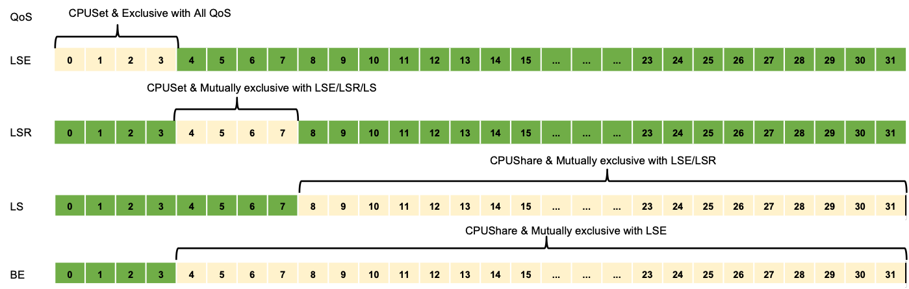

# 在离线混部

企业中一般存在两种类型的工作负载：在线服务（latency-sensitive service）和离线任务（batch job）。在线服务如搜索/支付/推荐等，具有处理优先级高、时延敏感性高、错误容忍度低以及白天负载高晚上负载低等特点。而离线任务如 AI 训练/大数据处理等，具有处理优先级低、时延敏感性低、错误容忍度高以及运行时负载一直较高等特点。由于在线服务与离线任务这两类工作负载天然存在互补性，将在/离线业务混合部署是提高服务器资源利用率的有效途径。

* 可以将离线业务混部到在线业务的服务器上，让离线业务能够充分利用在线业务服务器的空闲资源，提高在线业务服务器资源利用率，实现降本增效。

* 当业务中临时需要大量的资源，这个时候可以将在线业务弹性混部到离线业务的服务器上，优先保证在线业务的资源需求，临时需求结束后再把资源归还给离线业务。

当前使用开源项目 [Koordinator](https://koordinator.sh) 作为在离线混部的解决方案。 

Koordinator 是一个基于 QoS 的 Kubernetes 混合工作负载调度系统。它旨在提高对延迟敏感的工作负载和批处理作业的运行时效率和可靠性，简化与资源相关的配置调整的复杂性，并增加 Pod 部署密度以提高资源利用率。

## Koordinator QoS

Koordinator 调度系统支持的 QoS 有五种类型:

| QoS                              | 特点                                 | 说明|
|----------------------------------|------------------------------------| -------------|
| SYSTEM                           | 系统进程，资源受限                          | 对于 DaemonSets 等系统服务，虽然需要保证系统服务的延迟，但也需要限制节点上这些系统服务容器的资源使用，以确保其不占用过多的资源|
| LSE(Latency Sensitive Exclusive) | 保留资源并组织同 QoS 的 Pod 共享资源            | 很少使用，常见于中间件类应用，一般在独立的资源池中使用|
| LSR(Latency Sensitive Reserved)  | 预留资源以获得更好的确定性                      | 类似于社区的 Guaranteed，CPU 核被绑定|
| LS(Latency Sensitive)            | 共享资源，对突发流量有更好的弹性                   | 微服务工作负载的典型QoS级别，实现更好的资源弹性和更灵活的资源调整能力|
| BE(Best Effort)                  | 共享不包括 LSE 的资源，资源运行质量有限，甚至在极端情况下被杀死 | 批量作业的典型 QoS 水平，在一定时期内稳定的计算吞吐量，低成本资源|

### Koordinator QoS CPU 编排原则
- LSE/LSR Pod 的 Request 和 Limit 必须相等，CPU 值必须是 1000 的整数倍。
- LSE Pod 分配的 CPU 是完全独占的，不得共享。如果节点是超线程架构，只保证逻辑核心维度是隔离的，但是可以通过 CPUBindPolicyFullPCPUs 策略获得更好的隔离。
- LSR Pod 分配的 CPU 只能与 BE Pod 共享。
- LS Pod 绑定了与 LSE/LSR Pod 独占之外的共享 CPU 池。
- BE Pod 绑定使用节点中除 LSE Pod 独占之外的所有 CPU 。
- 如果 kubelet 的 CPU 管理器策略为 static 策略，则已经运行的 K8s Guaranteed Pods 等价于 Koordinator LSR。
- 如果 kubelet 的 CPU 管理器策略为 none 策略，则已经运行的 K8s Guaranteed Pods 等价于 Koordinator LS。
- 新创建但未指定 Koordinator QoS 的 K8s Guaranteed Pod 等价于 Koordinator LS。



### 快速上手
#### 前提条件
- 已经部署 DCE 5.0 容器管理平台，且平台运行正常。
- 容器管理模块已接入 Kubernetes 集群或者已创建 Kubernetes 集群，且能够访问集群的 UI 界面。
- 当前集群已安装 koordinator 并正常运行，安装步骤可参考 [koordinator 离线安装](./install.md)。

#### 操作步骤
以下示例中创建4个副本数为1的 deployment, 设置 QoS 类别为 LSE, LSR, LS, BE, 待 pod 创建完成后，观察各 pod 的 CPU 分配情况。

1. 创建名称为 nginx-lse 的 deployment，QoS 类别为 LSE, yaml 文件如下。
```yaml
    apiVersion: apps/v1
    kind: Deployment
    metadata:
      name: nginx-lse
      labels:
        app: nginx-lse
    spec:
      replicas: 1
      selector:
        matchLabels:
          app: nginx-lse
      template:
        metadata:
          name: nginx-lse
          labels:
            app: nginx-lse
            koordinator.sh/qosClass: LSE # 设置 QoS 类别为 LSE
            # 调度器将在物理内核之间均匀的分配逻辑 CPU
          annotations:
              scheduling.koordinator.sh/resource-spec: '{"preferredCPUBindPolicy": "SpreadByPCPUs"}'
        spec:
          schedulerName: koord-scheduler # 使用 koord-scheduler 调度器
          containers:
          - name: nginx
            image: release.daocloud.io/kpanda/nginx:1.25.3-alpine
            resources:
              limits:
                cpu: '2'
              requests:
                cpu: '2'
          priorityClassName: koord-prod

```

2. 创建名称为 nginx-lsr 的 deployment，QoS 类别为 LSR, yaml 文件如下。

```yaml
    apiVersion: apps/v1
    kind: Deployment
    metadata:
      name: nginx-lsr
      labels:
        app: nginx-lsr
    spec:
      replicas: 1
      selector:
        matchLabels:
          app: nginx-lsr
      template:
        metadata:
          name: nginx-lsr
          labels:
            app: nginx-lsr
            koordinator.sh/qosClass: LSR # 设置 QoS 类别为 LSR
            # 调度器将在物理内核之间均匀的分配逻辑 CPU
          annotations:
              scheduling.koordinator.sh/resource-spec: '{"preferredCPUBindPolicy": "SpreadByPCPUs"}'
        spec:
          schedulerName: koord-scheduler # 使用 koord-scheduler 调度器
          containers:
          - name: nginx
            image: release.daocloud.io/kpanda/nginx:1.25.3-alpine
            resources:
              limits:
                cpu: '2'
              requests:
                cpu: '2'
          priorityClassName: koord-prod
```

3. 创建名称为 nginx-ls 的 deployment，QoS 类别为 LS, yaml 文件如下。

```yaml
    apiVersion: apps/v1
    kind: Deployment
    metadata:
      name: nginx-ls
      labels:
        app: nginx-ls
    spec:
      replicas: 1
      selector:
        matchLabels:
          app: nginx-ls
      template:
        metadata:
          name: nginx-ls
          labels:
            app: nginx-ls
            koordinator.sh/qosClass: LS # 设置 QoS 类别为 LS
            # 调度器将在物理内核之间均匀的分配逻辑 CPU
          annotations:
              scheduling.koordinator.sh/resource-spec: '{"preferredCPUBindPolicy": "SpreadByPCPUs"}'
        spec:
          schedulerName: koord-scheduler 
          containers:
          - name: nginx
            image: release.daocloud.io/kpanda/nginx:1.25.3-alpine
            resources:
              limits:
                cpu: '2'
              requests:
                cpu: '2'
          priorityClassName: koord-prod
```

4. 创建名称为 nginx-be 的 deployment，QoS 类别为 BE, yaml 文件如下。

```yaml
    apiVersion: apps/v1
    kind: Deployment
    metadata:
      name: nginx-be
      labels:
        app: nginx-be
    spec:
      replicas: 1
      selector:
        matchLabels:
          app: nginx-be
      template:
        metadata:
          name: nginx-be
          labels:
            app: nginx-be
            koordinator.sh/qosClass: BE # 设置 QoS 类别为 BE
            # 调度器将在物理内核之间均匀的分配逻辑 CPU
          annotations:
              scheduling.koordinator.sh/resource-spec: '{"preferredCPUBindPolicy": "SpreadByPCPUs"}'
        spec:
          schedulerName: koord-scheduler # 使用 koord-scheduler 调度器
          containers:
          - name: nginx
            image: release.daocloud.io/kpanda/nginx:1.25.3-alpine
            resources:
              limits:
                kubernetes.io/batch-cpu: 2k
              requests:
                kubernetes.io/batch-cpu: 2k
          priorityClassName: koord-batch
```

查看 pod 状态，当 pod 处于 running 后，查看各 pod 的 CPU 分配情况。

```shell
    [root@controller-node-1 ~]# kubectl get pod
    NAME                         READY   STATUS    RESTARTS   AGE
    nginx-be-577c946b89-js2qn    1/1     Running   0          4h41m
    nginx-ls-54746c8cf8-rh4b7    1/1     Running   0          4h51m
    nginx-lse-56c9cd77f5-cdqbd   1/1     Running   0          4h41m
    nginx-lsr-c7fdb97d8-b58h8    1/1     Running   0          4h51m

```
本示例中使用 get_cpuset.sh 脚本查看 Pod 的 cpuset 信息，脚本内容如下。

```shell
    #!/bin/bash
    
    # 获取Pod的名称和命名空间作为输入参数
    POD_NAME=$1
    NAMESPACE=${2-default}
    
    # 确保提供了Pod名称和命名空间
    if [ -z "$POD_NAME" ] || [ -z "$NAMESPACE" ]; then
        echo "Usage: $0 <pod_name> <namespace>"
        exit 1
    fi
    
    # 使用kubectl获取Pod的UID和QoS类别
    POD_INFO=$(kubectl get pod "$POD_NAME" -n "$NAMESPACE" -o jsonpath="{.metadata.uid} {.status.qosClass} {.status.containerStatuses[0].containerID}")
    read -r POD_UID POD_QOS CONTAINER_ID <<< "$POD_INFO"
    
    # 检查UID和QoS类别是否成功获取
    if [ -z "$POD_UID" ] || [ -z "$POD_QOS" ]; then
        echo "Failed to get UID or QoS Class for Pod $POD_NAME in namespace $NAMESPACE."
        exit 1
    fi
    
    POD_UID="${POD_UID//-/_}"
    CONTAINER_ID="${CONTAINER_ID//containerd:\/\//cri-containerd-}".scope
    
    # 根据QoS类别构建cgroup路径
    case "$POD_QOS" in
        Guaranteed)
            QOS_PATH="kubepods-pod.slice/$POD_UID.slice"
            ;;
        Burstable)
            QOS_PATH="kubepods-burstable.slice/kubepods-burstable-pod$POD_UID.slice"
            ;;
        BestEffort)
            QOS_PATH="kubepods-besteffort.slice/kubepods-besteffort-pod$POD_UID.slice"
            ;;
        *)
            echo "Unknown QoS Class: $POD_QOS"
            exit 1
            ;;
    esac
    
    CPUGROUP_PATH="/sys/fs/cgroup/kubepods.slice/$QOS_PATH"
    
    # 检查路径是否存在
    if [ ! -d "$CPUGROUP_PATH" ]; then
        echo "CPUs cgroup path for Pod $POD_NAME does not exist: $CPUGROUP_PATH"
        exit 1
    fi
    
    # 读取并打印cpuset值
    CPUSET=$(cat "$CPUGROUP_PATH/$CONTAINER_ID/cpuset.cpus")
    echo "CPU set for Pod $POD_NAME ($POD_QOS QoS): $CPUSET"
```

查看各 Pod 的 cpuset 分配情况。

1. QoS 类型为 LSE 的 Pod, 独占 0-1 核，不与其他类型的 Pod 共享 CPU。
```shell
    [root@controller-node-1 ~]# ./get_cpuset.sh nginx-lse-56c9cd77f5-cdqbd
    CPU set for Pod nginx-lse-56c9cd77f5-cdqbd (Burstable QoS): 0-1
```
2. QoS 类型为 LSR 的 Pod, 绑定 CPU 2-3 核，可与 BE 类型的 Pod 共享。
```shell
    [root@controller-node-1 ~]# ./get_cpuset.sh nginx-lsr-c7fdb97d8-b58h8
    CPU set for Pod nginx-lsr-c7fdb97d8-b58h8 (Burstable QoS): 2-3
```

3. QoS 类型为 LS 的 Pod, 使用 CPU 4-15 核，绑定了与 LSE/LSR Pod 独占之外的共享 CPU 池。
```shell
    [root@controller-node-1 ~]# ./get_cpuset.sh nginx-ls-54746c8cf8-rh4b7
    CPU set for Pod nginx-ls-54746c8cf8-rh4b7 (Burstable QoS): 4-15
```

4. QoS 类型为 BE 的 pod, 可使用 LSE Pod 独占之外的 CPU。
```shell
    [root@controller-node-1 ~]# ./get_cpuset.sh nginx-be-577c946b89-js2qn
    CPU set for Pod nginx-be-577c946b89-js2qn (BestEffort QoS): 2,4-12
```
