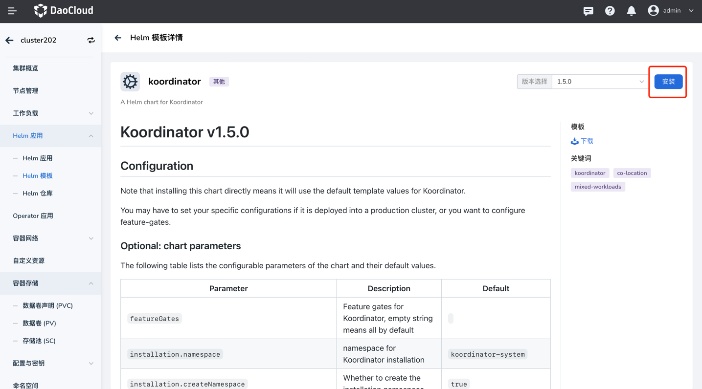
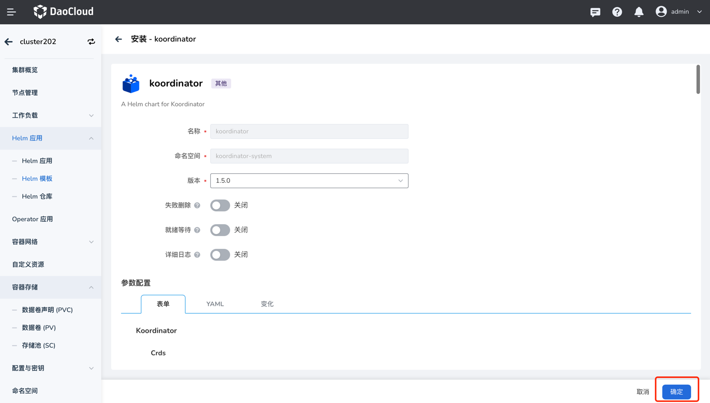
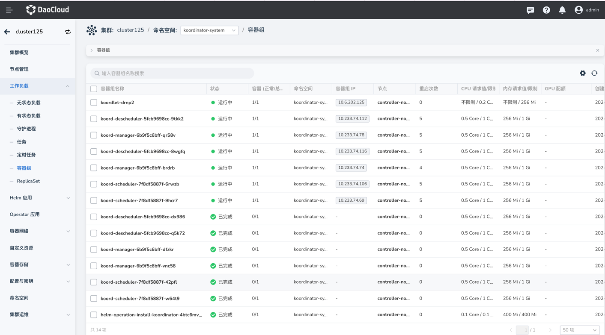

# Koordinator 离线安装

Koordinator 是一个基于 QoS 的 Kubernetes 混合工作负载调度系统。它旨在提高对延迟敏感的工作负载和批处理作业的运行时效率和可靠性，
简化与资源相关的配置调整的复杂性，并增加 Pod 部署密度以提高资源利用率。

DCE 5.0 预置了 Koordinator v1.5.0 离线包。 

本文介绍如何离线部署 Koordinator。

## 前提条件

1. 用户已经在平台上安装了 v0.20.0 及以上版本的 addon 离线包。
2. 待安装集群的 Kubernetes version >= 1.18.
3. 为了最好的体验，推荐使用 linux kernel 4.19 或者更高版本。

## 操作步骤

参考如下步骤为集群安装 Koordinator 插件。

1. 登录平台，进入 __容器管理__ -> __待安装 Koordinator 的集群__ -> 进入集群详情。

2. 在 __Helm 模板__ 页面，选择 __全部仓库__ ，搜索 __koordinator__ 。

3. 选择 __koordinator__ ，点击 __安装__ 。

    

4. 进入 koordinator 安装页面，点击 __确定__，使用默认配置安装 koordinator。

    

5. 查看 koordinator-system 命名空间下的 Pod 是否正常运行

    
