# DCE 4.0 -> DCE 5.0 有限场景迁移

## 环境准备

1. 可用的 DCE 4.0 环境
1. 可用的 DCE 5.0 环境
1. 可用于数据还原的 Kubernetes 集群，以下简称 __还原集群__

## 前置步骤

1. 在 DCE 4.0 上，安装 CoreDNS 插件，安装步骤参考：[安装 CoreDNS](https://dwiki.daocloud.io/pages/viewpage.action?pageId=36668076)。

1. 将 DCE 4.0 纳管到 DCE 5.0，纳管步骤参考[接入 DCE 4.0](../user-guide/clusters/integrate-cluster.md)，
   被纳管到 DCE 5.0 的 DCE 4.0 集群，以下简称 __备份集群__ 。

    !!! note

        接入集群时，发行版选择 __DaoCloud DCE4__ 。

1. 在纳管的 DCE 4.0 集群上安装 velero，安装步骤参考 [安装 velero](../user-guide/backup/install-velero.md)。

1. 将还原集群纳管到 DCE 5.0，通过创建集群方式或接入方式都可。

1. 在还原集群中安装 velero，安装步骤参考 [安装 velero](../user-guide/backup/install-velero.md)。

!!! note

    - 被纳管的 DCE 4.0 集群和还原集群中安装的 velero，对象存储配置必须保持一致。
    - 如果您需要进行 Pod 迁移，请将表单参数中的 __Migration Plugin Configuration__ 开关打开（**velero 5.2.0+** 版本支持此配置）。


## 可选配置

如果您需要进行 Pod 迁移，请在前置步骤完成后执行以下步骤，非 Pod 迁移场景可以忽略。

!!! note

    以下步骤都在被 DCE 5.0 纳管的还原集群中执行。

### 配置 Velero 插件

1. velero 插件安装完成，可以执行以下 yaml 文件完成 velero 插件的配置。

    !!! note

        安装 velero 插件时，必须将表单参数中的 __Migration Plugin Configuration__ 开关打开。

    ```yaml
    apiVersion: v1
    kind: ConfigMap
    metadata:
      # any name can be used; Velero uses the labels (below)
      # to identify it rather than the name
      name: velero-plugin-for-migration
      # must be in the velero namespace
      namespace: velero
      # the below labels should be used verbatim in your
      # ConfigMap.
      labels:
        # this value-less label identifies the ConfigMap as
        # config for a plugin (i.e. the built-in restore item action plugin)
        velero.io/plugin-config: "velero-plugin-for-migration"
        # this label identifies the name and kind of plugin
        # that this ConfigMap is for.
        velero.io/velero-plugin-for-migration: RestoreItemAction
    data:
      velero-plugin-for-migration: '{"resourcesSelector":{"includedNamespaces":["kube-system"],"excludedNamespaces":["default"],"includedResources":["pods","deployments","ingress"],"excludedResources":["secrets"],"skipRestoreKinds":["endpointslice"],"labelSelector":"app:dao-2048"},"resourcesConverter":[{"ingress":{"enabled":true,"apiVersion":"extensions/v1beat1"}}],"resourcesOperation":[{"kinds":["pod"],"domain":"labels","operation":{"add":{"key1":"values","key2":""},"remove":{"key3":"values","key4":""},"replace":{"key5":["source","dest"],"key6":["","dest"],"key7":["source",""]}}},{"kinds":["deployment","daemonset"],"domain":"annotations","scope":"resourceSpec","operation":{"add":{"key1":"values","key2":""},"remove":{"key3":"values","key4":""},"replace":{"key5":["source","dest"],"key6":["","dest"],"key7":["source",""]}}}]}'
    ```

    !!! note

        - 不能修改 plugin 配置 cm 的名字，且必须创建在 velero 命名空间下
        - 填写 plugin 配置需注意区分填写资源 resources 还是 kind
        - 修改 plugin 配置后需重启 velero pod
        - 以下 yaml 是 plugin 配置展示样式，需转换为 json 添加到 configmap 中

    如何配置 __velero-plugin-for-migration__ 可参考以下 yaml 和注释

    ```yaml
    resourcesSelector: # plugin 需要处理或者忽略的资源
      includedNamespaces: # plugin 排除 backup 包含的 namespace
        - kube-system
      excludedNamespaces: # plugin 不处理 backup 包含的 namespace
        - default
      includedResources:  # plugin 处理 backup 包含的资源
        - pods
        - deployments
        - ingress
      excludedResources:  # plugin 不处理 backup 包含的资源
        - secrets
      skipRestoreKinds:
        - endpointslice  # restore plugin 跳过 backup 内包含的资源，即不执行 restore 操作，
                         # 该资源需要包含在 includedResources 中，才会被 plugin 捕捉到，
                         # 该字段需填写资源 kind，不区分大小写
      labelSelector: 'app:dao-2048'
    resourcesConverter: # restore plugin 需要转换的资源，不支持配置具体资源字段转换
      - ingress:
          enabled: true
          apiVersion: extensions/v1beat1
    resourcesOperation: # restore plugin 修改 resource/template 的 annotations/labels 
      - kinds: ['pod'] # 填写 backup 包含资源 kind，不区分大小写
        domain: labels   # 处理 resources labels
        operation:
          add:
            key1: values # 添加 labels key1:values
            key2: ''
          remove:
            key3: values # 删除 lables key3:values,匹配 key,values
            key4: ''     # 删除 lables key4,只匹配key,不匹配 values
          replace:
            key5:   # 替换 lables key5:source -> key5:dest
              - source
              - dest
            key6:   # 替换 lables key6: -> key6:dest, 不匹配 key6 values
              - ""
              - dest
            key7:   # 替换 lables key7:source -> key7:""
              - source
              - ""
      - kinds: ['deployment', 'daemonset'] # 填写 backup 包含资源 kind，不区分大小写
        domain: annotations  # 处理 resources template annotations
        scope: resourceSpec  # 处理 resources template spec 的 annotations 或者 labels，取决于 domain 配置
        operation:
          add:
            key1: values # 添加 annotations key1:values
            key2: ''
          remove:
            key3: values # 删除 annotations key3:values,匹配 key,values
            key4: ''     # 删除 annotations key4,只匹配key,不匹配 values
          replace:
            key5:   # 替换 annotations key5:source -> key5:dest
              - source
              - dest
            key6:   # 替换 annotations key6: -> key6:dest, 不匹配 key6 values
              - ""
              - dest
            key7:   # 替换 annotations key7:source -> key7:""
              - source
              - ""
    ```

2. velero-plugin-for-dce plugin 获取以上配置后，根据配置对资源做链式操作，例如 ingress 经过 resourcesConverter 处理之后还会经过 resourcesOperation 处理。

### 镜像仓库替换

如果镜像地址发上了变化，可以通过在 Velero 命名空间中创建一个 ConfigMap 来配置映射，完成镜像地址的替换。

次配置适用的迁移资源：pod/deployment/statefulsets/daemonset/replicaset/replicationcontroller/job/cronjob。

!!! note

    - ConfigMap 在还原集群中的 Velero 命名空间中创建。
    - 标签为 velero.io/change-image-name: RestoreItemAction 的 ConfigMap 只能配置一个。
    - 映射规则只会匹配符合的第一条规则，对应 ConfigMap 中的 case。

```yaml
apiVersion: v1
kind: ConfigMap
metadata:
  # any name can be used; Velero uses the labels (below)
  # to identify it rather than the name
  name: change-image-name-config
  # must be in the velero namespace
  namespace: velero
  # the below labels should be used verbatim in your
  # ConfigMap.
  labels:
    # this value-less label identifies the ConfigMap as
    # config for a plugin (i.e. the built-in restore item action plugin)
    velero.io/plugin-config: ""
    # this label identifies the name and kind of plugin
    # that this ConfigMap is for.
    velero.io/change-image-name: RestoreItemAction
data:
  # add 1+ key-value pairs here, where the key can be any
  # words that ConfigMap accepts. 
  # the value should be：
  # "<old_image_name_sub_part><delimiter><new_image_name_sub_part>"
  # for current implementation the <delimiter> can only be ","
  # e.x: in case your old image name is 1.1.1.1:5000/abc:test
  "case1":"1.1.1.1:5000,2.2.2.2:3000"
  "case2":"5000,3000"
  "case3":"abc:test,edf:test"
  "case5":"test,latest"
  "case4":"1.1.1.1:5000/abc:test,2.2.2.2:3000/edf:test"
  # Please note that image name may contain more than one part that
  # matching the replacing words.
  # e.x:in case your old image names are:
  # dev/image1:dev and dev/image2:dev
  # you want change to:
  # test/image1:dev and test/image2:dev
  # the suggested replacing rule is:
  "case5":"dev/,test/"
  # this will avoid unexpected replacement to the second "dev".
```

## 迁移场景

### 资源和数据迁移

下文以业务应用迁移作为示例。

#### 迁移情境：有状态应用 StatefulSet + PVC 备份和恢复

已知前提：备份集群中某个命名空间下已部署一个有状态应用（StatefulSet），例如 etcd，并挂载了 PVC。

**备份**

先将需要备份的资源在备份集群中进行备份，流程如下，在此之前，您可以先阅读 [应用备份](../user-guide/backup/deployment.md)：

1. 进入容器管理模块，点击左侧导航栏上的 __备份恢复__ -> __应用备份__ ，进入 __应用备份__ 列表页面。

    

2. 在 __应用备份__ 列表页面，选择备份集群。点击右上角的 __备份计划__ ，新建一个备份计划。

3. 参考下方说明填写备份配置。

    - 名称：新建备份计划的名称。
    - 源集群：计划执行应用备份的集群。
    - 对象存储位置：在源集群安装 velero 时配置的对象存储的访问路径。
    - 命名空间：需要进行备份的命名空间，支持多选。
    - 高级配置：根据资源标签对命名空间内的特定资源进行备份如某个应用，或者备份时根据资源标签对命名空间内的特定资源不进行备份。

!!! note

    - 如果需要对多个或全部命名空间资源进行批量备份，请在命名空间选项选择多个或全部命名空间。
    - 如果需要对命名空间内特定资源进行备份，请设置标签进行资源过滤。
        


**恢复**

备份集群数据备份好后，将资源和数据在还原集群中恢复，操作步骤如下：

1. 进入容器管理模块，点击左侧导航栏上的 __备份恢复__ -> __应用备份__ ，进入 __应用恢复__ 列表页面。

2. 在 __应用恢复__ 列表页面，选择恢复集群。点击右上角的 __恢复备份__ ，创建一个恢复备份任务。

    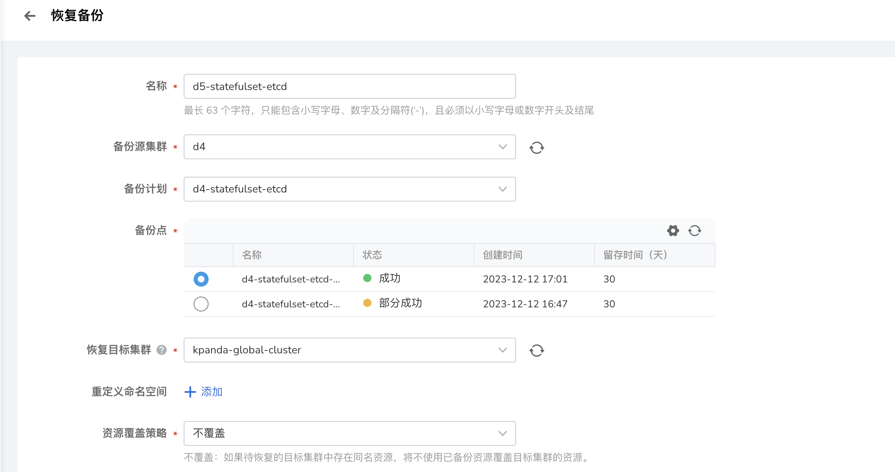

3. 填写备份恢复配置，执行备份。

    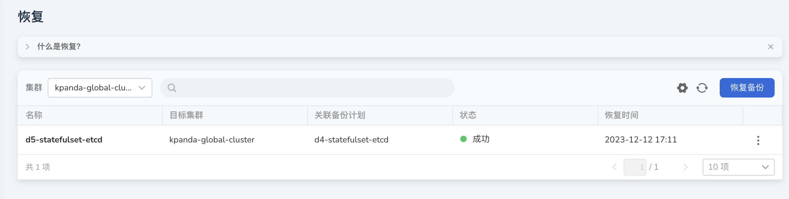
      
    !!! note

        - 以上迁移流程同样适用于以下资源：
            - workload 的附属资源，如 secret、configmap
            - 多服务场景：Helm 应用 + Redis
        - namespace 资源 和 cluster 资源如果配置了 RBAC，那对应类别的资源迁移成功后对应的 RBAC 也会一并迁移到 DCE 5.0

### **镜像仓库镜像迁移**

下文介绍镜像仓库镜像迁移步骤。

1. 将 DCE 4.0 镜像仓库接入到 Kangaroo 仓库集成（管理员），操作步骤参考 [仓库集成](../../kangaroo/integrate/integrate-admin.md)。

    

    !!! note

        - 仓库地址使用 dce-registry 的 vip 地址 ip
        - 账号密码使用 DCE 4.0 管理员的账号密码

2. 在管理员界面创建或集成一个 Harbor 仓库，用于迁移源镜像。

    

3. 进入 Harbor 仓库实例配置目标仓库与同步规则，规则触发后，Harbor 会自动从 dce-registry 拉取镜像。

    

    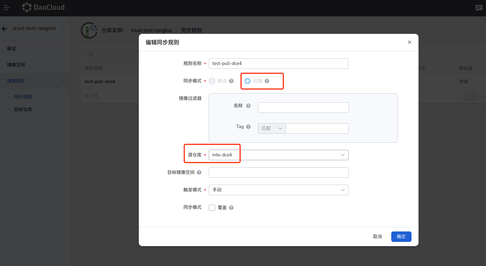
  
4. 点击 同步规则名称，进入同步任务详情页，可以查看镜像同步是否成功。

    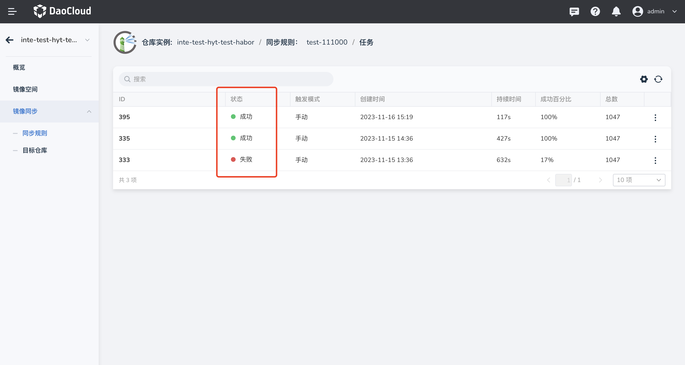

### 网络策略迁移

#### Calico 网络策略迁移

参考资源和数据迁移流程，将 DCE 4.0 中的 Calico 服务迁移至 DCE 5.0。
由于 IPPool 名称不同，会导致服务异常，请迁移后？手动删除服务 YAML 中的注解，以确保服务正常启动。

 !!! note
	
    - DCE 4.0 中，名称为 default-ipv4-ippool
    - DCE 5.0 中，名称为 default-pool

```yaml
annotations:
  dce.daocloud.io/parcel.net.type: calico
  dce.daocloud.io/parcel.net.type: default-ipv4-ippool
```


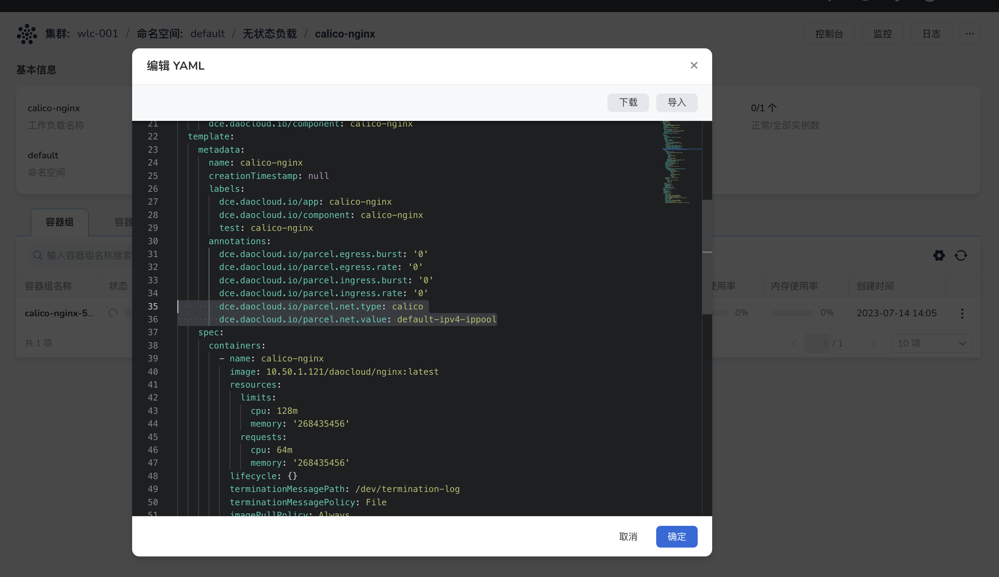

#### Parcel Underlay 网络策略迁移

下文介绍 Parcel Underlay 网络策略迁移步骤。

1. 在 __还原集群__ 中安装 Helm 应用 spiderpool，安装流程参考[安装 spiderpool ](../../network/modules/spiderpool/install.md)。

    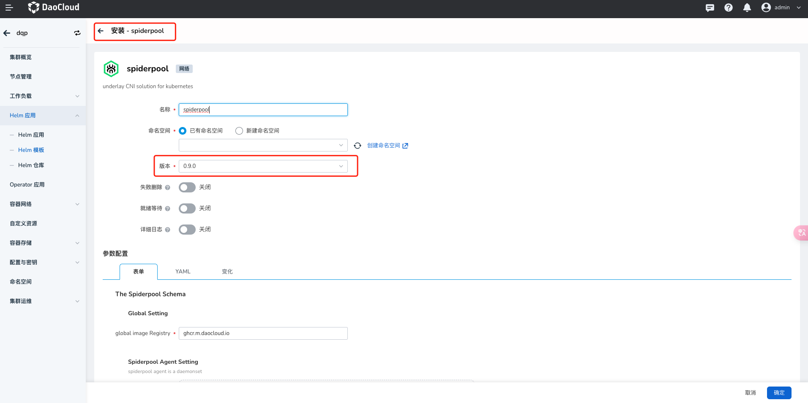

2. 进入 __还原集群__ 详情页，选择左侧菜单 __容器网络__ -> __网络配置__ 。

    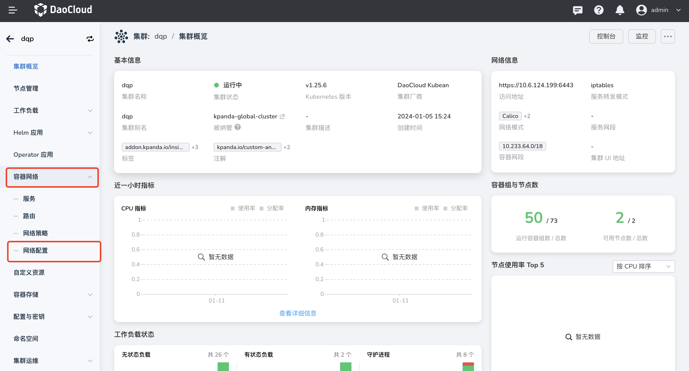

3. 查看 DCE4 中使用的 IP 地址，在 DCE5.0  __静态 IP 池__ 中创建与 DCE4 中相同的子网 IP 地址及 IP 池。子网及 IP 池的使用请参考[创建子网及 IP 池 ](../../network/config/ippool/createpool.md.md)。

    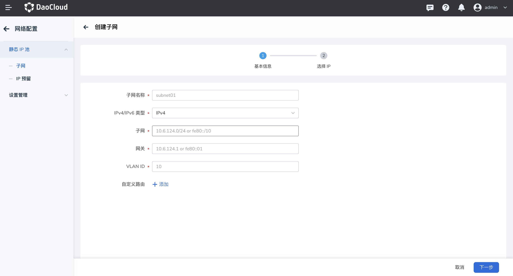

    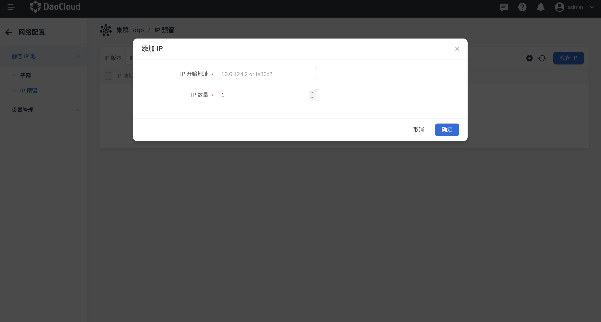
创建完子网后，在子网详情页创建 IP 池及添加 IP 开始地址与 IP 数量。

   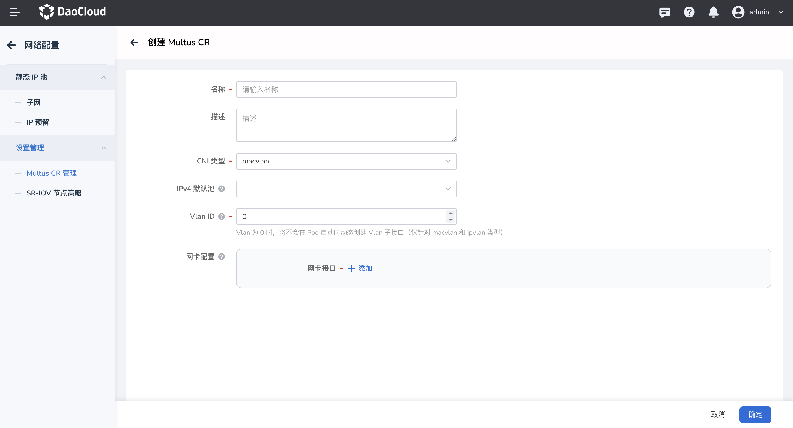

1. 创建 macvlan 类型的 Multus CR 实例，并选择刚才创建好的 IP 池。 具体使用请参考[创建 Multus CR](../../network/config/multus-cr.md)

    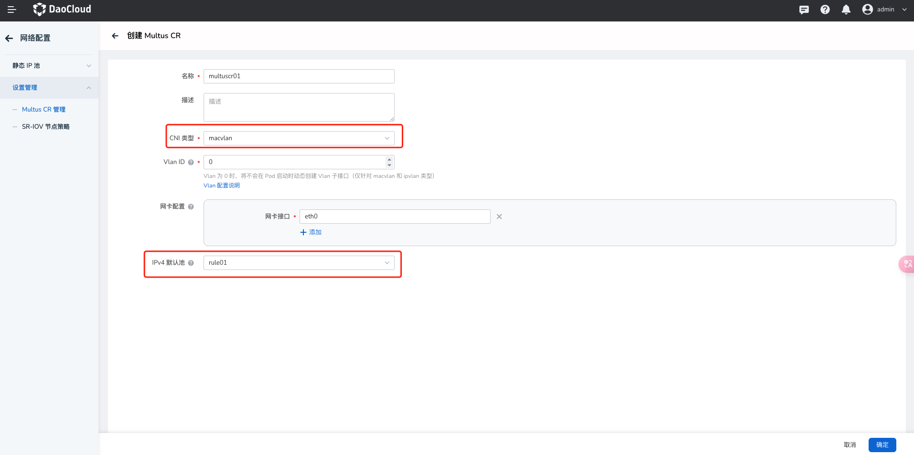

1. 进入**自定义资源**界面，并手动修改`spidermultusconfigs.spiderpool.spidernet.io`的`detectIPConflict`字段为：`true`，此为开启 IP 冲突检测。

   

1. 进入**工作负载** -> **容器网卡配置**，网卡选择刚才创建好的 macvlan 类型的 Multus CR，网卡 IP 池选择创建好的 IP 池，点击确定创建完成。此时容器组为运行中，则代表可以正常访问。

  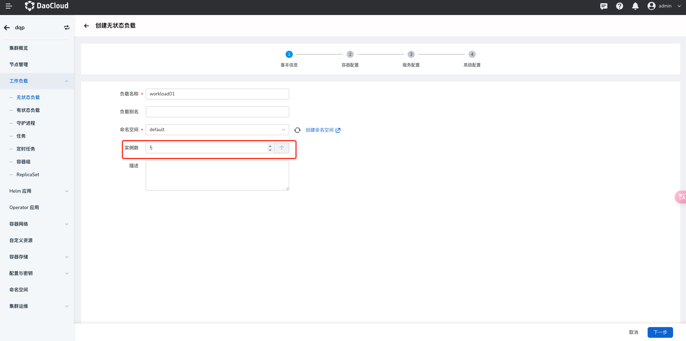 

  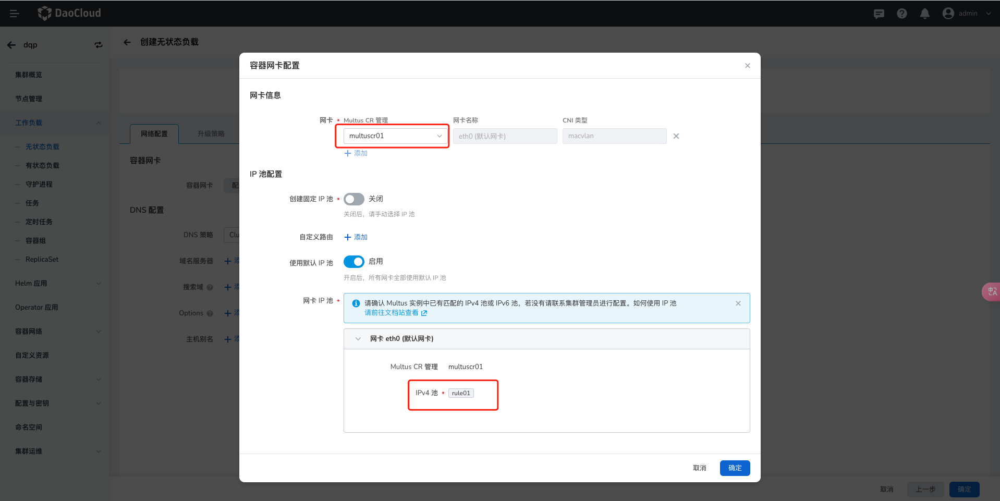 

1. 创建 velero dce plugin configmap。

    ```yaml
    ---
      resourcesSelector:
        includedResources:
        - pods
        - deployments
      resourcesConverter:
      resourcesOperation:
      - kinds:
        - pod
        domain: annotations
        operation:
          replace:
            cni.projectcalico.org/ipv4pools:
            - '["default-ipv4-ippool"]'
            - default-pool
      - kinds:
        - deployment
        domain: annotations
        scope: resourceSpec
        operation:
          remove:
            dce.daocloud.io/parcel.egress.burst:
            dce.daocloud.io/parcel.egress.rate:
            dce.daocloud.io/parcel.ingress.burst:
            dce.daocloud.io/parcel.ingress.rate:
            dce.daocloud.io/parcel.net.type:
            dce.daocloud.io/parcel.net.value:
            dce.daocloud.io/parcel.ovs.network.status:
          add:
            ipam.spidernet.io/subnets: ' [ { "interface": "eth0", "ipv4": ["d5"] } ]'
            v1.multus-cni.io/default-network:  kube-system/d5multus
    ```

1. 验证是否迁移成功。

    1. 查看应用 YAML 中是否有 annotation。

        ```yaml
        annotations:
          ipam.spidernet.io/subnets: ' [ { "interface": "eth0", "ipv4": ["d5"] } ]'
          v1.multus-cni.io/default-network: kube-system/d5multus
        ```

    2. 查看 Pod IP 是否在 配置的 IP 池内。
