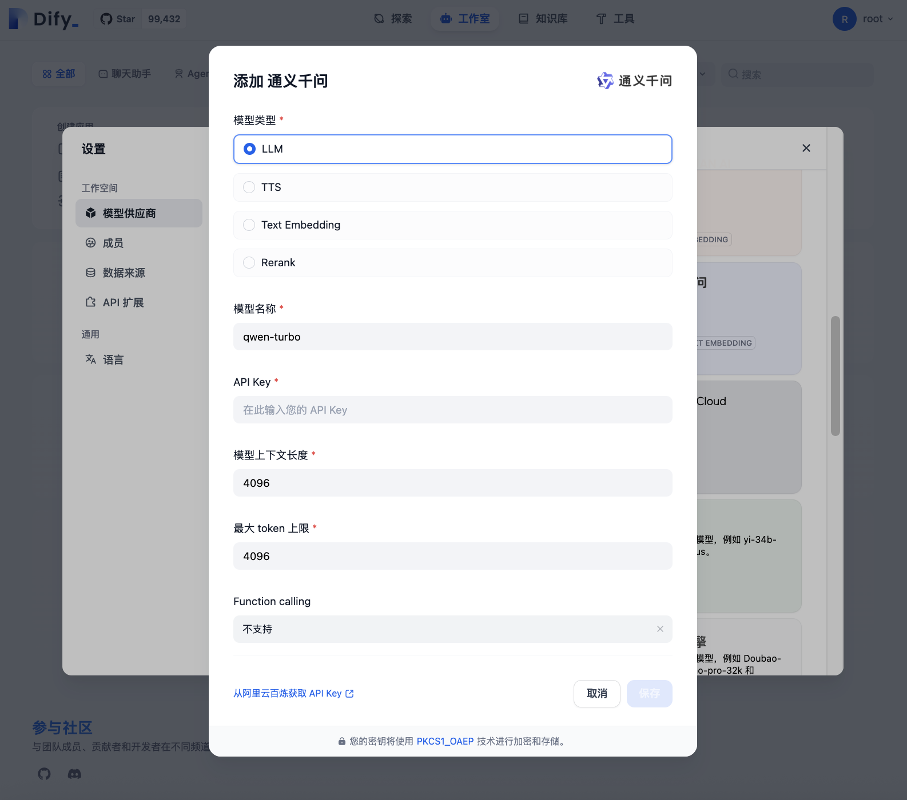

# 快速搭建 Dify LLM 应用开发平台

[Dify](https://dify.ai) 是一款开源的大语言模型(LLM) 应用开发平台，提供了 Agent 工作流、RAG Pipeline、丰富的集成及可观测性等一站式能力，使用户可以快速搭建生产级的生成式 AI 应用。

本文主要介绍如何在 DCE 5.0 中使用 __Helm 应用__ 部署 __dify-chart__ 插件，快速搭建 Dify LLM 应用开发平台，实现基于 Qwen-turbo 的 Dify 应用/工作流的使用示例。

## 前提条件

安装 __dify-chart__ 插件前，需要满足以下前提条件：

- 容器管理模块[已接入 Kubernetes 集群](../clusters/integrate-cluster.md)或者[已创建 Kubernetes 集群](../clusters/create-cluster.md)，且能够访问集群的 UI 界面。

- 当前操作用户应具有 [NS Editor](../permissions/permission-brief.md#ns-editor) 或更高权限，详情可参考[命名空间授权](../namespaces/createns.md)。

## 安装流程

执行如下步骤为集群安装 __dify-chart__ 插件，搭建 Dify LLM 应用开发平台。

1. 在集群列表页面找到需要安装 __dify-chart__ 插件的目标集群，点击集群名称，在左侧导航栏依次点击 __Helm 应用__ -> __Helm 模板__ ，在搜索栏输入 __dify-chart__ 进行搜索。

    

2. 阅读 __dify-chart__ 插件相关介绍，选择版本后点击 __安装__ 按钮，本文以 __0.0.2__ 版本为例。

    

3. 填写和配置参数后点击 __下一步__ 。

    === "基本参数"

        

        - 名称：必填参数，输入插件名称，请注意名称最长 63 个字符，只能包含小写字母、数字及分隔符（“-”）,且必须以小写字母或数字开头及结尾，例如 dify-chart。
        - 命名空间：插件安装的命名空间，可以选择已有命名空间，也可以新建命名空间。例如 新建 __dify__ 命名空间。
        - 版本：插件的版本，例如 __0.0.2__ 。
        - 失败删除：可选参数，开启后，将默认同步开启安装等待。如果安装失败，将删除安装相关资源。
        - 就绪等待：可选参数，开启后，将等待应用下所有关联资源处于就绪状态，才会标记应用安装成功。
        - 详情日志：可选参数，开启后，将输出安装过程的详细日志。

        !!! note

            开启 __就绪等待__ 和/或 __失败删除__ 后，应用需要经过较长时间才会被标记为 __运行中__ 状态。

    === "参数配置"

        
        
        - __service__ ：
            - __type__ ：dify 应用的访问方式，保持默认 __Nodeport__ 节点访问。
            - __nodePort__ ：访问端口，默认 __30000__ 。
            - __nodeIP__ ：外部可访问的节点 IP ，默认 __127.0.0.1__ ，需替换为当前集群的节点 IP 。

4. 确认 YAML 无误后点击 __确定__ ，完成 __dify-chart__ 插件的安装。之后系统将自动跳转至 __Helm 应用__ 列表页面，稍等几分钟后，为页面执行刷新操作，即可看到刚刚安装的应用。
    

## 快速访问

1. 可以通过安装配置的 __nodeIP__ ：__nodePort__ 直接访问，也可以在 UI 界面点击 __服务__ -> __dify-nginx-nodeport__ -> __外部访问__ 按钮访问已搭建的 Dify 平台。

    

2. 输入管理员初始化密码验证进入初始化界面，默认管理员初始化密码 __password__ 。

    

3. 设置 Dify 应用的管理员账户，用于创建应用和管理 LLM 供应商等，点击 __设置__ 后完成初始化。

    

4. 登陆上一步设置的管理员账户即可进入 Dify 平台主页 。

    

## 使用示例

本文以快速构建一个 __中英翻译__ 的应用/工作流为例，对 DCE 5.0 目标集群中搭建的 Dify 平台进行简单实践。

### 模型接入 

1. 在 Dify 平台主页右上角依次点击  __用户名__ 进入 __设置__ 界面。

    

2. 点击 __设置__ -> __模型供应商__ ，进入模型列表选择所需要的模型。

    
  
3. 配置模型的基本参数，点击  __确认__ 添加大模型服务。本文将以 __通义千文__ 为例。

    

    - 模型类型：Dify 按模型的使用场景将模型分为以下 4 类：LLM 模型 、TTS 模型 、Text Embedding 模型 和 Rerank 模型。
    - 模型名称：所需模型的具体名称，例如 qwen-turbo。
    - API Key：调用模型服务的核心凭证，用于验证用户身份并保护数据安全。
    - 模型上下文长度：模型单次处理文本时能保留的最大 Token 数量（包括输入和输出），超出上下文长度会导致历史对话被丢弃，默认 4096 。
    - 最大 Token 上限：模型单次输出的最大 Token 数量，默认 4096 。
    - Function Calling：允许模型在生成文本时调用外部工具或 API，默认 不支持 。

### 构建应用 

创建 __文本生成__ 应用步骤如下：

1.  在 Dify 平台主页依次点击  __创建应用__ -> __创建空白应用__ ，选择应用类型，并填写 __应用名称 & 图标__ 和 __描述__ 创建应用。

    

2.  创建应用后会自动跳转到应用概览页。点击左侧菜单 __编排__ 来编排应用，界面右侧 __调试与预览__ 区域可以实现对应用的调试和预览。

    

    - 前缀提示词：提示词用于约束 AI 给出专业的回复，让回应更加精确。用户可以借助内置的提示生成器，编写合适的提示词。
    - 变量：变量将以表单形式让用户在对话前填写，提示词中的变量的值会替换成用户填写的值，支持设置最大长度，例如 {{query}}。
    - 上下文：上下文可以理解为向 LLM 提供的背景信息，常用于填写知识检索的输出变量。

3.  点击右上角 __发布__ ，即可完成一个简单应用的快速构建。

    

4.  依次点击 __发布__ -> __运行__ 访问已创建的应用主页进行使用。

    

### 工作流配置

Dify 工作流分为两种类型：

-  __Chatflow__：面向对话类情景，包括客户服务、语义搜索、以及其他需要在构建响应时进行多步逻辑的对话式应用程序。
-  __Workflow__：面向自动化和批处理情景，适合高质量翻译、数据分析、内容生成、电子邮件自动化等应用程序。

创建 __Workflow__ 工作流步骤如下：

1.  在 __创建应用__ -> __创建空白应用__ 页面选择工作流，并填写 __应用名称 & 图标__ 和 __描述__ 创建工作流。

    

2.  创建后会自动跳转到编排界面，通过点击鼠标右键或上一节点末尾的 __+ 号__ 添加节点，编排工作流。
 
    

3.  添加 __LLM__ 节点，调用大模型后填写和配置参数。
 
    

    - 模型：调用大语言模型回答问题，例如 qwen-turbo。
    - 上下文：上下文可以理解为向 LLM 提供的背景信息，常用于填写知识检索的输出变量。
    - 提示词：一个易用的提示词编排页面。如果选择聊天模型（Chat model），你可以自定义系统提示词（SYSTEM）/用户（USER）/ 助手（ASSISTANT）三部分内容。
    - 视觉：开启视觉功能将允许模型输入图片，并根据图像内容的理解回答用户问题。
    - 输出变量：大模型生成的内容。
    - 错误重试：开启错误重试功能后，节点将在发生错误的时候按照预设策略进行自动重试。可以调整最大重试次数和每次重试间隔以设置重试策略。
    - 异常处理：提供多样化的节点错误处理策略，能够在当前节点发生错误时抛出故障信息而不中断主流程；或通过备用路径继续完成任务。

4.  添加 __结束__ 节点后完成工作流的编排，点击右上角 __运行__ 可以对工作流进行调试和预览。

    

5. 点击右上角 __发布__ ，即可完成一个简单工作流的快速构建。
 
    

更多 Dify 应用开发平台使用功能请参阅 [Dify 官方文档](https://dify.ai)。