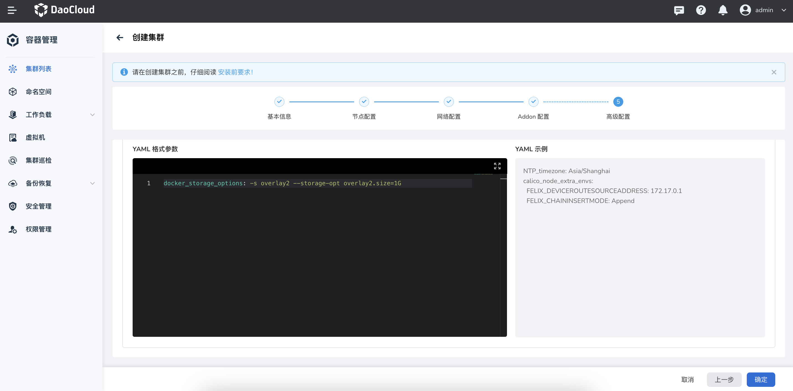

# 限制 Docker 单容器可占用的磁盘空间

Docker 在 17.07.0-ce 版本中引入 overlay2.zize，本文介绍如何使用 overlay2.zize 来限制 docker 单容器可占用的磁盘空间。

## 前提条件

在配置 docker overlay2.size 之前，需要调整操作系统中文件系统类型为 xfs 并使用 pquota 方式进行设备挂载。

格式化设备为 XFS 文件系统，可以执行以下命令：

```shell
mkfs.xfs -f /dev/xxx
```

!!! note

    pquota 限制的是项目（project）磁盘配额。

## 设置单容器磁盘可占用空间

满足以上条件后，用户可以通过设置 docker overlay2.size 来限制单容器磁盘占用空间大小。命令行示例如下：

```shell
sudo dockerd -s overlay2 --storage-opt overlay2.size=1G
```

## 场景演练

接下来以一个实际的例子来演练一下限制 docker 单容器可占用的磁盘空间整体实现流程。

### 目标

部署一个 Kubernetes 集群，并限制 docker 单容器可占用的磁盘空间大小为1G，超出1G将无法使用。

### 操作流程

1. 登陆目标节点，查看 fstab 文件，获取当前设备的挂载情况。

    ```yaml
    $ cat /etc/fstab
    
    #
    # /etc/fstab
    # Created by anaconda on Thu Mar 19 11:32:59 2020
    #
    # Accessible filesystems, by reference, are maintained under '/dev/disk'
    # See man pages fstab(5), findfs(8), mount(8) and/or blkid(8) for more info
    #
    /dev/mapper/centos-root /                       xfs     defaults        0 0
    UUID=3ed01f0e-67a1-4083-943a-343b7fed1708 /boot                   xfs     defaults        0 0
    /dev/mapper/centos-swap swap                    swap    defaults        0 0
    ```

    以图示节点设备为例，可以看到 XFS 格式设备 /dev/mapper/centos-root 以默认方式 defauls 挂载到 / 根目录.

2. 配置 xfs 文件系统使用 pquota 方式挂载。

    a. 修改 fstab 文件，将挂载方式从 defaults 更新为 rw,pquota；

    ```yaml
    # 修改 fstab 配置
    $ vi /etc/fstab
    - /dev/mapper/centos-root /                       xfs     defaults         0 0
    + /dev/mapper/centos-root /                       xfs     rw,pquota        0 0
 
    # 验证配置是否有误
    $ mount -a
    ```

    b. 查看 pquota 是否生效

    ```shell
    xfs_quota -x -c print
    ```

    

    !!! note

        如果 pquota 未生效，请检查操作系统是否开启 pquota 选项，如果未开启，需要在系统引导配置 /etc/grub2.cfg 中添加：rootflags=pquota 参数，配置完成后，需要 reboot 重启操作系统。

    

3. **创建集群** -> **高级配置** -> **自定义参数** 中添加 docker_storage_options 参数，设置单容器磁盘可占用空间。

    

    !!! note

        也可以基于 kubean manifest 操作，在 vars conf 里添加 docker_storage_options 参数。

        ```yaml
        apiVersion: v1
        kind: ConfigMap
        metadata:
          name: sample-vars-conf
          namespace: kubean-system
        data:
          group_vars.yml: |
            unsafe_show_logs: true
            container_manager: docker
        +   docker_storage_options: -s overlay2 --storage-opt overlay2.size=1G  # 新增 docker_storage_options 参数
            kube_network_plugin: calico
            kube_network_plugin_multus: false
            kube_proxy_mode: iptables
            etcd_deployment_type: kubeadm
            override_system_hostname: true
            ...
        ```

4. 查看 dockerd 服务运行配置，检查磁盘限制是否设置成功。

    

以上，完成限制 docker 单容器可占用的磁盘空间整体实现流程。