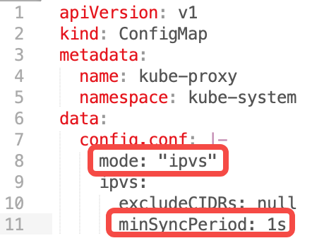
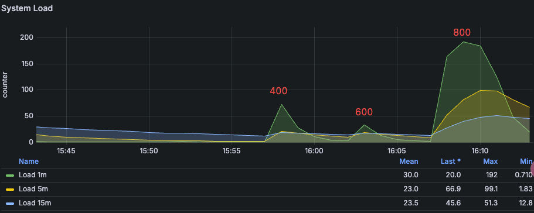
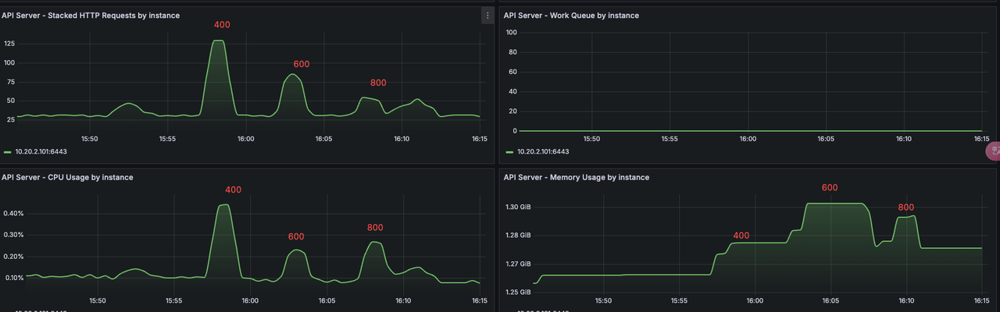
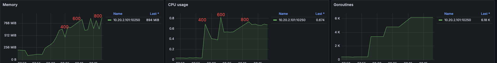
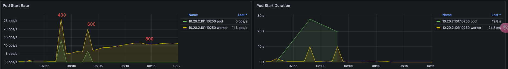

# 单台物理机最大运行 Pod 数量的最佳实践

本文介绍了如何为集群上运行的节点配置最大运行 Pod 数量的最佳实践。包括资源规划、配置更改、测试过程及结果、节点故障迁移问题和实施建议。

## 硬件配置

- 3 台虚机作为工作集群 K8s 主节点，规格：8C 16G，硬盘 100G
- 1 台物理机作为工作集群 K8s 节点，规格：80C 512G
- 操作系统：Oracle Linux 9.5

## 其他配置调优

### 系统参数

```bash
sysctl -w fs.inotify.max_user_watches=655360
sysctl -w fs.inotify.max_user_instances=81920
sysctl -w fs.inotify.max_queued_events=655360
```

### kubelet

```yaml title="/var/lib/kubelet/config.yaml"
- eventBurst: 100 # 默认 100
- eventRecordQPS: 50 # 默认 50
- maxPods: 800 # 默认 110
- podsPerCore: 10 # 默认值 0，每个核心的最大 Pod 数量
- serializeImagePulls: false # 关闭串行拉取镜像
- maxParallelImagePulls: 10 # 最大并行拉取镜像数量，是作为提高创建 Pod QPS
```

给 kubelet 配置资源预留，不让其注册到 node 上

```yaml
kubeReserved: {cpu: "2", memory: "2Gi", ephemeral-storage: "10Gi"}
systemReserved: {cpu: "2", memory: "2Gi", ephemeral-storage: "10Gi"}
```

### containerd

```yaml
# /etc/containerd/config.toml
[plugins."io.containerd.grpc.v1.cri"]
 max_concurrent_downloads = 10 # 并发镜像下载数 (默认 3)，需要合理评估
```

### kube-apiserver

```yaml
--max-requests-inflight=4000 # 提升并发请求数 (默认 400)
--max-mutating-requests-inflight=2000 # 提升写请求并发 (默认 200)
--watch-cache=true # 开启 watch 缓存
--watch-cache-sizes=pod#1000 # 提高 watch 缓存容量
--http2-max-streams-per-connection=1000 # 提升 HTTP/2 流数量，golang 默认值是 250
```

### kube-controller-manager

```yaml
--concurrent-service-syncs=10 # 默认值1
--concurrent-deployment-syncs=50 # 默认值5
--concurrent-replicaset-syncs=50 # 默认值5
--http2-max-streams-per-connection=1000 # 提升 HTTP/2 流数量（非必需）
```

### kube-scheduler

```yaml
--http2-max-streams-per-connection=1000 # 提升 HTTP/2 流数量（非必需）
```

### 网络配置

#### Calico 调优

1. 配置 IPPool 中 ipipMode 为 CrossSubnet，vxlanMode 为 Never

    ```bash
    calicoctl patch ippool default-ippool -p '{"spec": {"ipipMode": "CrossSubnet","vxlanMode": "Never"}}'
    ```

2. 设置 Calico-node 的最低资源限制：CPU 2C，Memory 1G

3. Calico 基于周期触发和事件触发两种机制来更新 Iptables 和 ipset 规则，建议做如下调整，
   减少 CPU 消耗增大 iptabels 周期触发更新策略间隔 iptablesRefreshInterval=30s
   （默认为 10s）增大 ipset 周期触发更新策略间隔 ipsetsRefreshInterval=120s (默认为 90s)

    ```bash
    calicoctl patch felixconfiguration default -p '{"spec": {"iptablesRefreshInterval": "30s","ipsetsRefreshInterval": "120s"}}'
    ```

4. 确保 calico-node 环境变量 IPTABLES_BACKEND=Auto，calico-node 在高内核下（> 3.13）会使用正确的 iptables-nft 模式

    ```bash
    kubectl set env daemonSet/calico-node -n kube-system FELIX_IPTABLESBACKEND=Auto
    ```

5. 设置 IP 池子网大小为 16 位掩码，BlockSize 为 26，避免 IP 不够分配。

    > 必须在安装集群时设置，IP 池创建后子网大小和 BlockSize 不可更改。

6. 大规模下节点主机内核网络参数调优

在大规模 Kubernetes 集群中，节点配置的优化对于确保集群的稳定性、性能和可扩展性至关重要

| Sysctl | Node |
| ------ | ---- |
| net.ipv4.neigh.default.gc_thresh1=0 <br> net.ipv4.neigh.default.gc_thresh2=512 <br> net.ipv4.neigh.default.gc_thresh3=8192 <br> net.ipv6.neigh.default.gc_thresh1=0 <br> net.ipv6.neigh.default.gc_thresh2=512 <br> net.ipv6.neigh.default.gc_thresh3=8192 | arp 邻居表最小保留数目。Underlay 场景中，Spiderpool 会自动调整 |
| net.ipv4.ip_local_port_range=1024 65535 | 设置本地源端口范围 |
| net.netfilter.nf_conntrack_max=1048576 | netfilter 最大连接跟踪条目数量 |
| net.core.somaxconn=32768 | 设置系统中每个监听套接字的最大连接数 |

#### kube-proxy 调优

1. 编辑 kube-proxy configMap，设置 mode 为 ipvs

2. 编辑 kube-proxy configMap，设置 ipvs 的 minSyncPeriod 为 1s。

    

!!! note

    作用：minSyncPeriod 尝试同步 iptables 规则与内核之间的最短时长。默认值：0s，
    则任何 Service 和 Endpoint 发送变化，kube-proxy 都会马上更新规则。

    建议值：默认值 1s 适用于大多数集群，在大型集群中，可能需要将其设置为更大的值。

    调优依据：观察 kube-proxy 的 sync_proxy_rules_duration_seconds 指标表明平均时间远大于 1 秒，
    那么提高 minSyncPeriod 可能会更有意义。

## 测试过程及结果

多个 ns（平均每个 ns 下 5 个 Pod）下逐步创建 400-800 个 nginx Pod。
测试每批 Pod 的创建到就绪的时长，以及创建完成后整个平台的稳定性和性能。

- 操作系统优化参数：kubelet、ETCD、kube-apiserver、kube-controller-manager、kube-scheduler、containerd、fluent-bit、Prometheus 等 K8s 组件参数调优
- kube-proxy、calico 等网络组件调优参数

### 测试脚本

部署以下脚本，控制每个 Deployment 的 Replicas。

```bash title="deploy-to-ns.sh"
#!/bin/bash

# 定义命名空间前缀和数量
NAMESPACE_PREFIX="test"
TOTAL_NS=60

# 定义 Deployment 的 YAML 内容
DEPLOYMENT_YAML=$(cat <<EOF
apiVersion: apps/v1
kind: Deployment
metadata:
  name: nginx-deployment
  labels:
    app: nginx
spec:
  replicas: 15
  selector:
    matchLabels:
      app: nginx
  template:
    metadata:
      labels:
        app: nginx
    spec:
      containers:
      - name: nginx
        image: docker.io/library/nginx:latest
        ports:
        - containerPort: 80
        livenessProbe:
          httpGet:
            path: /
            port: 80
          initialDelaySeconds: 15  # 容器启动后等待时间
          periodSeconds: 20       # 检查间隔
          timeoutSeconds: 5        # 超时时间
          successThreshold: 1     # 成功阈值
          failureThreshold: 3      # 失败阈值
        readinessProbe:
          httpGet:
            path: /
            port: 80
          initialDelaySeconds: 5
          periodSeconds: 10
          timeoutSeconds: 5
          successThreshold: 1
          failureThreshold: 3
        resources:
          requests:
            cpu: "10m"
            memory: "20Mi"
          limits:
            cpu: "50m"
            memory: "100Mi"
---
apiVersion: v1
kind: Service
metadata:
  name: nginx-service
spec:
  selector:
    app: nginx
  ports:
    - protocol: TCP
      port: 80
      targetPort: 80
EOF
)

# 循环创建 Deployment
for i in $(seq 1 $TOTAL_NS); do
  NS_NAME="${NAMESPACE_PREFIX}-${i}"

  # 检查命名空间是否存在
  if ! kubectl get namespace "$NS_NAME" &> /dev/null; then
    echo "[错误] 命名空间 ${NS_NAME} 不存在，跳过"
    continue
  fi

  # 检查 Deployment 是否已存在
  if kubectl get deployment -n "$NS_NAME" busybox-300 &> /dev/null; then
    echo "[跳过] Deployment 已存在于 ${NS_NAME}"
  else
    # 创建 Deployment
    echo "$DEPLOYMENT_YAML" | kubectl apply -n "$NS_NAME" -f -
    echo "[成功] 在 ${NS_NAME} 中创建 Deployment"
  fi
done

echo "操作完成！"
```

### 系统负载变化

从 400-800 Pod 的系统负载变化，在 800 Pod 的时候系统负载很高。



### kube-apiserver

在 400 到 800 Pod 的资源消耗对比、并发对比。800 Pod 的是机器负载变高，QPS 就降低了。



### kubelet

kubelet 组件在 400-800 的 cpu-memory 使用情况



kubelet Pod 创建的 QPS，400 Pod QPS 最高 25 左右，负载升高，QPS 逐步下降。



## 测试结果

800 Pod Per Node 节点运行正常，kube-apiserver 没有错误⽇志。
1000 Pod Per Node，节点卡顿，创建 Pod 也很慢。Prometheus 等组件有重启现象。

## 测试结论

在该配置下，建议每台最好运行 600 Pod，避免滚动更新时触发的 Pod 上限，或者节点故障导致的大量调度。

## 节点故障之后迁移可能存在的问题

在一个集群中加入每个节点运行 600+ Pod，可能存在节点故障，故障半径影响较大问题。

1. 节点迁移时，这几百个 Pod 对应的镜像可能有几百个，同时在新节点进行拉取的时候，会出现影响原有节点的情况。

2. 节点上运行 600+ Pod，Deployment 如果是滚动更新的时候，就会出现接近 1000 个 Pod，节点压力就会变得很高。

3. 节点故障之后恢复时间较长。

4. 节点上 Pod 过多之后，kubelet 的探针执行不过来，会出现系统组件探活失败自动重启的情况。
