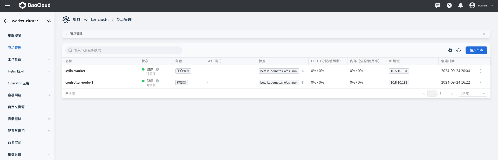
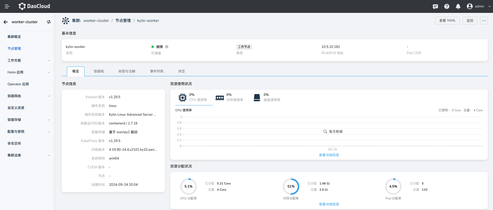

# 为工作集群添加异构节点

本文介绍如何为 AMD 架构，操作系统为 CentOS 7.9 的工作集群添加 ARM 架构，操作系统为 Kylin v10 sp2 的工作节点

!!! note

    本文仅针对离线模式下，使用 DCE 5.0 平台所创建的工作集群进行异构节点的添加，不包括接入的集群。

## 前提条件

- 已经部署好一个 DCE 5.0 全模式，并且火种节点还存活，部署参考文档[离线安装 DCE 5.0 商业版](../../install/commercial/start-install.md)
- 已经通过 DCE 5.0 平台创建好一个 AMD 架构，操作系统为 CentOS 7.9 的工作集群，创建参考文档[创建工作集群](../user-guide/clusters/create-cluster.md)

## 操作步骤

### 下载并导入离线包

以 ARM 架构、操作系统 Kylin v10 sp2 为例。

请确保已经登录到火种节点！并且之前部署 DCE 5.0 时使用的 clusterConfig.yaml 文件还在。

#### 离线镜像包

!!! note

    可以在[下载中心](https://docs.daocloud.io/download/dce5/)下载最新版本。请确保在容器管理 v0.31 及以上版本使用该能力，对应安装器 v0.21.0 及以上版本

| CPU 架构 | 版本      | 下载地址                                                                                           |
| :------ |:--------|:-----------------------------------------------------------------------------------------------|
| AMD64 | v0.21.0 | <https://qiniu-download-public.daocloud.io/DaoCloud_Enterprise/dce5/offline-v0.21.0-amd64.tar> |
| ARM64 | v0.21.0 | <https://qiniu-download-public.daocloud.io/DaoCloud_Enterprise/dce5/offline-v0.21.0-arm64.tar> |

下载完毕后解压离线包。此处我们下载 arm64 架构的离线包：

```bash
tar -xvf offline-v0.21.0-arm64.tar
```

#### ISO 离线包（Kylin v10 sp2）

| CPU 架构 | 操作系统版本 | 下载地址 |
| :------- | :-------- | :------ |
| ARM64 | Kylin Linux Advanced Server release V10 (Sword) SP2 | 申请地址：<https://www.kylinos.cn/support/trial.html> |

!!! note

    麒麟操作系统需要提供个人信息才能下载使用，下载时请选择 V10 (Sword) SP2。

#### osPackage 离线包 （Kylin v10 sp2）

其中 [Kubean](https://github.com/kubean-io/kubean) 提供了不同操作系统的osPackage 离线包，可以前往 <https://github.com/kubean-io/kubean/releases> 查看。

| 操作系统版本 | 下载地址                                                                                                |
| :--------- |:----------------------------------------------------------------------------------------------------|
| Kylin Linux Advanced Server release V10 (Sword) SP2 | <https://github.com/kubean-io/kubean/releases/download/v0.18.5/os-pkgs-kylin-v10sp2-v0.18.5.tar.gz> |


!!! note

    osPackage 离线包的具体对应版本请查看离线镜像包中 __offline/sample/clusterConfig.yaml__ 中对应的 kubean 版本

#### 导入离线包至火种节点

执行 import-artifact 命令：

```bash
./offline/dce5-installer import-artifact -c clusterConfig.yaml \
    --offline-path=/root/offline \
    --iso-path=/root/Kylin-Server-10-SP2-aarch64-Release-Build09-20210524.iso \
    --os-pkgs-path=/root/os-pkgs-kylin-v10sp2-v0.18.5.tar.gz
```

!!! note

    参数说明：

    - __-c clusterConfig.yaml__ 指定之前部署 DCE5.0 时使用的 clusterConfig.yaml 文件
    - __--offline-path__ 指定下载的离线镜像包文件地址
    - __--iso-path__ 指定下载的 ISO 操作系统镜像文件地址
    - __--os-pkgs-path__ 指定下载的 osPackage 离线包文件地址

导入命令执行成功后，会将离线包上传到火种节点的 Minio 中。

### 添加异构工作节点

!!! note

    如果您安装的 DCE 5.0 版本高于（包含）[DCE5.0-20230731](../../dce/dce-rn/20230731.md)，
    完成以上步骤后，您可以直接在界面中接入节点；反之，您需要继续执行以下步骤来接入异构节点。

请确保已经登录到 DCE 5.0 [管理集群](../user-guide/clusters/cluster-role.md#_3)的管理节点上。

#### 修改主机清单文件

主机清单文件示例：

=== "新增节点前"

    ```yaml
    apiVersion: v1
    kind: ConfigMap
    metadata:
      name: ${cluster-name}-hosts-conf
      namespace: kubean-system
    data:
      hosts.yml: |
        all:
          children:
            etcd:
              hosts:
                centos-master:
            k8s_cluster:
              children:
                kube_control_plane:
                kube_node:
            kube_control_plane:
              hosts:
                centos-master:
            kube_node:
              hosts:
                centos-master:
        hosts:
          centos-master:
            ip: 10.5.10.183
            access_ip: 10.5.10.183
            ansible_host: 10.5.10.183
            ansible_connection: ssh
            ansible_user: root
            ansible_ssh_pass: ******
            ansible_password: ******
            ansible_become_password: ******
    ```

=== "新增节点后"

    ```yaml
    apiVersion: v1
    kind: ConfigMap
    metadata:
      name: ${cluster-name}-hosts-conf
      namespace: kubean-system
    data:
      hosts.yml: |
        all:
          hosts:
            centos-master:
              ip: 10.5.10.183
              access_ip: 10.5.10.183
              ansible_host: 10.5.10.183
              ansible_connection: ssh
              ansible_user: root
              ansible_ssh_pass: ******
              ansible_password: ******
              ansible_become_password: ******
              # 添加异构节点信息
            kylin-worker:
              ip: 10.5.10.181
              access_ip: 10.5.10.181
              ansible_host: 10.5.10.181
              ansible_connection: ssh
              ansible_user: root
              ansible_ssh_pass: ******
              ansible_password: ******
              ansible_become_password: ******
            children:
              kube_control_plane:
                hosts:
                  - centos-master
              kube_node:
                hosts:
                  - centos-master
                  - kylin-worker  # 添加新增的异构节点名称
              etcd:
                hosts:
                  - centos-master
              k8s_cluster:
                children:
                  - kube_control_plane
                  - kube_node
    ```

按照上述的配置注释，添加新增的工作节点信息。

```shell
kubectl edit cm ${cluster-name}-hosts-conf -n kubean-system
```

__cluster-name__ 为工作集群的名称，通过容器管理创建集群时会默认生成。

#### 通过 ClusterOperation.yml 新增扩容任务

示例：

```yaml title="ClusterOperation.yml"
apiVersion: kubean.io/v1alpha1
kind: ClusterOperation
metadata:
  name: add-worker-node
spec:
  cluster: ${cluster-name} # 指定 cluster name
  image: 10.5.14.30/ghcr.m.daocloud.io/kubean-io/spray-job:v0.18.5
  actionType: playbook
  action: scale.yml
  extraArgs: --limit=kylin-worker
  preHook:
    - actionType: playbook
      action: ping.yml
    - actionType: playbook
      action: disable-firewalld.yml
    - actionType: playbook
      action: enable-repo.yml
      extraArgs: |
        -e "{repo_list: ["http://10.5.14.30:9000/kubean/kylin-iso/\$releasever/sp2/os/\$basearch","http://10.5.14.30:9000/kubean/kylin/\$releasever/sp2/os/\$basearch"]}" --limit=kylin-worker
  postHook:
    - actionType: playbook
      action: cluster-info.yml
```

!!! note

    - spec.image 镜像地址要与之前执行部署时的 job 其内镜像保持一致
    - spec.action 设置为 scale.yml
    - spec.extraArgs 设置为 --limit=g-worker
    - spec.preHook 中的 enable-repo.yml 剧本参数，要填写相关OS的正确的 repo_list 

按照上述的配置，创建并部署 join-node-ops.yaml：

```shell
vi join-node-ops.yaml
kubectl apply -f join-node-ops.yaml -n kubean-system
```

#### 检查任务执行状态

```shell
kubectl -n kubean-system get pod | grep add-worker-node
```

了解缩容任务执行进度，可查看该 Pod 日志。

### 前往界面验证

1. 前往 __容器管理__ -> __集群__ -> __节点管理__

    

2. 点击新增的节点，查看详情

    
