---
hide:
  - toc
---

# 常见问题

1. Helm 应用安装失败，提示 “OOMKilled”

    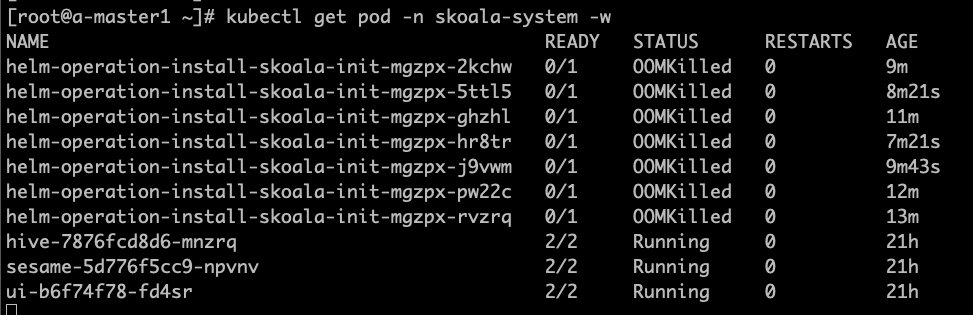

    如图所示，容器管理会自动创建启动一个 Job 负责具体应用的安装工作，在 v0.6.0 版本中由于 job resources 设置不合理，导致 OOM,影响应用安装。该 bug 在 0.6.1 版本中已经被修复。如果是升级到 v0.6.1的环境，仅仅会在新创建、接入的集群中生效，已经存在的集群需要进行手动调整，方能生效。

    ??? note "调整脚本"

        - 以下脚本均在全局服务集群中执行
        - 找到对应集群，本文以 skoala-dev 为例,获取对应的 skoala-dev-setting configmap
        - 更新 configmap 之后即可生效

        ```shell
        kubectl get cm -n kpanda-system skoala-dev-setting -o yaml
        apiVersion: v1
        data:
        clusterSetting: '{"plugins":[{"name":1,"intelligent_detection":true},{"name":2,"enabled":true,"intelligent_detection":true},{"name":3},{"name":6,"intelligent_detection":true},{"name":7,"intelligent_detection":true},{"name":8,"intelligent_detection":true},{"name":9,"intelligent_detection":true}],"network":[{"name":4,"enabled":true,"intelligent_detection":true},{"name":5,"intelligent_detection":true},{"name":10},{"name":11}],"addon_setting":{"helm_operation_history_limit":100,"helm_repo_refresh_interval":600,"helm_operation_base_image":"release-ci.daocloud.io/kpanda/kpanda-shell:v0.0.6","helm_operation_job_template_resources":{"limits":{"cpu":"50m","memory":"120Mi"},"requests":{"cpu":"50m","memory":"120Mi"}}},"clusterlcm_setting":{"enable_deletion_protection":true},"etcd_backup_restore_setting":{"base_image":"release.daocloud.io/kpanda/etcdbrctl:v0.22.0"}}'
        kind: ConfigMap
            metadata:
            labels:
                kpanda.io/cluster-plugins: ""
            name: skoala-dev-setting
            namespace: kpanda-system
            ownerReferences:
            - apiVersion: cluster.kpanda.io/v1alpha1
                blockOwnerDeletion: true
                controller: true
                kind: Cluster
                name: skoala-dev
                uid: f916e461-8b6d-47e4-906e-5e807bfe63d4
            uid: 8a25dfa9-ef32-46b4-bc36-b37b775a9632

            修改 clusterSetting-> helm_operation_job_template_resources 到合适的值即可，v0.6.1 版本对应的值为 cpu: 100m,memory: 400Mi
            ```

2. 容器管理模块和全局管理模块的权限问题

    经常有用户会问，为什么我这个用户可以看到这个集群，或者为什么我看不到这个集群，我们应该如何排查相关的权限问题？分为以下三种情况：

    - 容器管理模块的权限分为集群权限、命名空间权限。如果绑定了用户，那该用户就可以查看到相对应的集群及资源。具体权限说明，可以参考[集群权限说明](../user-guide/permissions/permission-brief.md)。

        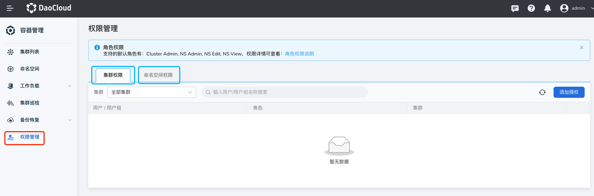

    - 全局管理模块中用户的授权：使用 admin 账号，进入`全局管理` -> `用户与访问控制` -> `用户`菜单，找到对应用户。在`授权所属用户组`标签页，如果有类似 Admin、Kpanda Owner 等拥有容器管理权限的角色，那即使在容器管理没有绑定集群权限或命名空间权限，也可以看到全部的集群，可以参考[用户授权文档说明](../../ghippo/user-guide/access-control/user.md)

        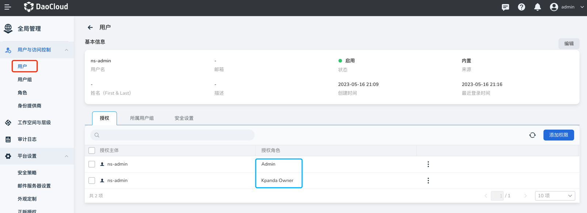

    - 全局管理模块中工作空间的绑定：使用账号进入`全局管理` -> `工作空间与层级`，可以看到自己的被授权的工作空间，点击工作空间名称

        a.如果该工作空间单独授权给自己，就可以在授权标签页内看到自己的账号，然后查看资源组或共享资源标签页，如果资源组绑定了命名空间或共享资源绑定了集群，那该账号就可以看到对应的集群

        b.如果是被授予了全局管理相关角色，那就无法授权标签页内看到自己的账号，也无法在容器管理模块中看到工作空间所绑定的集群资源

        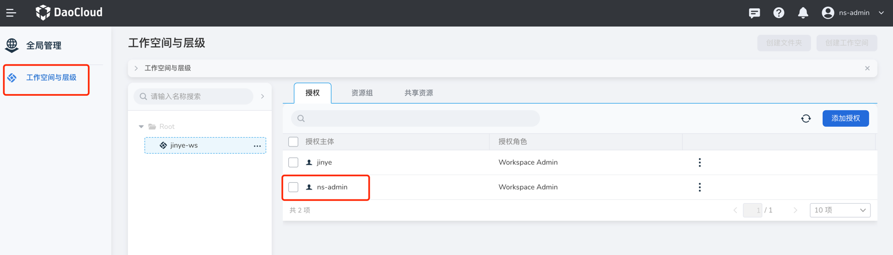

3. Helm 安装应用时，无法拉取 kpanda-shell 镜像

    使用离线安装后，接入的集群安装helm应用经常会遇到拉取 kpanda-shell 镜像失败，如图：

    

    此时，只需要去集群运维-集群设置页面，高级配置标签页，修改 Helm 操作基础镜像为一个可以被该集群正常拉取到的 kpanda-shell 的镜像即可。

    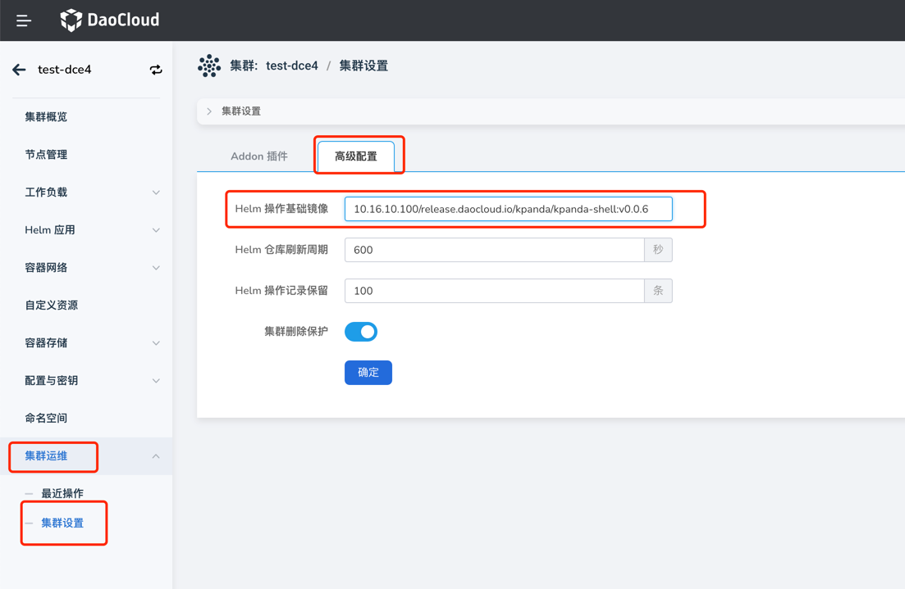

4. Helm Chart 界面未显示最新上传到对应 Helm Repo 的 Chart，如图：

    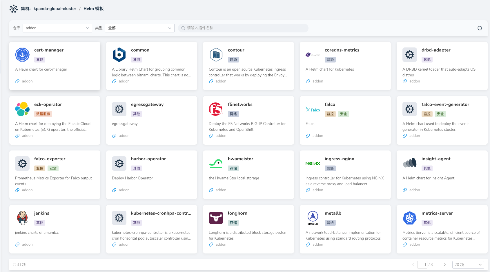

    此时，只需要去 Helm 仓库刷新对应的 Helm 仓库即可。

    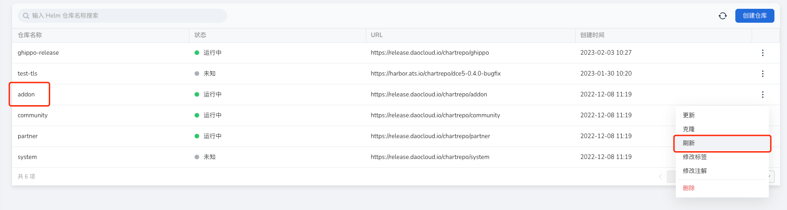

5. Helm 安装应用失败时卡在安装中无法删除应用重新安装，如图：

    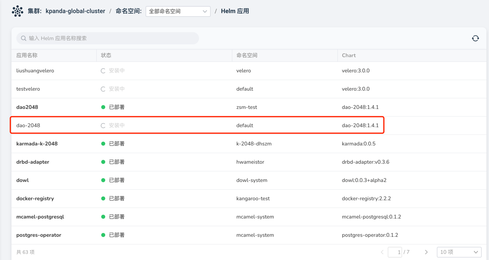

    此时，只需要去自定义资源页面，找到 helmreleases.helm.kpanda.io CRD，然后找到对应的 helmreleases CR 删除即可。

    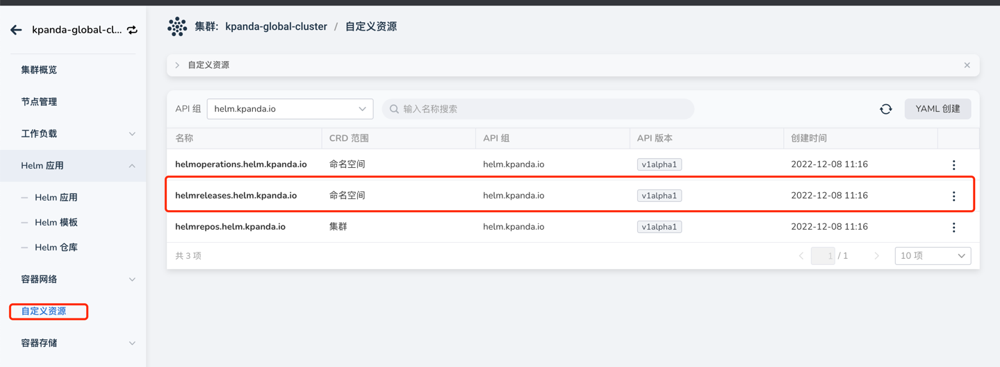

    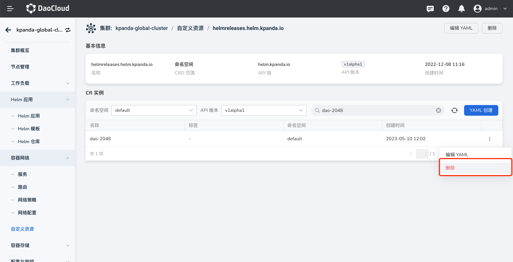

6. 工作负载-删除节点亲和性等调度策略后，调度异常，如图：

    

    此时，可能是因为策略没有删除干净，点击编辑，删除所有策略。

    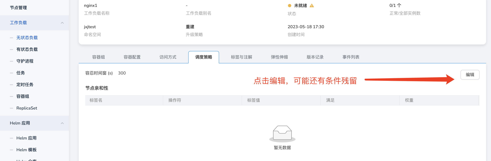

    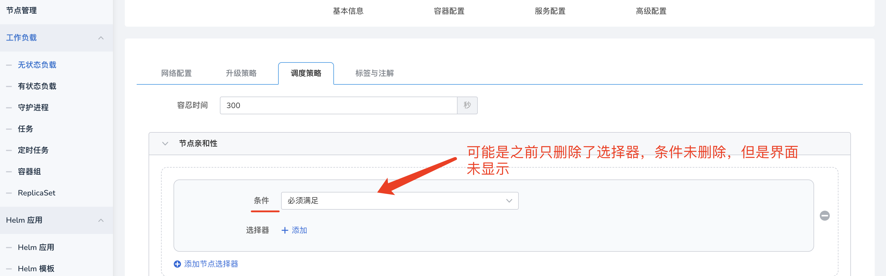
