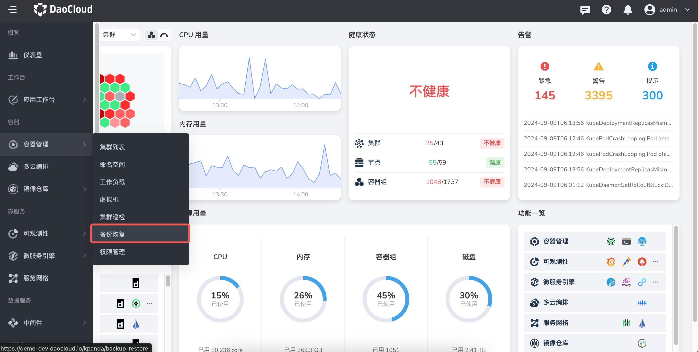
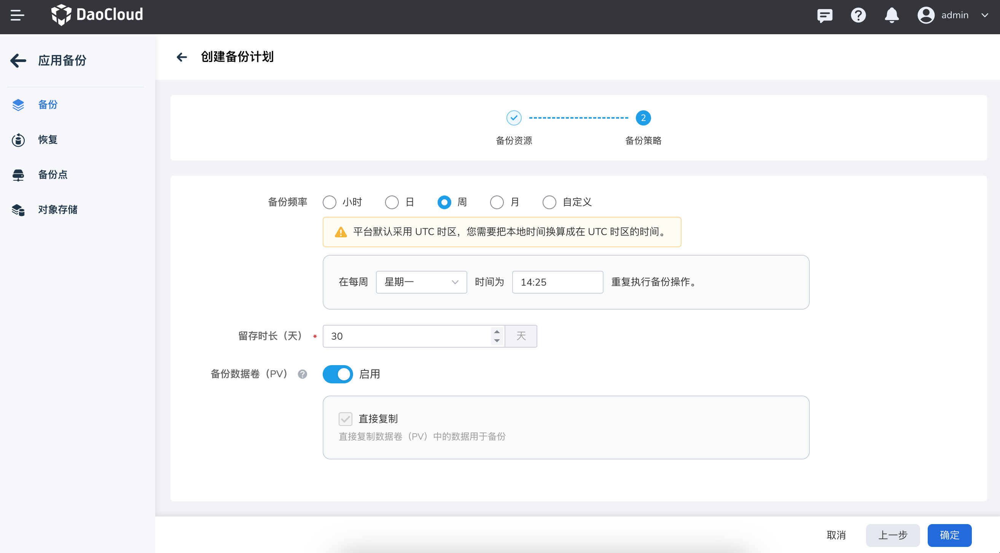

# 备份一个无状态的 2048 应用

本文介绍如何通过`应用备份`模块备份一个无状态的 2048 负载。

## 前提条件

在对无状态工作负载 2048 进行备份前，需要满足以下前提条件：

- 在[容器管理](../../intro/what.md)模块中[接入 Kubernetes 集群](../clusters/integrate-cluster.md)或者[创建 Kubernetes 集群](../clusters/create-cluster.md)，且能够访问集群的 UI 界面。

- 创建一个[命名空间](../namespaces/createns.md)和[用户](../../../ghippo/user-guide/access-control/user.md)。

- 当前操作用户应具有 [`NS Edit`](../permissions/permission-brief.md#ns-edit) 或更高权限，详情可参考[命名空间授权](../namespaces/createns.md)。

- 已经完成了 [velero 组件的安装](install-velero.md)，且 velero 组件运行正常。

- 已经完成了一个[无状态工作负载 2048 的创建](../workloads/create-deployment.md)，并为无状态工作负载打上了 `app: dao-2048` 的标签。

## 备份 2048

参考以下步骤，备份无状态工作负载 2048。

1. 进入容器管理模块，点击左侧导航栏上的`备份恢复` -> `应用备份`，进入`应用备份`列表页面。

    

2. 在`应用备份`列表页面，选择前提条件中已经完成 velero 安装和 2048 应用创建的集群。，查看当前集群下是否存在应用备份。并点击右上角的`备份计划`，新建一个备份集群。

    

3. 在`应用备份`列表页面，选择前提条件中已经完成 velero 安装和 2048 应用创建的集群。，查看当前集群下是否存在应用备份计划，点击右上角的`备份计划`，新建一个备份集群，并参考下面参数说明配置参数。

    - 名称：新建备份计划的名称。
    - 源集群：计划执行应用备份的集群。
    - 对象存储位置：在源集群安装 velero 时配置的对象存储的访问路径。
    - 命名空间：需要进行备份的命名空间，支持多选。
    - 高级配置：根据资源标签对命名空间内的特定资源进行备份如某个应用，或者备份时根据资源标签对命名空间内的特定资源不进行备份。

    

4. 完成 `备份资源`信息配置后，设置备份执行频率，此处我们采用默认值，直接点击 下一步`，相关参数说明如下。

    - 备份频率：基于分钟、小时、天、周、月设置任务执行的时间周期。支持用数字和 `*` 自定义 Cron 表达式，**输入表达式后下方会提示当前表达式的含义**。有关详细的表达式语法规则，可参考 [Cron 时间表语法](https://kubernetes.io/zh-cn/docs/concepts/workloads/controllers/cron-jobs/#cron-schedule-syntax)。
    - 留存时长（天）：设置备份资源保存的时间，默认为 30 天，过期后将会被删除。
    - 备份数据卷（PV）：是否备份数据卷（PV）中的数据，支持直接复制和使用 CSI 快照两种方式。直接复制：直接复制数据卷（PV）中的数据用于备份；使用 CSI 快照：使用 CSI 快照来备份数据卷（PV）。需要集群中有可用于备份的 CSI 快照类型。

    

5. 点击 `确定` 按钮完成备份计划的创建。平台将自动跳回应用备份计划列表，找到刚刚创建的 `dao-2048` 备份计划，执行`立即备份`操作。

    

6. 执行`立即备份`操作后，此时集群的`上一次执行状态`将转变为`备份中`。等待备份完成。我们也可以点击备份计划的名称，查看备份计划详情。

    