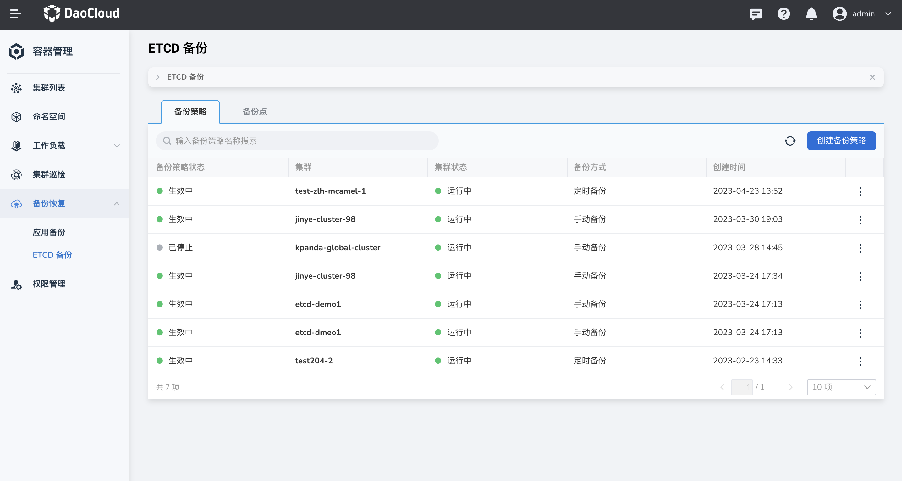
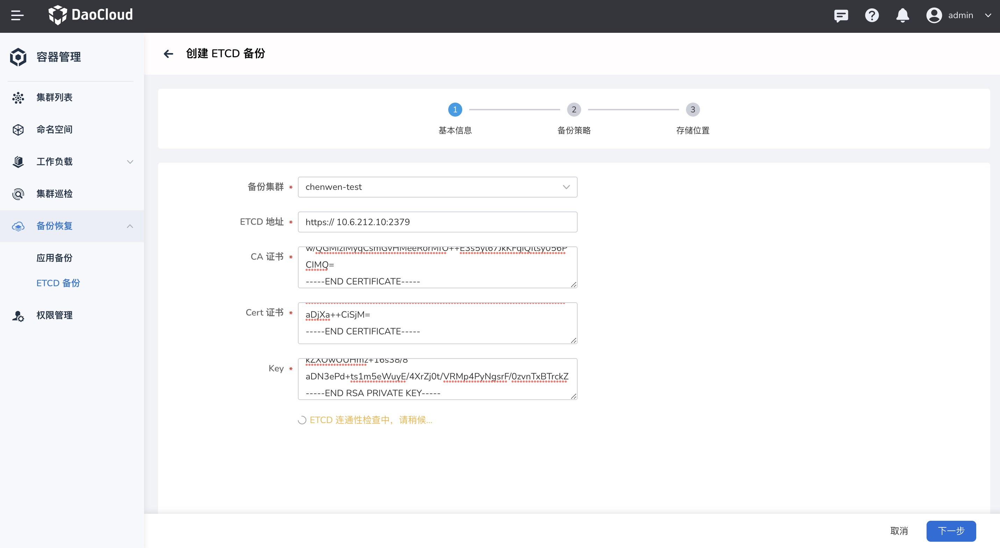
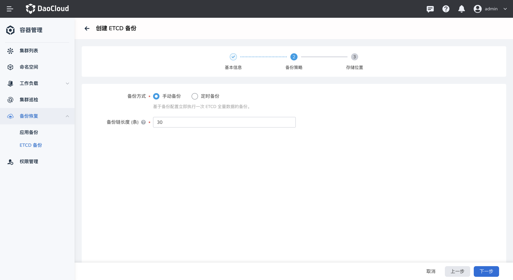
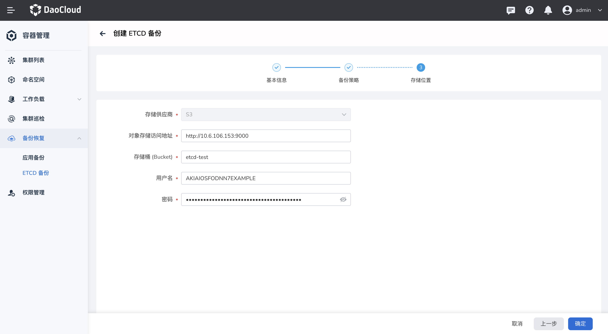
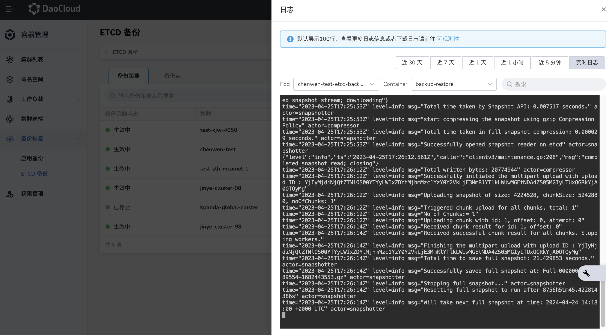
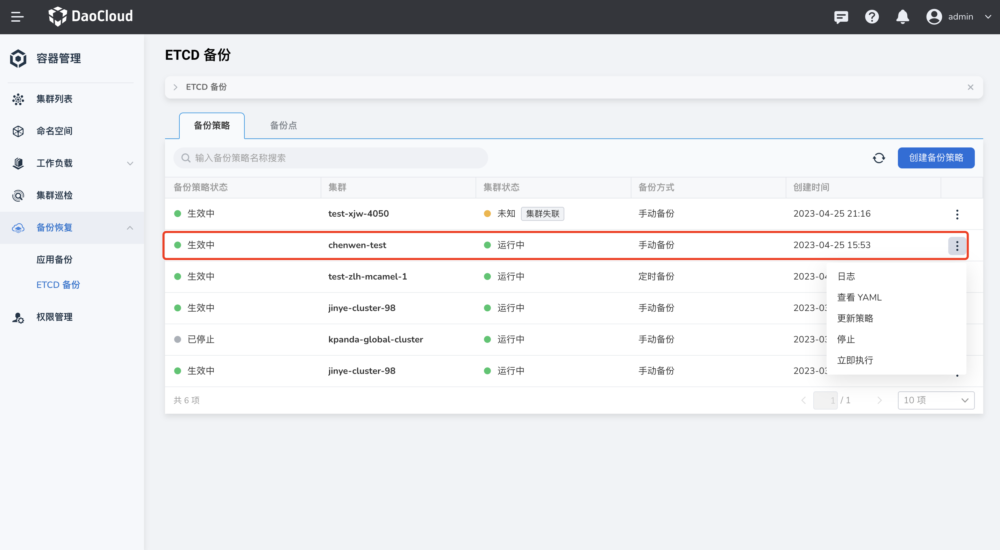
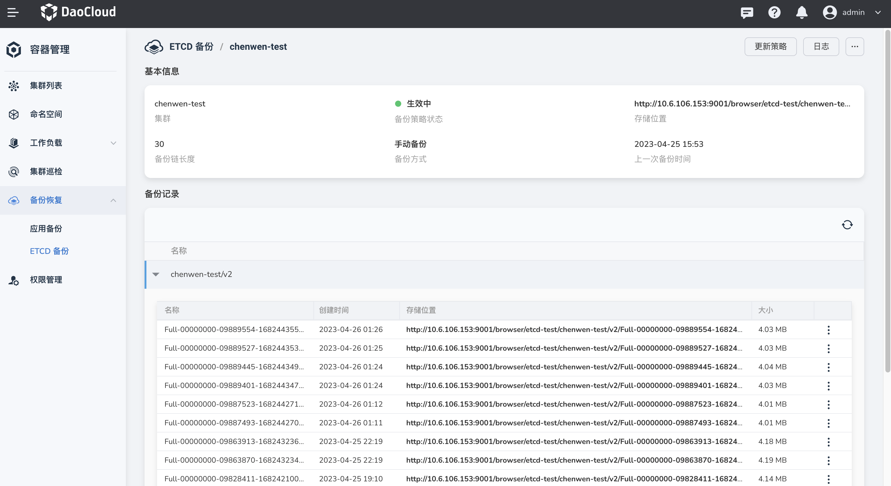
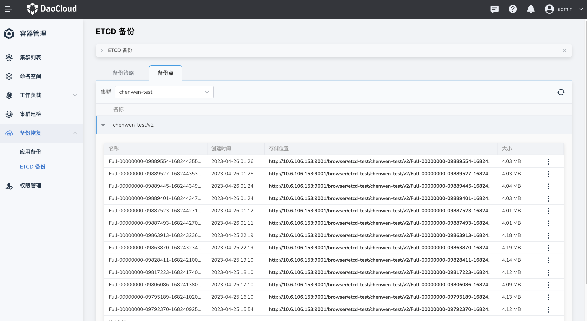

# ETCD 备份

ETCD 备份是以集群数据为核心的备份，在硬件设备损坏，开发测试配置错误等场景中，可以恢复备份集群数据。

本节将介绍如何通过容器管理界面实现集群的 ETCD 备份。

## 前提条件

- 容器管理模块[已接入 Kubernetes 集群](../clusters/integrate-cluster.md)或者[已创建 Kubernetes 集群](../clusters/create-cluster.md)，且能够访问集群的 UI 界面。

- 已完成一个[命名空间的创建](../namespaces/createns.md)、[用户的创建](../../../ghippo/user-guide/access-control/user.md)，并为用户授予 [`NS Admin`](../permissions/permission-brief.md#ns-admin) 或更高权限，详情可参考[命名空间授权](../permissions/cluster-ns-auth.md)。

- 准备一个 MinIO 实例，建议通过 DCE 5.0 的 MinIO 中间件进行创建，具体步骤可参考 [MinIO 对象存储](../../../middleware/minio/user-guide/create.md)。

## 创建 ETCD 备份

参照以下步骤创建 ETCD 备份。

1. 在`备份恢复`-`ETCD 备份`页面可以看到当前所有的备份策略，点击右侧的 `创建备份策略`可以为目标集群创建一个 ETCD 备份策略。

    

2. 填写基础信息，填写完毕后点击下一步，将自动校验 ETCD 的联通性，校验通过则进行下一步。
   
    - 首先选择备份集群，并在终端登陆
    - 填写 ETCD 地址，标准 K8s 集群大多为：`https://节点号:2379`
    - 填写 CA 证书，可通过如下命令查看证书内容并将其复制粘贴到对应位置：

        ```shell
        cat  /etc/kubernetes/ssl/etcd/ca.crt
        ```

    - 填写 Cert 证书，可通过如下命令查看证书内容并将其复制粘贴到对应位置：

        ```shell
        cat /etc/kubernetes/ssl/apiserver-etcd-client.crt
        ```

    - 填写 Key，可通过如下命令查看证书内容并将其复制粘贴到对应位置：

        ```shell
        cat /etc/kubernetes/ssl/apiserver-etcd-client.key
        ```

        

3. 选择备份方式，分为手动备份和定时备份。
   
    - 手动备份：基于备份配置立即执行一次 ETCD 全量数据的备份。备份链长度：保留备份数据的最长长度，默认为 30 条。
  
        

    - 定时备份：按照设置的备份频率对 ETCD 数据进行周期性全量备份。选择备份频率：支持小时、日、周、月级别和自定义方式。

        

4. 存储位置
   
    - 存储供应商：默认选择 S3 存储
    - 对象存储访问地址：MinIO 的访问地址
    - 存储桶：在 MinIO 中创建一个 Bucket，填写名称
    - 用户名：MinIO 的登陆用户名
    - 密码：MinIO 的登陆密码
   
        

5. 创建成功后将会在备份策略列表中生成一条数据。`操作`包括日志、查看 YAML、更新策略、停止、立即执行。当备份方式为手动时，可以点击`立即执行`进行备份。当备份方式为定时备份时，则会根据配置的时间进行备份。

    

6. 点击`查看日志`，将展示日志内容，默认展示100行，若想查看更多日志信息或者下载日志请前往[可观测性](https://demo-dev.daocloud.io/insight/logs?filterType=workload&cluster=chenwen-test&namespace=kpanda-system&workloadKind=deployment&workload=chenwen-test-etcd-backup&pod=chenwen-test-etcd-backup-5cf6d6bdfc-xstkx&container=backup-restore)

    

## 备份策略详情

1. 点击进入备份策略详情，包括基本信息和备份记录。

    

2. 查看备份点，选择集群后，可以查看该集群下所有备份信息。每执行一次备份，对应生成一个备份点，可通过成功状态的备份点快速恢复应用。
   
    
