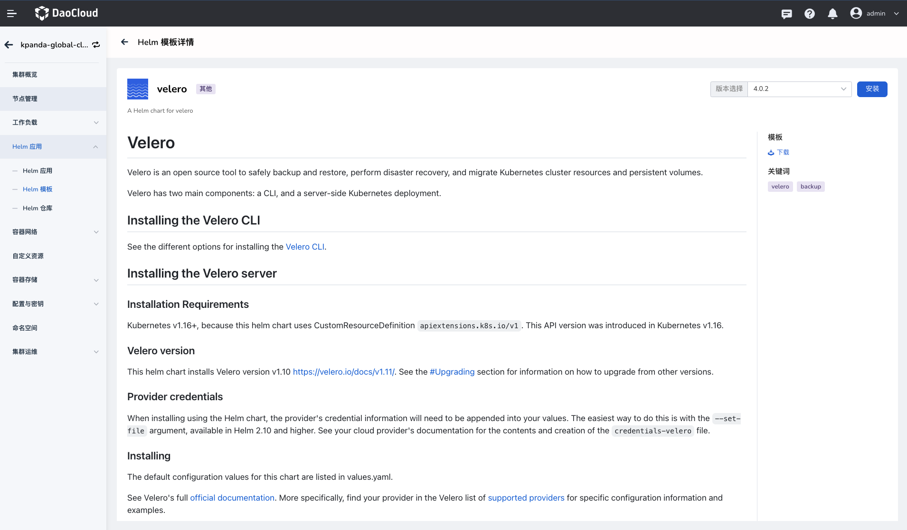
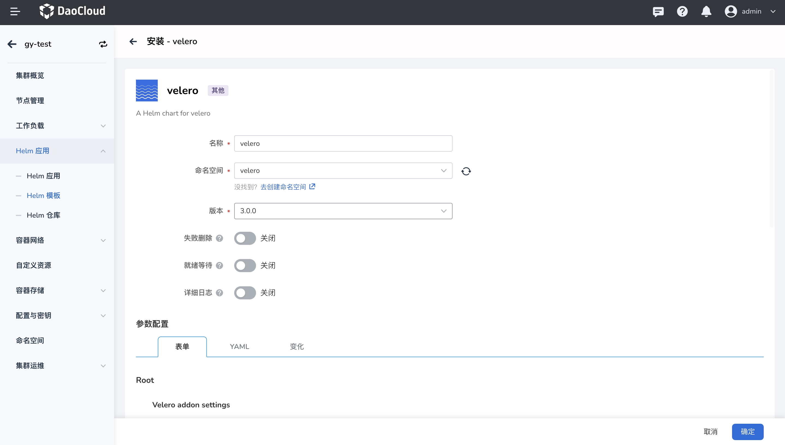
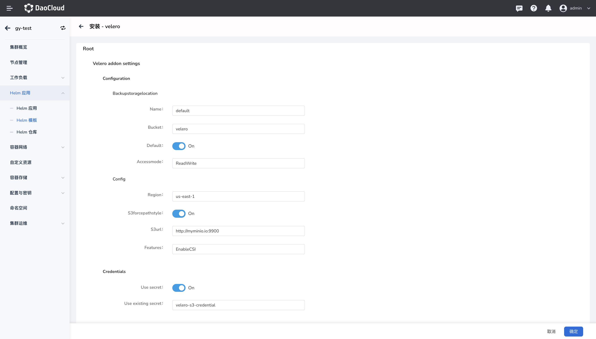
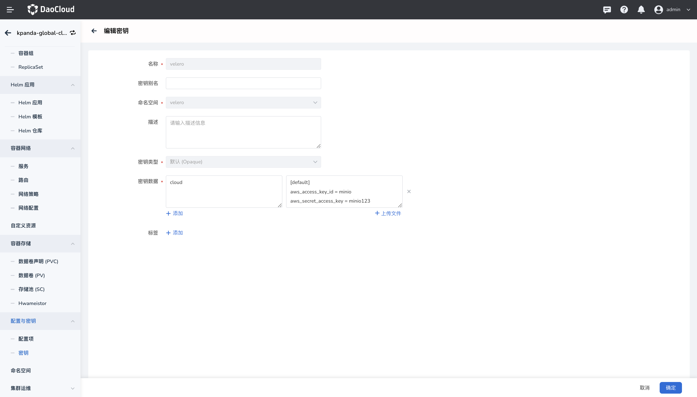

# 安装 velero 插件

velero 是一个备份和恢复 Kubernetes 集群资源的开源工具。它可以将 Kubernetes 集群中的资源备份到云存储服务、本地存储或其他位置，并且可以在需要时将这些资源恢复到同一或不同的集群中。

本节介绍如何安装 velero 插件。 

## 前提条件

安装 `velero` 插件前，需要满足以下前提条件：

- 容器管理模块[已接入 Kubernetes 集群](../clusters/integrate-cluster.md)或者[已创建 Kubernetes 集群](../clusters/create-cluster.md)，且能够访问集群的 UI 界面。

- 已完成一个 `velero` [命名空间的创建](../namespaces/createns.md)。

- 当前操作用户应具有 [`NS Edit`](../permissions/permission-brief.md#ns-edit) 或更高权限，详情可参考[命名空间授权](../namespaces/createns.md)。

## 操作步骤

请执行如下步骤为集群安装 `velero` 插件。

1. 在集群列表页面找到需要安装 `velero` 插件的目标集群，点击该集群的名称，在左侧导航栏依次点击 `Helm 应用` -> `Helm 模版`，在搜索栏输入 `velero` 进行搜索。

    

2. 阅读 `velero` 插件相关介绍，选择版本后点击`安装`按钮。本文将以 `3.0.0` 版本为例进行安装，推荐您安装 `3.0.0` 及更高版本。

    

3. 在安装配置界面配置基本参数。

    

    - 名称：输入插件名称，请注意名称最长 63 个字符，只能包含小写字母、数字及分隔符（“-”）,且必须以小写字母或数字开头及结尾，例如 metrics-server-01。
    - 命名空间：选择插件安装的命名空间，必须为 `velero` 命名空间。
    - 版本：插件的版本，此处以 `3.0.0` 版本为例。
    - 就绪等待：启用后，将等待应用下所有关联资源处于就绪状态，才会标记应用安装成功。
    - 失败删除：开启后，将默认同步开启就绪等待。如果安装失败，将删除安装相关资源。
    - 详情日志：开启安装过程日志的详细输出。

    !!! note

        开启`就绪等待`和/或`失败删除`后，应用需要经过较长时间才会被标记为`运行中`状态。

4. 安装参数配置

    - 必填参数

        - `S3url`：对象存储访问地址（目前仅对 Minio 进行了兼容性验证）。
        - `Use existing secret`：用来记录对象存储用户名密码的 secret 名称。
        开启`就绪等待`和/或`失败删除`后，应用需要经过较长时间才会被标记为`运行中`状态。
        - `Features`：启用的 kubernetes 特性插件模块。

    - 可选参数

        - `Backupstoragelocation`：velero 备份数据存储的位置。
        - `Name`：已经创建的 BackupStorageLocation 对象的名称。
        - `Bucket`：用于保存备份数据的存储桶名称。
        - `Accessmode`：velero 对数据的访问模式，可以选择 `ReadWrite`：允许 velero 读写备份数据；`ReadOnly`：允许 velero 读取备份数据，不能修改备份数据;`WriteOnly`：只允许 velero 写入备份数据，不能读取备份数据。
        - `Region`：云存储的地理区域。默认使用 `us-east-1` 参数，有系统管理员提供
        - `S3forcepathstyle`：开启或关闭使用 S3 路径样式访问，也就是将 bucket 名称作为 URL 路径的一部分。
        - `Use secret`：开启或关闭使用 secret 访问对象存储。

    

    !!! note "Use existing secret” 参数中的 secret 的主要内容包括 key 和 vaule 两部分，其中 key 为固定的 `cloud` 参数，vaule 值如下："

        ```yaml
        [default]
        aws_access_key_id = minio
        aws_secret_access_key = minio123
        ```

    

5. 点击`确定`按钮，完成 `velero` 插件的安装，之后系统将自动跳转至 `Helm 应用`列表页面，稍等几分钟后，为页面执行刷新操作，即可看到刚刚安装的应用。
