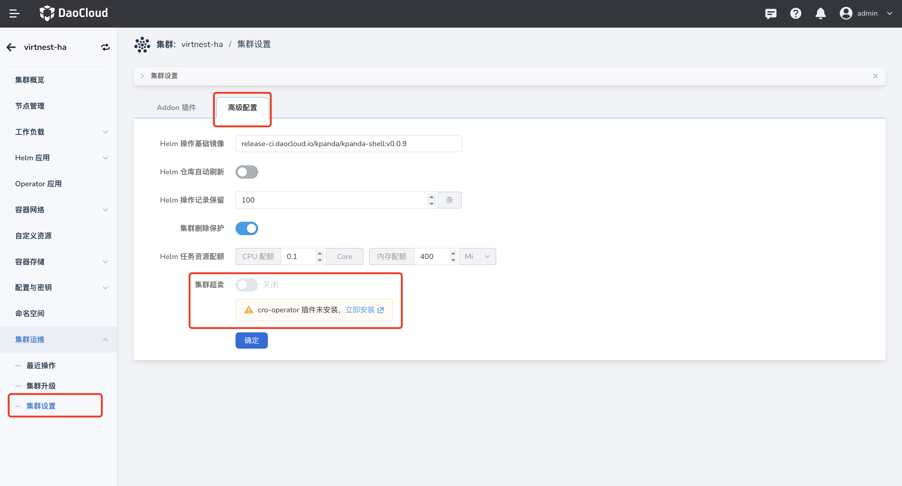
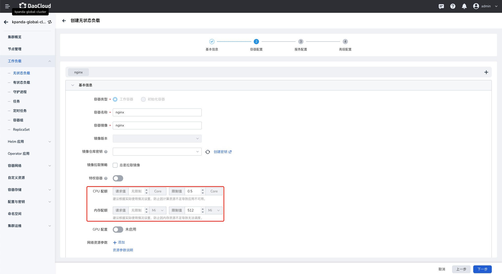
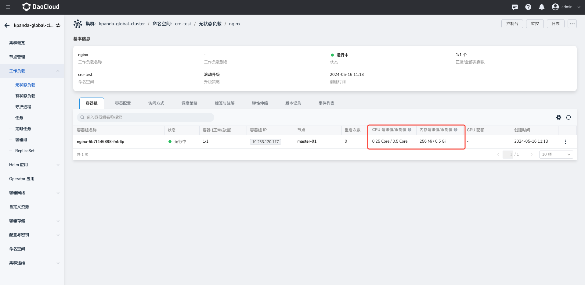

# 集群动态资源超卖

目前，许多业务存在峰值和低谷的现象。为了确保服务的性能和稳定性，在部署服务时，通常会根据峰值需求来申请资源。
然而，峰值期可能非常短暂，导致在非峰值期时资源被浪费。
**集群资源超卖** 就是将这些申请了而未使用的资源（即申请量与使用量的差值）利用起来，从而提升集群资源利用率，减少资源浪费。

本文主要介绍如何使用集群动态资源超卖功能。

## 前提条件

- 容器管理模块已[接入 Kubernetes 集群](./integrate-cluster.md)或者已[创建 Kubernetes 集群](./create-cluster.md)，且能够访问集群的 UI 界面。
- 已完成一个[命名空间的创建](../namespaces/createns.md)，并为用户授予 [Cluster Admin](../../user-guide/permissions/permission-brief.md) ，
  详情可参考[集群授权](../../user-guide/permissions/cluster-ns-auth.md)。
- 若为离线环境，则需完成 [addon 离线包](https://docs.daocloud.io/download/addon/history/)导入，且在 helm 模板界面可找到 cro-operator 模板。

## 开启集群超卖 

1. 点击左侧导航栏上的 **集群列表** ，然后点击目标集群的名称，进入 **集群详情** 页面

    

1. 在集群详情页面，点击左侧导航栏的 **集群运维** -> **集群设置** ，然后选择 **高级配置** 页签

    

1. 打开集群超卖，设置超卖比

    - 若未安装 cro-operator 插件，点击 **立即安装** 按钮，安装流程参考 [管理 Helm 应用](../helm/helm-app.md)  
    - 若已安装 cro-operator 插件，打开集群超卖开关，则可以开始使用集群超卖功能。

    !!! note

        需要在集群下对应的 namespace 打上如下标签，集群超卖策略才能生效。

    ```shell
    clusterresourceoverrides.admission.autoscaling.openshift.io/enabled: "true"
    ```

    

## 使用集群超卖

设置好集群动态资源超卖比后，会在工作负载运行时生效。下文以 niginx 为例，验证使用资源超卖能力。

1. 创建工作负载 nginx 并设置对应的资源限制值，创建流程参考 [创建无状态负载（Deployment）](../workloads/create-deployment.md)

    

1. 查看工作负载的 Pod 资源申请值与限制值的比值是否符合超售比

    
