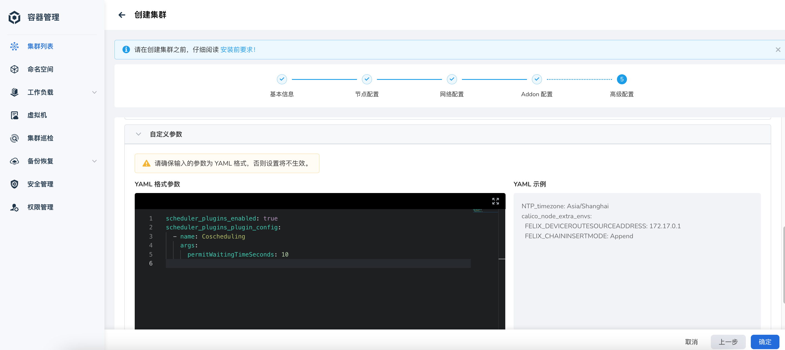
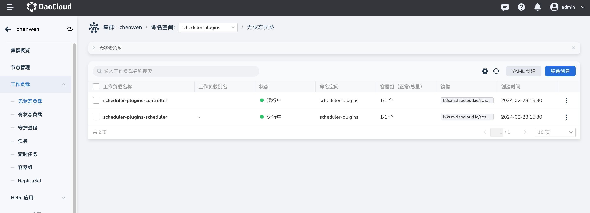
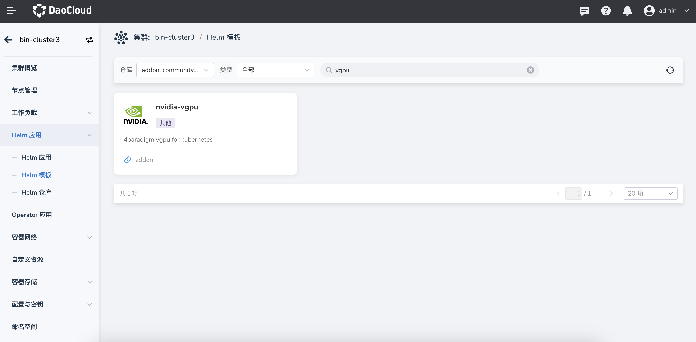

# 如何在集群中部署第二调度器 scheduler-plugins

本文介绍如何在集群中部署第二个调度器 scheduler-plugins。

## 为什么需要 scheduler-plugins？

通过平台创建的集群中会安装 K8s 原生的调度器，但是原生的调度器存在很多的局限性：

- 原生的调度器无法满足调度需求，你可以选择使用
  [CoScheduling](https://github.com/kubernetes-sigs/scheduler-plugins/tree/master/pkg/coscheduling)、
  [CapacityScheduling](https://github.com/kubernetes-sigs/scheduler-plugins/tree/master/pkg/capacityscheduling)
  等 scheduler-plugins 插件。
- 在特殊的场景，需要新的调度器来完成调度任务而不影响原生调度器的流程。
- 区分不同功能的调度器，通过切换调度器名称来实现不同的调度场景。

本文以使用 vgpu 调度器的同时，想结合 scheduler-plugins 的 coscheduling 插件能力的场景为示例，介绍如何安装并使用 scheduler-plugins。

## 安装 scheduler-plugins

### 前置条件

- kubean 是在 v0.13.0 版本推出的新功能，选择管理集群时请确保版本不低于此版本。
- 安装 scheduler-plugins 版本为 v0.27.8，请确保集群版本是否与它兼容。
  参考文档 [Compatibility Matrix](https://github.com/kubernetes-sigs/scheduler-plugins/tree/master?tab=readme-ov-file#compatibility-matrix)。

### 安装流程

1. 在 **创建集群** -> **高级配置** -> **自定义参数** 中添加 scheduler-plugins 参数

    ```yaml
    scheduler_plugins_enabled:true
    scheduler_plugins_plugin_config:
      - name: Coscheduling
        args:
          permitWaitingTimeSeconds: 10 # default is 60
    ```

    参数说明：
    
    - `scheduler_plugins_enabled` 设置为 true 时，开启 scheduler-plugins 插件能力。
    - 您可以通过设置 `scheduler_plugins_enabled_plugins` 或 `scheduler_plugins_disabled_plugins` 选项来启用或禁用某些插件。
      参阅 [K8s 官方插件名称](https://github.com/kubernetes-sigs/scheduler-plugins?tab=readme-ov-file#plugins)。
    - 如果需要设置自定义插件的参数请配置 scheduler_plugins_plugin_config，例如：设置 coscheduling 的 permitWaitingTimeoutSeconds 参数。
      参阅 [K8s 官方插件配置项](https://github.com/kubernetes-sigs/scheduler-plugins/blob/master/manifests/coscheduling/scheduler-config.yaml)

    

2. 集群创建成功后系统会自动安装 scheduler-plugins 和 controller 组件负载，可以在对应集群的无状态负载中查看负载状态。

    

## 使用 scheduler-plugins

以下以使用 vgpu 调度器的同时，想结合 scheduler-plugins 的 coscheduling 插件能力场景为示例，介绍如何使用 scheduler-plugins。

1. 在 Helm 模板中安装 vgpu，设置 values.yaml 参数。

    - `schedulerName: scheduler-plugins-scheduler`，这是 kubean 默认安装的 scheduler-plugins 的 scheduler 名称，目前不能修改。
    - `scheduler.kubeScheduler.enabled: false`，不安装 kube-scheduler，将 vgpu-scheduler 作为单独的 extender。

    

1. 在 scheduler-plugins 上扩展 vgpu-scheduler。

    ```bash
    [root@master01 charts]# kubectl get cm -n scheduler-plugins scheduler-config -ojsonpath="{.data.scheduler-config\.yaml}"
    ```

    ```yaml
    apiVersion: kubescheduler.config.k8s.io/v1
    kind: KubeSchedulerConfiguration
    leaderElection:
      leaderElect: false
    profiles:
      # Compose all plugins in one profile
      - schedulerName: scheduler-plugins-scheduler
        plugins:
          multiPoint:
            enabled:
              - name: Coscheduling
              - name: CapacityScheduling
              - name: NodeResourceTopologyMatch
              - name: NodeResourcesAllocatable
            disabled:
              - name: PrioritySort
    pluginConfig:
      - args:
          permitWaitingTimeSeconds: 10
        name: Coscheduling
    ```

    修改 scheduler-plugins 的 scheduler-config 的 configmap 参数，如下：

    ```bash
    [root@master01 charts]# kubectl get cm -n scheduler-plugins scheduler-config -ojsonpath="{.data.scheduler-config\.yaml}"
    ```

    ```yaml
    apiVersion: kubescheduler.config.k8s.io/v1
    kind: KubeSchedulerConfiguration
    leaderElection:
      leaderElect: false
    profiles:
      # Compose all plugins in one profile
      - schedulerName: scheduler-plugins-scheduler
        plugins:
          multiPoint:
            enabled:
              - name: Coscheduling
              - name: CapacityScheduling
              - name: NodeResourceTopologyMatch
              - name: NodeResourcesAllocatable
            disabled:
              - name: PrioritySort
    pluginConfig:
      - args:
          permitWaitingTimeSeconds: 10
        name: Coscheduling
    extenders:
      - urlPrefix: "${urlPrefix}"
        filterVerb: filter
        bindVerb: bind
        nodeCacheCapable: true
        ignorable: true
        httpTimeout: 30s
        weight: 1
        enableHTTPS: true
        tlsConfig:
          insecure: true
        managedResources:
          - name: nvidia.com/vgpu
            ignoredByScheduler: true
          - name: nvidia.com/gpumem
            ignoredByScheduler: true
          - name: nvidia.com/gpucores
            ignoredByScheduler: true
          - name: nvidia.com/gpumem-percentage
            ignoredByScheduler: true
          - name: nvidia.com/priority
            ignoredByScheduler: true
          - name: cambricon.com/mlunum
            ignoredByScheduler: true
    ```

1. 安装完 vgpu-scheduler 后，系统会自动创建 svc，urlPrefix 指定 svc 的 URL。

    !!! note

        - svc 指 pod 服务负载，您可以到安装了 nvidia-vgpu 插件的命名空间下通过以下命令拿到 443 端口对应的外部访问信息。

            ```shell
            kubectl get svc -n ${namespace} 
            ```

        - urlprifix 格式为 `https://${ip 地址}:${端口}`


1. 将 scheduler-plugins 的 scheduler Pod 重启，加载新的配置文件。

    !!! note

        在创建 vgpu 应用时不需要指定调度器名称，vgpu-scheduler 的 Webhook 会自动将 Scheduler 的名称修改为 scheduler-plugins-scheduler，不用手动指定。
