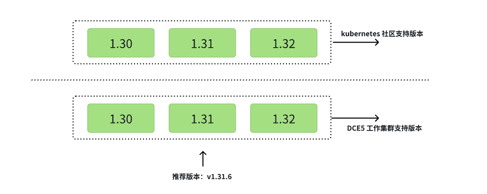

# 集群版本支持范围

在 DCE 5.0 平台中，[接入型集群](cluster-status.md)和[自建集群](cluster-status.md)采取不同的版本支持机制。

本文主要介绍自建集群的版本支持机制。

Kubernetes 社区支持 3 个版本范围，如 1.30、1.31、1.32。当社区新版本发布之后，支持的版本范围将会进行递增。
如社区最新的 1.32 版本已经发布，此时社区支持的版本范围是 1.30、1.31、1.32。
[查看 Kubernetes 社区支持的最新版本范围](https://kubernetes.io/releases/version-skew-policy/#supported-versions)。

为了保障集群的安全和稳定性，在 DCE 5.0 中使用界面创建集群时支持的版本范围与社区版本保持一致，但是推荐版本始终比 Kubernetes 社区 **低一个版本**。

例如，社区支持的版本范围是 1.30、1.31、1.32，则在 DCE 5.0 中使用界面创建工作集群的版本范围是 1.30、1.31、1.32，并且会为用户推荐一个稳定的版本，如 v1.31.6。

除此之外，DCE 5.0 中使用界面创建工作集群的版本范围与社区保持高度同步，当社区版本进行递增后，DCE 5.0 中使用界面创建工作集群的版本范围也会同步递增一个版本。

## Kubernetes 版本支持范围

| Kubernetes 社区版本范围 | 自建工作集群版本范围 | 自建工作集群推荐版本 | DCE 5.0 安装器 | 发布时间 |
|------------------|------------------|------------------|--------------|--------|
| <ul><li>1.30</li><li>1.31</li><li>1.32</li></ul> | <ul><li>1.30</li><li>1.31</li><li>1.32</li></ul> | v1.31.6 | v0.28.0 | 2025/4/11 |

