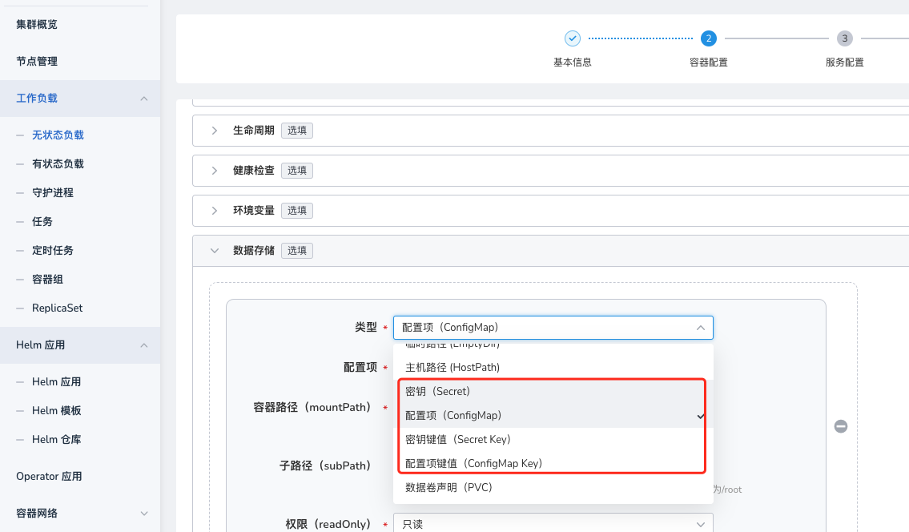
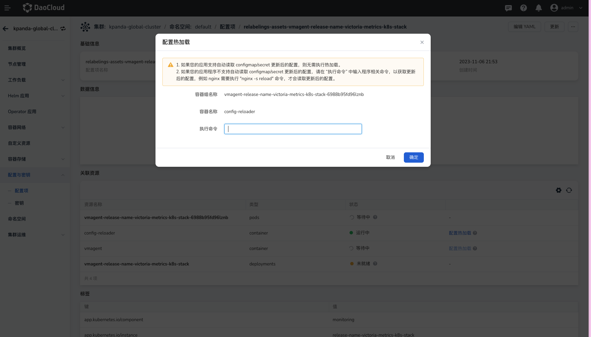
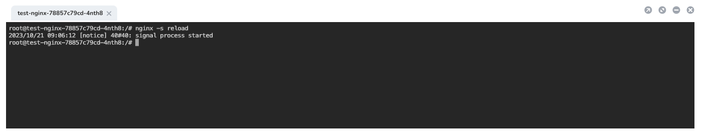

# configmap/secret 热加载

configmap/secret 热加载是指将 configmap/secret 作为数据卷挂载在容器中挂载时，当配置发生改变时，容器将自动读取 configmap/secret 更新后的配置，而无需重启 Pod。

## 操作步骤

1. 参考创建工作负载 - [【容器配置】](../workloads/create-deployment.md#容器配置)，配置容器【数据存储】，选择 `Configmap`、`Configmap Key`、`Secret`、`Secret Key` 作为数据卷挂载至容器。

    

    !!! note

        使用子路径（SubPath）方式挂载的配置文件不支持热加载。

2. 进入配置与密钥页面，找到需要进行热加载的配置项后点击配置项名称进入配置项详情页面，在【关联资源】中找到对应的 `containe` 资源，点击 `立即加载` 按钮，进入配置热加载页面。

    !!! note

        如果您的应用支持自动读取 configmap/secret 更新后的配置，则无需手动执行热加载操作。

3. 在热加载配置弹窗中，输入进入容器内的`执行命令`并点击`确定`按钮，以重载配置。例如，在 nginx 容器中，以 root 用户权限，执行 `nginx -s reload` 命令来重载配置。

    

4. 在界面弹出的 web 终端中查看应用重载情况。

    

