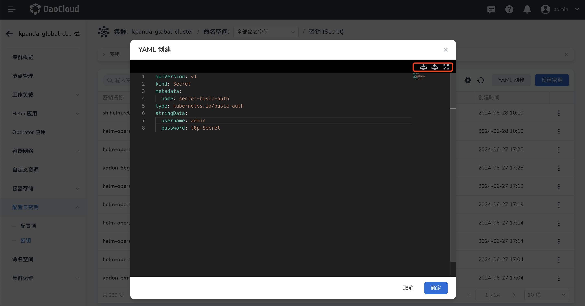

# 创建密钥

密钥是一种用于存储和管理密码、OAuth 令牌、SSH、TLS 凭据等敏感信息的资源对象。使用密钥意味着您不需要在应用程序代码中包含敏感的机密数据。

密钥使用场景：

- 作为容器的环境变量使用，提供容器运行过程中所需的一些必要信息。
- 使用密钥作为 Pod 的数据卷。
- 在 kubelet 拉取容器镜像时作为镜像仓库的身份认证凭证。

支持两种创建方式：

- 图形化表单创建
- YAML 创建

## 前提条件

- 容器管理模块[已接入 Kubernetes 集群](../clusters/integrate-cluster.md)或者[已创建 Kubernetes 集群](../clusters/create-cluster.md)，且能够访问集群的 UI 界面

- 已完成一个[命名空间的创建](../namespaces/createns.md)、[用户的创建](../../../ghippo/user-guide/access-control/user.md)，并将用户授权为 [NS Editor](../permissions/permission-brief.md#ns-editor) ，详情可参考[集群和命名空间授权](../permissions/cluster-ns-auth.md)。

## 图形化表单创建

1. 在 __集群列表__ 页面点击某个集群的名称，进入 __集群详情__ 。

    

2. 在左侧导航栏，点击 __配置与密钥__ -> __密钥__ ，点击右上角 __创建密钥__ 按钮。

    

3. 在 __创建密钥__ 页面中填写配置信息，点击 __确定__ 。

    

    填写配置时需要注意：

    - 密钥的名称在同一个命名空间中必须具有唯一性
    - 密钥类型：
        - 默认（Opaque）：Kubernetes 默认的密钥类型，支持用户定义的任意数据。
        - TLS (kubernetes.io/tls)：用于 TLS 客户端或者服务器端数据访问的凭证。
        - 镜像仓库信息 (kubernetes.io/dockerconfigjson)：用于镜像仓库访问的凭证。
        - 用户名和密码（kubernetes.io/basic-auth）：用于基本身份认证的凭证。
        - 自定义：用户根据业务需要自定义的类型。
    - 密钥数据：密钥所存储的数据，不同数据需要填写的参数有所不同
        - 当密钥类型为默认（Opaque）/自定义：可以填入多个键值对数据。
        - 当密钥类型为 TLS (kubernetes.io/tls)：需要填入证书凭证和私钥数据。证书是自签名或 CA 签名过的凭据，用来进行身份认证。证书请求是对签名的请求，需要使用私钥进行签名。
        - 当密钥类型为镜像仓库信息 (kubernetes.io/dockerconfigjson)：需要填入私有镜像仓库的账号和密码。
        - 当密钥类型为用户名和密码（kubernetes.io/basic-auth）：需要指定用户名和密码。

## YAML 创建

1. 在 __集群列表__ 页面点击某个集群的名称，进入 __集群详情__ 。

    

2. 在左侧导航栏，点击 __配置与密钥__ -> __密钥__ ，点击右上角 __YAML 创建__ 按钮。

    

3. 在 __YAML 创建__ 页面中填写 YAML 配置，点击 __确定__ 。

    > 支持从本地导入 YAML 文件或将填写好的文件下载保存到本地。

    

## 密钥 YAML 示例

    ```yaml
    apiVersion: v1
    kind: Secret
    metadata:
      name: secretdemo
    type: Opaque
    data:
      username: ******
      password: ******
    ```

[下一步：使用密钥](use-secret.md){ .md-button .md-button--primary }
