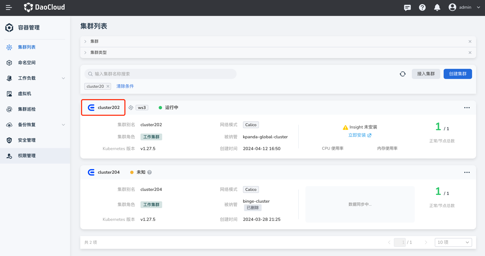
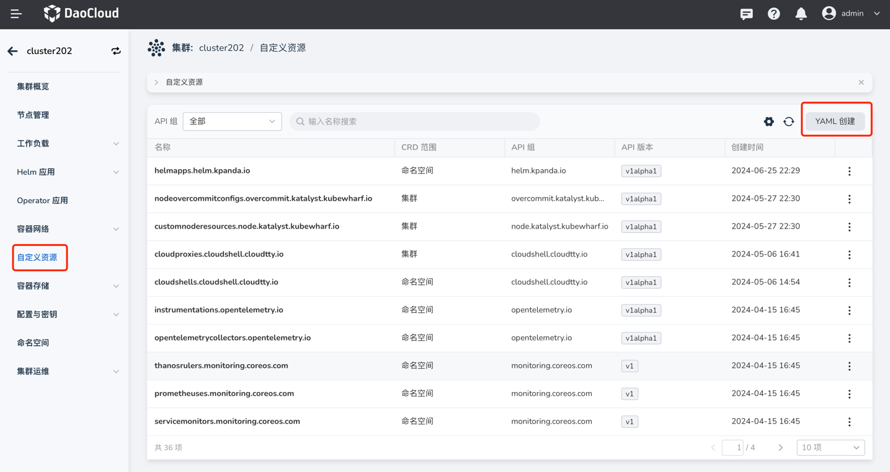
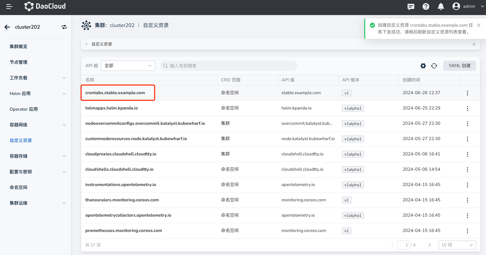
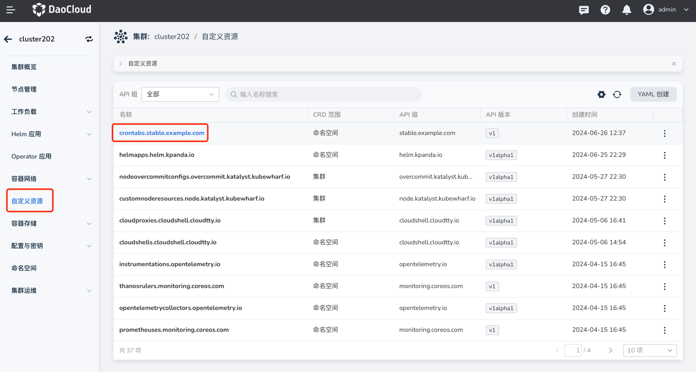
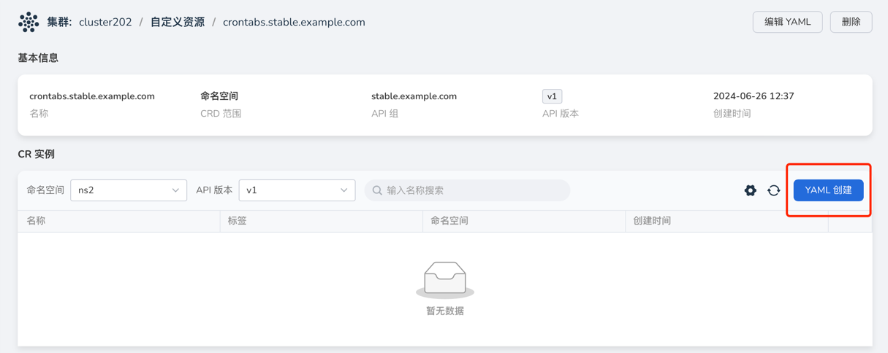

# 创建自定义资源 (CRD)

在 Kubernetes 中一切对象都被抽象为资源，如 Pod、Deployment、Service、Volume 等是 Kubernetes 提供的默认资源，
这为我们的日常运维和管理工作提供了重要支撑，但是在一些特殊的场景中，现有的预置资源并不能满足业务的需要，
因此我们希望去扩展 Kubernetes API 的能力，自定义资源（CustomResourceDefinition, CRD）正是基于这样的需求应运而生。

容器管理模块支持对自定义资源的界面化管理，主要功能如下：

- 获取集群下自定义资源列表和详细信息
- 基于 YAML 创建自定资源
- 基于 YAML 创建自定义资源示例 CR（Custom Resource）
- 删除自定义资源

## 前提条件

- 容器管理模块[已接入 Kubernetes 集群](../clusters/integrate-cluster.md)或者[已创建 Kubernetes](../clusters/create-cluster.md)，且能够访问集群的 UI 界面

- 已完成一个[命名空间的创建](../namespaces/createns.md)、[用户的创建](../../../ghippo/user-guide/access-control/user.md)，并将用户授权为 [Cluster Admin](../permissions/permission-brief.md#cluster-admin) 角色 ，详情可参考[命名空间授权](../permissions/cluster-ns-auth.md)

## 通过 YAML 创建自定义资源

1. 点击一个集群名称，进入 __集群详情__ 。

    

2. 在左侧导航栏，点击 __自定义资源__ ，点击右上角 __YAML 创建__ 按钮。

    

3. 在 __YAML 创建__ 页面中，填写 YAML 语句后，点击 __确定__ 。

    

4. 返回自定义资源列表页，即可查看刚刚创建的名为 `crontabs.stable.example.com` 的自定义资源。

    

**自定义资源示例：**

```yaml title="CRD example"
apiVersion: apiextensions.k8s.io/v1
kind: CustomResourceDefinition
metadata:
  name: crontabs.stable.example.com
spec:
  group: stable.example.com
  versions:
    - name: v1
      served: true
      storage: true
      schema:
        openAPIV3Schema:
          type: object
          properties:
            spec:
              type: object
              properties:
                cronSpec:
                  type: string
                image:
                  type: string
                replicas:
                  type: integer
  scope: Namespaced
  names:
    plural: crontabs
    singular: crontab
    kind: CronTab
    shortNames:
    - ct
```

## 通过 YAML 创建自定义资源示例

1. 点击一个集群名称，进入 __集群详情__ 。

    

2. 在左侧导航栏，点击 __自定义资源__ ，进入自定义资源列表页面。

    

3. 点击名为 `crontabs.stable.example.com` 的自定义资源，进入详情，点击右上角 __YAML 创建__ 按钮。

    

4. 在 __YAML 创建__ 页面中，填写 YAML 语句后，点击 __确定__ 。

    

5. 返回 `crontabs.stable.example.com` 的详情页面，即可查看刚刚创建的名为 __my-new-cron-object__ 的自定义资源。

**CR 示例：**

```yaml title="CR example"
apiVersion: "stable.example.com/v1"
kind: CronTab
metadata:
  name: my-new-cron-object
spec:
  cronSpec: "* * * * */5"
  image: my-awesome-cron-image
```
